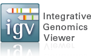

```{r,child="assets/header-lab.Rmd"}
```

```{r,eval=TRUE,include=FALSE}
library(yaml)
upid <- yaml::read_yaml("_site.yml")$uppmax_project
nscid <- yaml::read_yaml("_site.yml")$nsc_project
```

This workshop is aimed towards biologists, researchers, computer scientists or data analysts with limited experience in analysing NGS data.

# &nbsp; {.tabset .tabset-fade}

## Preparation

These are steps to be completed before the workshop.

### 1. Create UPPMAX and NSC accounts

Remote computing clusters (UPPMAX and NSC) will be use for data analyses. A SUPR/SNIC account is needed to use these resources.

If you do not already have one, create an account at [https://supr.snic.se/](https://supr.snic.se/).


Log in to [SUPR/SNIC](https://supr.snic.se/) and request membership to the project IDs **`r paste0(upid)`** and **`r paste0(nscid)`**.


Once you are accepted to a project, you should see that project listed under your active projects.


Finally you need to request a login account to NSC. Login to SUPR and go to the Accounts page. Under the **Possible Resource Account Requests** heading click on **Request Account on Tetralith @ NSC** button and confirm it on the next page.


Checking your request and approving your account requires some manual work, so you might have to wait for some time (up to a working day) before the next step. When the account is ready to be created, you will receive an email to your registered email address (shown in your SUPR contact information) with information on how to proceed. You will get a URL that you use to choose the password (within seven days). When that has been done, the account ready for use within 15 minutes and you can then login using your chosen password.

<div class="boxy boxy-yellow boxy-exclamation">
**Note:** You will get one username & password for the account on UPPMAX, and one username and password for the account on NSC. Please keep track of both, we will tell you when to use which account during the workshop.
</div>

### 2. Install tools for SSH & SFTP access

#### 2.1 SSH

[](http://mobaxterm.mobatek.net)

You need a program to connect to a remote cluster (UPPMAX and NSC). Linux and Mac users already have terminal on their systems. If you are on a Windows system, we recommend [MobaXterm](http://mobaxterm.mobatek.net). It is recommended that you INSTALL the program and not use the portable version. MobaXterm also has an integrated SFTP file browser.

#### 2.2 XQuartz

[](https://www.xquartz.org/)

Mac users will need to download and install [XQuartz](https://www.xquartz.org/) for X11 forwarding. *ie*; to forward remotely opened windows to local machine.


#### 2.3 SFTP Browser

[](https://filezilla-project.org/)

When you need to transfer data between the remote cluster and your computer, you can use the tools SCP or SFTP through the terminal. Windows users can use the SFTP browser available with MobaXterm. If you prefer a GUI to upload and download files from the remote cluster, we recommend installing [FileZilla](https://filezilla-project.org/).


### 3. Test the connection to UPPMAX

<div class="boxy boxy-grey boxy-lightbulb">
For this step, you will have to use the terminal a bit. You can get started by following **Tutorial One** at this link *[Unix tutorial for beginners](http://www.ee.surrey.ac.uk/Teaching/Unix/)*. You can use [https://scilifelab.github.io/courses/ngsintro/common/emu/](https://scilifelab.github.io/courses/ngsintro/common/emu/) [(or this mirror)](https://bellard.org/jslinux/vm.html?url=https://bellard.org/jslinux/buildroot-x86.cfg) to try the commands in the tutorial, so that you don't mess up any real world system. If you any questions regarding this tutorial contact: *martin.dahlo [at] scilifelab.uu.se*.
</div>

**Connect to UPPMAX:** Open the terminal (Windows users can use MobaXterm) and type `ssh -Y user@rackham.uppmax.uu.se`, then enter your password. The password will not be visible as you type.

**Create a user folder: ** Go to ``r paste0("/proj/",upid,"/nobackup/")`` and create a directory with your username. For example `mkdir jody`. You will work inside this directory for the workshop. For example ``r paste0("/proj/",upid,"/nobackup/jody")``. If you cannot write to the folder, the most likely reason is that you have not requested access to the workshop project via SUPR. This is described in step 1 above.

<div class="boxy boxy-yellow boxy-exclamation">
**Note:** It may take an hour or so from request approval, before you can actually write to the folder. We will check before the workshop that all students have logged in and done this, so do not forget!
</div>

### 4. Install other tools

#### 4.1 Zoom

[](https://zoom.us/)  

Please install the latest version of [Zoom](https://zoom.us/).

#### 4.2 IGV

Please install IGV on your local system before the start of the workshop.

[](https://www.broadinstitute.org/igv/)  

**Download IGV** (Integrated Genome Browser) from the [Broad Institute](https://www.broadinstitute.org/igv/) on your own computer and have the mouse genome (mm10) as well as the human genome (hg19) available.

***

## Syllabus

The syllabus for this workshop are as follows.

- Working on the unix/linux command line
  - Command line navigation and related commands: cd, mkdir, rm, rmdir
  - Commonly used linux tools: cp, mv, tar, less, more, head, tail, nano, grep, top, man
  - Wildcards
  - Ownership and permissions
  - Symbolic links
  - Piping commands
- Working on remote computing cluster
  - Logging on to UPPMAX
  - Booking resources
  - Job templates, submission and queues
  - Modules
- Commonly used bioinformatic tools and pipelines
- Working with integrated genome viewer
- Variant-calling workflow
  - Mapping reads to the reference genome
  - Variant detection
  - VCF file format
- RNA-Seq workflow
  - RNA-Seq experimental design and considerations
  - QC, mapping and gene expression counts
  - Differential gene expression analyses
- Current advances in NGS technologies

***

## Learning outcomes

After this workshop you should be able to:

- Describe the basic principles of next generation sequencing.
- Use the Linux command line interface to manage simple file processing operations, and organise directory structures.
- Connect to and work on a remote compute cluster.
- Apply programs in Linux for analysis of NGS data.
- Summarise the applications of current NGS technologies, including the weakness and strengths of the approaches and when it is appropriate to use which one of them.
- Explain common NGS file formats.
- Interpret quality control of NGS reads.
- Explain the steps involved in variant calling using whole genome sequencing data.
- Independently perform a basic variant calling workflow on example data.
- Explain the steps involved in a differential gene expression workflow using RNA seq data.
- Hands-on experience with handling of raw RNA sequencing data, QC and quantification of gene expression.
- Conceptual understanding of differential gene expression analysis.

***

## Entry requirements

- This is a national course open to PhD students, postdocs, group leaders and core facility staff.

- A background in genetics, cell biology, biomedicine, biochemistry, bioinformatics or comparable is desirable. To get the maximum benefit from the workshop we would like you to

- Have a research project where you are currently using next generation sequencing or are planning to use next generation sequencing.
It is beneficial if you are directly performing analyses or if you have a support role and will be able to participate in a wide range of projects and transfer your knowledge to others.

- Selection criteria include correct entry requirements, motivation to attend the workshop as well as gender and geographical balance. Applicants affiliated to a Swedish institution are prioritized. International applicants are considered only if/when seats are available. Further prioritization: PhD scholars > Post-Docs, PIs, Healthcare staff > Master's students).

- Please note that NBIS training events do not provide any formal university credits. The training content is estimated to correspond to a certain number of credits, however the estimated credits are just guidelines. If formal credits are crucial, the student needs to confer with the home department before submitting a course application in order to establish whether the course is valid for formal credits or not.

#
