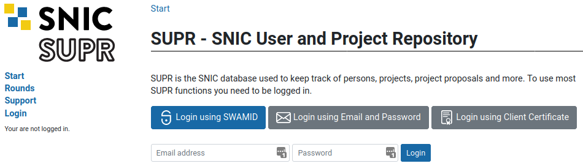
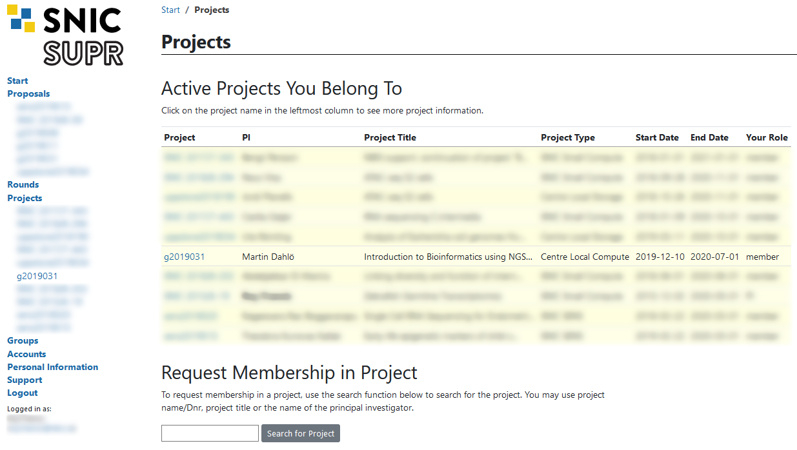
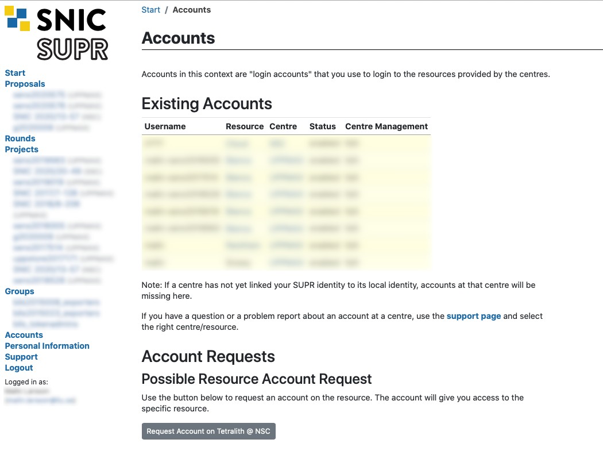

```{r,child="assets/header-lab.Rmd"}
```

```{r,eval=TRUE,include=FALSE}
library(yaml)
upid <- yaml::read_yaml("_site.yml")$uppmax_project
upstore <- yaml::read_yaml("_site.yml")$uppmax_storage
nscid <- yaml::read_yaml("_site.yml")$nsc_project
```

These are steps to be completed before the workshop.

# Create UPPMAX and NSC accounts

Remote computing clusters (UPPMAX and NSC) will be use for data analyses. A SUPR/SNIC account is needed to use these resources.

If you do not already have one, create an account at [https://supr.snic.se/](https://supr.snic.se/).



Log in to [SUPR/SNIC](https://supr.snic.se/) and request membership to the project IDs **`r paste0(upid)`** and **`r paste0(nscid)`**.


Once you are accepted to a project, you should see that project listed under your active projects.



Finally you need to request login accounts to NSC and UPPMAX. These are the accounts you use to log in to the actual computers, so they are not the same as your SUPR account. Login to SUPR and go to the Accounts page. Under the **Possible Resource Account Requests** heading click on **Request Account on Tetralith @ NSC** and **Request Account on Rackham @ UPPMAX** button and confirm it on the next page. If either of them are missing from this page, it could be because you already have a login account created (only 1 account per person allowed), or that you have not yet gotten your project memberships approved.



Checking your request and approving your account requires some manual work, so you might have to wait for some time (up to a working day) before the next step. When the account is ready to be created, you will receive an email to your registered email address (shown in your SUPR contact information) with information on how to proceed. You will get a URL that you use to choose the password (within seven days). When that has been done, the account ready for use within 15 minutes and you can then login using your chosen password.

<div class="boxy boxy-yellow boxy-exclamation">
**Note:** You will get one username & password for the account on UPPMAX, and one username and password for the account on NSC. Please keep track of both, we will tell you when to use which account during the workshop.
</div>

# Install tools

## SFTP Browser

[](https://filezilla-project.org/)

When you need to transfer data between the remote cluster and your computer, you can use the tools SCP or SFTP through the terminal. Windows users can use the SFTP browser available with MobaXterm. If you prefer a GUI to upload and download files from the remote cluster, we recommend installing [FileZilla](https://filezilla-project.org/).

## ThinLinc

[]((https://www.cendio.com/thinlinc/download))

ThinLinc allows graphical connection to UPPMAX. Download and install from [https://www.cendio.com/thinlinc/download](https://www.cendio.com/thinlinc/download). It can be used directly from the browser for most part, but if there are issues, the installed application may be helpful.

## XQuartz

[](https://www.xquartz.org/)

Mac users will need to download and install [XQuartz](https://www.xquartz.org/) for X11 forwarding. *ie*; to forward remotely opened windows to local machine.

## MobaXterm(Optional)

[](http://mobaxterm.mobatek.net)

If you are on a Windows system, and you want to open graphical applications from the terminal, we recommend [MobaXterm](http://mobaxterm.mobatek.net). It is recommended that you INSTALL the program and not use the portable version. MobaXterm also has an integrated SFTP file browser.

# Connect to UPPMAX

See "Connecting to UPPMAX" instructions on the **Contents** page.

<div class="boxy boxy-grey boxy-lightbulb">
If you want to get a primer on using the terminal, you can get started with the following **Tutorial One** at this link *[Unix tutorial for beginners](http://www.ee.surrey.ac.uk/Teaching/Unix/)*. You can use [https://scilifelab.github.io/courses/ngsintro/common/emu/](https://scilifelab.github.io/courses/ngsintro/common/emu/) [(or this mirror)](https://bellard.org/jslinux/vm.html?url=https://bellard.org/jslinux/buildroot-x86.cfg) to try the commands in the tutorial, so that you don't mess up any real world system. If you have any questions regarding this tutorial contact: *martin.dahlo [at] scilifelab.uu.se*.
</div>

# Create a user folder

<div class="boxy boxy-yellow boxy-exclamation">
**Note:** Where `username` is mentioned, change to your user name.
</div>

Once you have logged in to UPPMAX, run the following below.

```{r,echo=FALSE,comment="",class.output="bash"}
cat(paste0("mkdir /proj/",upid,"/nobackup/username"))
```

This creates a directory with your user name. You will work inside this directory for the workshop. If you cannot write to the folder, the most likely reason is that you have not requested access to the workshop project via SUPR. This is described in step 1 above.

<div class="boxy boxy-yellow boxy-exclamation">
**Note:** It may take an hour or so from request approval, before you can actually write to the folder. We will check before the workshop that all students have logged in and done this, so do not forget!
</div>
