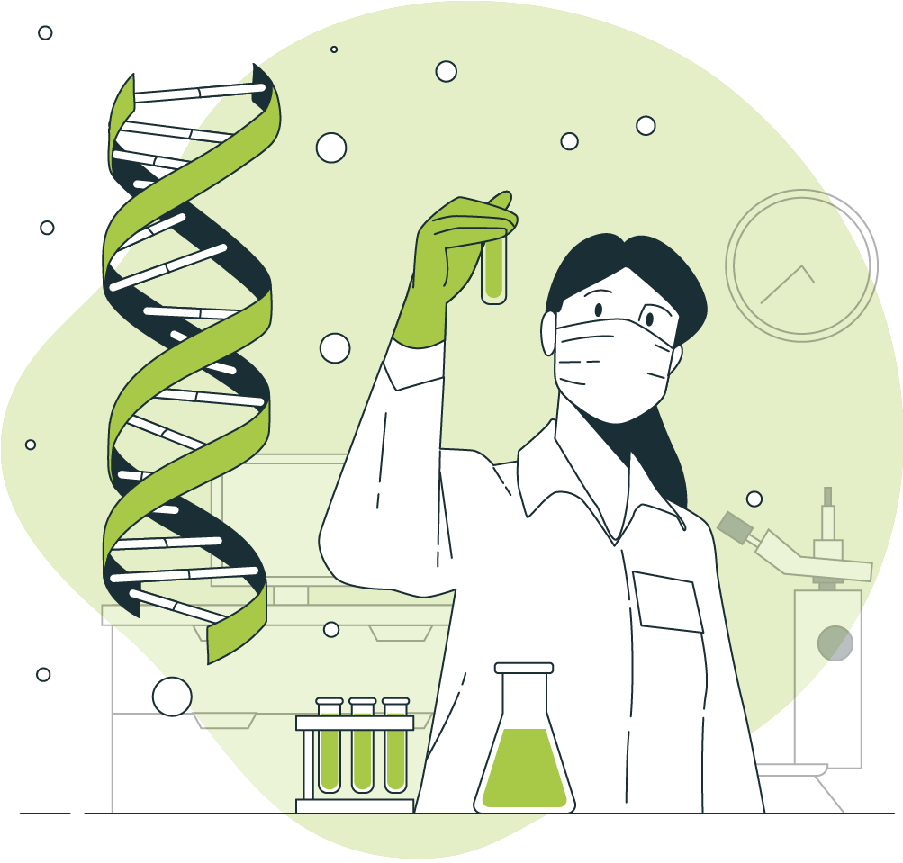

```{r,child="assets/header-lab.Rmd"}
```

```{css,echo=FALSE}
.title{
  display: none;
}
```

<div class="container">
<div class="landing">
<div class="landing-left">
<div class="landing-subtitle">
## NBIS • Workshop
</div>
<div class="landing-title">
# Introduction to Bioinformatics using NGS data
</div>
<div class="landing-features">
- Working on the Linux command line
- Sequence data formats and QC
- DNA variant calling workflow
- RNA sequence analyses workflow
</div>
</div>
<div class="landing-right">

</div>
</div>

***

<div class="landing-update">
<p class="small" style="color:#bdbdbd;">
`r paste("Last updated on",fontawesome::fa("calendar-alt",fill="#bdbdbd"),format(Sys.time(),format='%d-%b-%Y'),"at",fontawesome::fa("clock",fill="#bdbdbd"),format(Sys.time(),format='%X'),".")`
</p>
</div>

</div>
