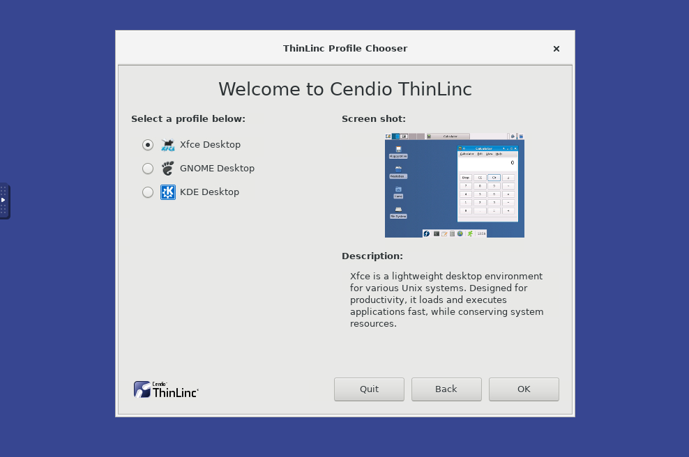

```{r,child="assets/header-lab.Rmd"}
```

```{r,eval=TRUE,include=FALSE}
library(yaml)
upid <- yaml::read_yaml("_site.yml")$uppmax_project
upres <- yaml::read_yaml("_site.yml")$uppmax_res_1
```

<div class="boxy boxy-yellow boxy-exclamation">
In code blocks, the dollar sign (`$`) is not to be printed. The dollar sign is usually an indicator that the text following it should be typed in a terminal window.
</div>

# Connect to UPPMAX

We will teach you two different ways to connect to UPPMAX. From UPPMAX point of view it doesn't matter which one you use, and you can change whenever you want to or even use both ways simultaiously. The first one is a text-based SSH connection, and the other one is a graphical remote desktop. The latter one is useful if you need to view images or documents in GUI programs without having to first download the image/document to your own computer first. Since it is using graphics, it will require you to have an internet connection that is good and stable.

The reason we will teach you two ways is that some parts of this course will require you to view plots and images, and adding an additional download step would just unneccesarily complicate things.


## SSH connection

Let's look at the text-based SSH approach first. This type of connection work just fine even on slow internet connections since it only transmitts small amounts of text when you work with it. You will need an SSH program to do this, which fortunately is included in most major operating systems:

<i class="fab fa-linux"></i> Linux: Use Terminal (Included by default).<br>
<i class="fab fa-apple"></i> OSX: Use Terminal (Included by default).<br>
<i class="fab fa-windows"></i> Windows: Use Powershell or Command prompt, both should be installed by default.<br>
 

Fire up the available SSH program and enter the following:

```bash
$ ssh username@rackham.uppmax.uu.se
```

Replace username with your UPPMAX username.

Enter your password when prompted. As you type, nothing will show on the screen.
No stars, no dots. It is supposed to be that way. Just type the password and press enter, it will be fine.

Now your screen should look something like this:

```bash
dahlo@dahlo-xps ~ $ ssh dahlo@rackham.uppmax.uu.se
Last login: Fri May 18 15:03:59 2018 from mi04.icm.uu.se
 _   _ ____  ____  __  __    _    __  __
| | | |  _ \|  _ \|  \/  |  / \   \ \/ /   | System:    rackham4
| | | | |_) | |_) | |\/| | / _ \   \  /    | User:      dahlo
| |_| |  __/|  __/| |  | |/ ___ \  /  \    |
 \___/|_|   |_|   |_|  |_/_/   \_\/_/\_\   |

###############################################################################

       User Guides: http://www.uppmax.uu.se/support/user-guides
       FAQ: http://www.uppmax.uu.se/support/faq

       Write to support@uppmax.uu.se, if you have questions or comments.


dahlo@rackham4 ~ $
```

Now you are connected to UPPMAX and can start working on the labs.


## Remote desktop connection

We have a ThinLinc server running at one of the login nodes which allows users to run a remote desktop. To be able to login you will have to set up two-factor authentication first. Follow the [instructions at the UPPMAX homepage](https://www.uppmax.uu.se/support/user-guides/setting-up-two-factor-authentication/), and once you are done you can continue below.

   1. Go to the login page, https://rackham-gui.uppmax.uu.se/
   1. Enter your UPPMAX username.
   1. Enter your UPPMAX password, followed by your current two-factor authentication code. 
      Eg. if your password is `hunter2` and your current two-factor authentication code is `123456` you will enter `hunter2123456` as your password.
      
   1. It will ask you which profile you want to use, so first press the `Forward` button. Then you can choose which desktop environment you want to use. `Xfce` is pretty straight-forward and easy to use, but feel free to try either of them. You get to choose every time you login so it's not a permanent choice.
      
   1. Once your desktop has been loaded, start a terminal either by clicking the black terminal icon at the bottom of the screen, or by pressing the `Applications` button in the top right corner and select `Terminal Emulator`.
      


# After connection to UPPMAX

From this point forward there is no difference between the two different ways of connection to UPPMAX. Both ways result in you having a terminal running on UPPMAX and from UPPMAX point of view they are the same. 


