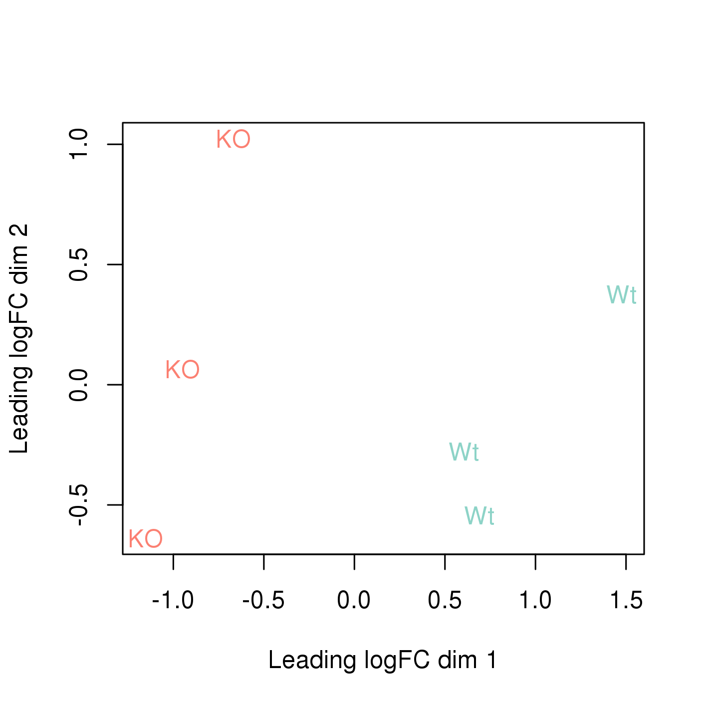

```{r,child="assets/header-lab.Rmd"}
```

```{r,include=FALSE}
library(yaml)
upid <- yaml::read_yaml("_site.yml")$uppmax_project
id_reservation_1 <- paste0(upid,"_3")
id_reservation_2 <- paste0(upid,"_4")
path_data <- "/sw/courses/ngsintro/rnaseq"
path_project <- paste0("/proj/",upid,"/nobackup")
path_project_rnaseq <- paste0(path_project,"/<username>/rnaseq")
```

<!-- ------------ Only edit title, subtitle & author above this ------------ -->

```{r,include=FALSE}
## LIBRARIES AND VARIABLES
## load libraries
#library(ggplot2) # plotting
#library(stringr) # text processing
#library(tidyr) # data wrangling
library(dplyr) # data handling
library(kableExtra)

#colours
col_sll_green <- "#95C11E"
col_sll_blue <- "#0093BD"
col_sll_orange <- "#EF7C00"
col_sll_green_light <- "#f4f8e8"
col_sll_blue_light <- "#e5f4f8"
col_sll_orange_light <- "#fdf1e5"

col_condition=c("#fb8072","#8dd3c7")
col_rep <- c("#80b1d3","#fdb462","#bebada")
```

# Introduction

RNA-seq has become a powerful approach to study the continually changing cellular transcriptome. Here, one of the most common questions is to identify genes that are differentially expressed between two conditions, e.g. controls and treatment. The **main** exercise in this tutorial will take you through a basic bioinformatic analysis pipeline to answer just that, it will show you how to find differentially expressed (DE) genes.

**Main exercise**

- 01 Check the quality of the raw reads with **FastQC**
- 02 Map the reads to the reference genome using **Star**
- 03 Assess the post-alignment quality using **QualiMap**
- 04 Count the reads overlapping with genes using **featureCounts**
- 05 Find DE genes using **edgeR** in R

RNA-seq experiment does not necessarily end with a list of DE genes. If you have time after completing the **main** exercise, try one (or more) of the **bonus** exercises. The **bonus** exercises can be run independently of each other, so choose the one that matches your interest. Bonus sections are listed below.

**Bonus exercises**

- 01 Functional annotation of DE genes using **GO/Reactome/Kegg** databases
- 02 Visualisation of RNA-seq BAM files using **IGV** genome browser
- 03 RNA-Seq figures and plots using **R**
- 04 De-novo transcriptome assembly using **Trinity**

<div class="boxy boxy-tip">
**General guide**

* Expected run times (in minutes, when running all samples) for some of the steps as shown below when using 8 cores with 64 GB RAM.

```{r,echo=FALSE}
data.frame(Step=c("FastQC","STAR Mapping","QualiMap","MultiQC","FeatureCounts","Trinity"),
           Time_Min=c("12:00","32:00","46:00","13:00","03:30","44:00")) %>%
  kable("html",escape=F,align="r") %>%
  kable_styling(bootstrap_options=c("striped","hover","responsive"),
                full_width=F,position="left")
```

* It is not recommended to run every step on all samples are it is not possible to complete in the available time. Pre-computed files for all steps are made available. Instructions to copy them are shown at the end of each section.

* You are welcome to try your own solutions to the problems, before checking the solution. Click the <code style="background-color:#0093BD;color:white;">+</code> button to see the suggested solution. There is more than one way to complete a task. Discuss with person next to you and ask us when in doubt.

* Input code blocks are displayed like shown below. The code language is displayed above the block. Shell scripts (**SH**) are to be executed in the linux terminal such as bash. **R** scripts are to be run in R after running  R` in the terminal or in R/RStudio locally. Output text blocks are marked as **OUTPUT**.

```{sh,eval=FALSE,block.title=TRUE}
command
```

</div>

# Data description

The data used in this exercise is from the paper: **Poitelon, Yannick, *et al*. YAP and TAZ control peripheral myelination and the expression of laminin receptors in Schwann cells. [Nature neuroscience 19.7 (2016): 879](https://www.nature.com/articles/nn.4316)**. In this study, YAP and TAZ genes were knocked-down in Schwann cells to study myelination, using the sciatic nerve in mice as a model.

Myelination is essential for nervous system function. Schwann cells interact with neurons and the basal lamina to myelinate axons using receptors, signals and transcription factors. Hippo pathway is a conserved pathway involved in cell contact inhibition, and it acts to promote cell proliferation and inhibits apoptosis. The pathway integrates mechanical signals (cell polarity, mechanotransduction, membrane tension) and gene expression response. In addition to its role in organ size control, the Hippo pathway has been implicated in tumorigenesis, for example its deregulation occurs in a broad range of human carcinomas. Transcription co-activators YAP and TAZ are two major downstream effectors of the Hippo pathway, and have redundant roles in transcriptional activation.

The material for RNA-seq was collected from 2 conditions (**Wt** and **KO**), each with 3 biological replicates.

```{r,echo=FALSE}
data.frame(Accession=c("SRR3222409","SRR3222410","SRR3222411","SRR3222412","SRR3222413","SRR3222414"),
           Condition=c(rep(c("KO","Wt"),each=3)),
           Replicate=rep(1:3,2)) %>%
  mutate(Condition=cell_spec(Condition,"html",color="white",bold=T,
    background=col_condition[.$Condition])) %>%
  mutate(Replicate=cell_spec(Replicate,"html",color="white",bold=T,
    background=col_rep[.$Replicate])) %>%
  kable("html",escape=F,align="r") %>%
  kable_styling(bootstrap_options=c("striped","hover","responsive"),
                full_width=F,position="left")
```

<div class="boxy boxy-note">
For the purpose of this tutorial, to shorten the time needed to run various bioinformatics steps, we have downsampled the original files. We randomly sampled, without replacement, 25% reads from each sample, using `fastq-sample` from the toolset [fastq-tools](https://homes.cs.washington.edu/~dcjones/fastq-tools/).
</div>

# Main exercise

The main exercise covers Differential Gene Expression (DGE) workflow from raw reads to a list of differentially expressed genes.

## Using Uppmax

COnnect to UPPMAX.

```{sh,block.title=TRUE,eval=FALSE}
ssh -Y username@rackham.uppmax.uu.se
```

Book a node.

For the RNA-Seq part of the course, we will work on the Rackham cluster. A standard compute node on cluster Rackham has 128 GB of RAM and 20 cores. Therefore, each core gives you 6.4 GB of RAM. We will use 8 cores per person for this session which gives you about 51 GB RAM. The code below is valid to run at the start of the day. If you are running it in the middle of a day, you need to decrease the time (`-t`). Do not run this twice and also make sure you are not running computations on a login node.

Book resources for RNA-Seq day 1.

```{r,comment="",block.title=TRUE,class.output="sh",echo=FALSE}
cat(paste0("salloc -A ",upid," -t 08:00:00 -p core -n 8 --reservation=",id_reservation_1))
```

Book resources for RNA-Seq day 2.

```{r,comment="",block.title=TRUE,class.output="sh",echo=FALSE}
cat(paste0("salloc -A ",upid," -t 08:00:00 -p core -n 8 --reservation=",id_reservation_2))
```

### Set-up directory

Setting up the directory structure is an important step as it helps to keep our raw data, intermediate data and results in an organised manner. All work must be carried out at this location ``r paste0(path_project)`` where `<username>` is your user name.

Create a directory named `rnaseq`. All RNA-Seq related activities must be carried out in this sub-directory named `rnaseq`.

```{sh,eval=FALSE,block.title=TRUE}
mkdir rnaseq
```

<i class="fas fa-clipboard-list"></i> Set up the below directory structure in your project directory.

```
<username>/
rnaseq/
  +-- 1_raw/
  +-- 2_fastqc/
  +-- 3_mapping/
  +-- 4_qualimap/
  +-- 5_dge/
  +-- 6_multiqc/
  +-- reference/
  |   +-- mouse/
  |   +-- mouse_chr11/
  +-- scripts/
```

```{r,accordion=TRUE,block.title=TRUE,echo=FALSE,comment="",class.output="sh"}
cat(paste0('cd rnaseq
mkdir 1_raw 2_fastqc 3_mapping 4_qualimap 5_dge 6_multiqc reference scripts
cd reference
mkdir mouse
mkdir mouse_chr11
cd ..'))
```

The `1_raw` directory will hold the raw fastq files (soft-links). `2_fastqc` will hold FastQC outputs. `3_mapping` will hold the STAR mapping output files. `4_qualimap` will hold the QualiMap output files. `5_dge` will hold the counts from featureCounts and all differential gene expression related files. `6_multiqc` will hold MultiQC outputs. `reference` directory will hold the reference genome, annotations and STAR indices.

<i class="fas fa-lightbulb"></i> It might be a good idea to open an additional terminal window. One to navigate through directories and another for scripting in the `scripts` directory.

### Create symbolic links

We have the raw fastq files in this remote directory: ``r paste0(path_data,"/main/1_raw/")``. We are going to create symbolic links (soft-links) for these files from our `1_raw` directory to the remote directory. We do this because they are large files and simply copying them would use up a lot of storage space. Soft-linking files and folders allows us to work with those files as if they were actually there. Use `pwd` to check if you are standing in the correct directory. You should be standing here:

```{r,comment="",echo=FALSE}
cat(paste0(path_project_rnaseq,"/1_raw"))
```

Run below to create softlinks. Note that the command ends in a space followed by a period.

```{r,comment="",block.title=TRUE,class.output="sh",echo=FALSE}
cat(paste0("ln -s ",path_data,"/main/1_raw/*.fastq.gz ."))
```

Check if your files have linked correctly. You should be able to see as below.

```{sh,eval=FALSE,block.title=TRUE}
ls -l
```

```{output,eval=FALSE,block.title=TRUE}
SRR3222409_1.fastq.gz -> /sw/courses/ngsintro/rnaseq/main/1_raw/SRR3222409_1.fastq.gz
SRR3222409_2.fastq.gz -> /sw/courses/ngsintro/rnaseq/main/1_raw/SRR3222409_2.fastq.gz
SRR3222410_1.fastq.gz -> /sw/courses/ngsintro/rnaseq/main/1_raw/SRR3222410_1.fastq.gz
SRR3222410_2.fastq.gz -> /sw/courses/ngsintro/rnaseq/main/1_raw/SRR3222410_2.fastq.gz
SRR3222411_1.fastq.gz -> /sw/courses/ngsintro/rnaseq/main/1_raw/SRR3222411_1.fastq.gz
SRR3222411_2.fastq.gz -> /sw/courses/ngsintro/rnaseq/main/1_raw/SRR3222411_2.fastq.gz
SRR3222412_1.fastq.gz -> /sw/courses/ngsintro/rnaseq/main/1_raw/SRR3222412_1.fastq.gz
SRR3222412_2.fastq.gz -> /sw/courses/ngsintro/rnaseq/main/1_raw/SRR3222412_2.fastq.gz
SRR3222413_1.fastq.gz -> /sw/courses/ngsintro/rnaseq/main/1_raw/SRR3222413_1.fastq.gz
SRR3222413_2.fastq.gz -> /sw/courses/ngsintro/rnaseq/main/1_raw/SRR3222413_2.fastq.gz
SRR3222414_1.fastq.gz -> /sw/courses/ngsintro/rnaseq/main/1_raw/SRR3222414_1.fastq.gz
SRR3222414_2.fastq.gz -> /sw/courses/ngsintro/rnaseq/main/1_raw/SRR3222414_2.fastq.gz
```

## FastQC

**Quality check using FastQC**  

After receiving raw reads from a high throughput sequencing centre it is essential to check their quality.  [FastQC](http://www.bioinformatics.babraham.ac.uk/projects/fastqc/) provides a simple way to do some quality control check on raw sequence data. It provides a modular set of analyses which you can use to get a quick impression of whether your data has any problems of which you should be aware before doing any further analysis.

<i class="fas fa-clipboard-list"></i> Change into the `2_fastqc` directory. Use `pwd` to check if you are standing in the correct directory. You should be standing here:

```{r,comment="",echo=FALSE}
cat(paste0(path_project_rnaseq,"/2_fastqc"))
```

Load Uppmax modules `bioinfo-tools` and FastQC `FastQC/0.11.5`.

```{sh,block.title=TRUE,eval=FALSE}
module load bioinfo-tools
module load FastQC/0.11.5
```

Once the module is loaded, FastQC program is available through the command `fastqc`. Use `fastqc --help` to see the various parameters available to the program. We will use `-t 8`, to specify number of threads, `-o` to specify the output directory path and finally, the name of the input fastq file to analyse. The syntax will look like below.

```{sh,block.title=TRUE,eval=FALSE}
fastqc -t 8 -o . ../1_raw/filename.fastq.gz
```

Based on the above command, we will write a bash loop to process all fastq files in the directory. Writing multi-line commands through the terminal can be a pain. Therefore, we will run larger scripts from a bash script file. Move to your `scripts` directory and create a new file named `fastqc.sh`.

You should be standing here to run this:

```{r,comment="",echo=FALSE}
cat(paste0(path_project_rnaseq,"/scripts"))
```

The command below creates a new file in the current directory.

```{sh,block.title=TRUE,eval=FALSE}
touch fastqc.sh
```

Use `nano`,`vim` or `gedit` to edit `fastqc.sh`.

```{sh,block.title=TRUE,eval=FALSE}
#!/bin/bash
for i in ../1_raw/*.fastq.gz
do
	echo "Running $i ..."
	fastqc -t 8 -o . "$i"
done
```

While standing in the `2_fastqc` directory, run the file `fastqc.sh`.  Use `pwd` to check if you are standing in the correct directory.

You should be standing here to run this:

```{r,comment="",echo=FALSE}
cat(paste0(path_project_rnaseq,"/2_fastqc"))
```

```{sh,block.title=TRUE,eval=FALSE}
bash ../scripts/fastqc.sh
```

After the fastqc run, there should be a `.zip` file and a `.html` file for every fastq file. The `.html` file is the report that you need. Open the `.html` in the browser and view it. You only need to do this for one file now. We will do a comparison with all samples when using the MultiQC tool.

```{sh,block.title=TRUE,eval=FALSE}
firefox file.html &
```

<i class="fas fa-lightbulb"></i> Adding `&` at the end sends that process to the background, so that the console is free to accept new commands.

<div class="boxy boxy-task boxy-orange">
**Optional**

Download the `.html` file to your computer and view it.

<i class="fas fa-lightbulb"></i> All users can use an SFTP browser like [Filezilla](https://filezilla-project.org/) or [Cyberduck](https://cyberduck.io/) for a GUI interface. Windows users can also use the MobaXterm SFTP file browser to drag and drop.

Linux and Mac users can use SFTP or SCP by running the below command in a **LOCAL** terminal and **NOT** on Uppmax. Open a terminal locally on your computer, move to a suitable download directory and run the command below.

```{r,comment="",echo=FALSE,block.title=TRUE,class.output="sh"}
cat(paste0("scp user@rackham.uppmax.uu.se:",path_project_rnaseq,"/2_fastqc/SRR3222409_1_fastqc.html ./"))
```
</div>

<i class="fas fa-clipboard-list"></i> Go back to the FastQC website and compare your report with the sample report for [Good Illumina data](http://www.bioinformatics.babraham.ac.uk/projects/fastqc/good_sequence_short_fastqc.html) and [Bad Illumina data](http://www.bioinformatics.babraham.ac.uk/projects/fastqc/bad_sequence_fastqc.html).

<i class="fas fa-comments"></i> Discuss based on your reports, whether your data is of good enough quality and/or what steps are needed to fix it.

## STAR

**Mapping reads using STAR**  

After verifying that the quality of the raw sequencing reads is acceptable, we will map the reads to the reference genome. There are many mappers/aligners available, so it may be good to choose one that is adequate for your type of data. Here, we will use a software called STAR (Spliced Transcripts Alignment to a Reference) as it is good for generic purposes, fast, easy to use and has been shown to outperform many of the other tools when aligning 2x76bp paired-end data. Before we begin mapping, we need to obtain genome reference sequence (`.fasta` file) and a corresponding annotation file (`.gtf`) and build a STAR index. Due to time constraints, we will practice index building only on chromosome 11. But, then we will use the pre-prepared full-genome index to run the actual mapping.

### Get reference

It is best if the reference genome (`.fasta`) and annotation (`.gtf`) files come from the same source to avoid potential naming conventions problems. It is also good to check in the manual of the aligner you use for hints on what type of files are needed to do the mapping.

<i class="fas fa-comments"></i> What is the idea behind building STAR index? What files are needed to build one? Where do we take them from? Could one use a STAR index that was generated before? Browse through [Ensembl](https://www.ensembl.org/index.html) and try to find the files needed. Note that we are working with Mouse (*Mus musculus*).

<i class="fas fa-clipboard-list"></i> Move into the `reference` directory and download the Chr 11 genome (`.fasta`) file and the genome-wide annotation file (`.gtf`) from Ensembl.

You should be standing here to run this:

```{r,comment="",echo=FALSE}
cat(paste0(path_project_rnaseq,"/reference"))
```

You are most likely to use the [latest version](https://www.ensembl.org/index.html) of ensembl release genome and annotations when starting a new analysis. For this exercise, we will choose an older version (79) for compatibility with old code/results.

```{sh,block.title=TRUE,eval=FALSE}
wget ftp://ftp.ensembl.org/pub/release-79/fasta/mus_musculus/dna/Mus_musculus.GRCm38.dna.chromosome.11.fa.gz
wget ftp://ftp.ensembl.org/pub/release-79/gtf/mus_musculus/Mus_musculus.GRCm38.79.gtf.gz
```

Decompress the files for use.

```{sh,block.title=TRUE,eval=FALSE}
gunzip Mus_musculus.GRCm38.dna.chromosome.11.fa.gz
gunzip Mus_musculus.GRCm38.79.gtf.gz
```

Check what you have in your directory.

```{sh,accordion=TRUE,block.title=TRUE,eval=FALSE}
ls -l
```

```{output,eval=FALSE,block.title=TRUE}
drwxrwsr-x 2 user gXXXXXXX 4.0K Sep  4 19:33 mouse
drwxrwsr-x 2 user gXXXXXXX 4.0K Sep  4 19:32 mouse_chr11
-rw-rw-r-- 1 user gXXXXXXX 742M Sep  4 19:31 Mus_musculus.GRCm38.79.gtf
-rw-rw-r-- 1 user gXXXXXXX 119M Sep  4 19:31 Mus_musculus.GRCm38.dna.chromosome.11.fa
```

### Build index

Move into the `reference` directory if not already there. Load module STAR version 2.5.2b. Remember to load `bioinfo-tools` if you haven't done so already.

```{sh,accordion=TRUE,block.title=TRUE,eval=FALSE}
module load bioinfo-tools
module load star/2.7.0e
```

<i class="fas fa-lightbulb"></i> To search for other available versions of STAR, use `module spider star`.

Create a new bash script in your `scripts` directory named `star_index.sh` and add the following lines:

```{sh,block.title=TRUE,eval=FALSE}
#!/bin/bash

# load module
module load bioinfo-tools
module load star/2.7.0e

star \
  --runMode genomeGenerate \
  --runThreadN 8 \
  --genomeDir ./mouse_chr11 \
  --genomeFastaFiles ./Mus_musculus.GRCm38.dna.chromosome.11.fa \
  --sjdbGTFfile ./Mus_musculus.GRCm38.79.gtf
```

The above script means that STAR should run in `genomeGenerate` mode to build an index. It should use 8 threads for computation. The output files must be directed to the indicated directory. The paths to the `.fasta` file and the annotation file (`.gtf`) is also shown. STAR arguments are described in the [STAR manual](https://github.com/alexdobin/STAR/blob/master/doc/STARmanual.pdf).

Use `pwd` to check if you are standing in the correct directory. Then, run the script from the `reference` directory.

```{sh,block.title=TRUE,eval=FALSE}
bash ../scripts/star_index.sh
```

Once the indexing is complete, move into the `mouse_chr11` directory and make sure you have all the files.

```{sh,accordion=TRUE,block.title=TRUE,eval=FALSE}
ls -l
```

```{output,eval=FALSE,block.title=TRUE}
-rw-rw-r-- 1 user gXXXXXXX   10 Sep  4 19:31 chrLength.txt
-rw-rw-r-- 1 user gXXXXXXX   13 Sep  4 19:31 chrNameLength.txt
-rw-rw-r-- 1 user gXXXXXXX    3 Sep  4 19:31 chrName.txt
-rw-rw-r-- 1 user gXXXXXXX   12 Sep  4 19:31 chrStart.txt
-rw-rw-r-- 1 user gXXXXXXX 1.7M Sep  4 19:33 exonGeTrInfo.tab
-rw-rw-r-- 1 user gXXXXXXX 805K Sep  4 19:33 exonInfo.tab
-rw-rw-r-- 1 user gXXXXXXX  56K Sep  4 19:33 geneInfo.tab
-rw-rw-r-- 1 user gXXXXXXX 121M Sep  4 19:33 Genome
-rw-rw-r-- 1 user gXXXXXXX  553 Sep  4 19:31 genomeParameters.txt
-rw-rw-r-- 1 user gXXXXXXX 967M Sep  4 19:33 SA
-rw-rw-r-- 1 user gXXXXXXX 1.5G Sep  4 19:33 SAindex
-rw-rw-r-- 1 user gXXXXXXX 522K Sep  4 19:33 sjdbInfo.txt
-rw-rw-r-- 1 user gXXXXXXX 463K Sep  4 19:33 sjdbList.fromGTF.out.tab
-rw-rw-r-- 1 user gXXXXXXX 463K Sep  4 19:33 sjdbList.out.tab
-rw-rw-r-- 1 user gXXXXXXX 480K Sep  4 19:33 transcriptInfo.tab
```

This index for chr11 was created just to familiarise with the steps. We will use the index built on the whole genome for downstream exercises. The index for the whole genome was prepared for us before class in the very same way as for the chromosome 11 in steps above. It just requires more time (ca. 4h) to run. The index is found here: ``r paste0(path_data,"/reference/mouse/")``.

Create symbolic links for all files inside ``r paste0(path_data,"/reference/mouse/")`` to the directory named `mouse` which is inside your `rnaseq/reference/`.

You should be standing here to run this:

```{r,comment="",echo=FALSE}
cat(paste0(path_project_rnaseq,"/reference"))
```

```{sh,accordion=TRUE,block.title=TRUE,eval=FALSE}
cd mouse
ln -s /sw/share/compstore/courses/ngsintro/rnaseq/reference/mouse/* .
```

### Map reads

Now that we have the index ready, we are ready to map reads. Move to the directory `3_mapping`.  Use `pwd` to check if you are standing in the correct directory.

You should be standing here to run this:

```{r,comment="",echo=FALSE}
cat(paste0(path_project_rnaseq,"/3_mapping"))
```

We will create softlinks to the fastq files from here to make things easier.

```{sh,block.title=TRUE,eval=FALSE}
cd 3_mapping
ln -s ../1_raw/* .
```

These are the parameters that we want to specify for the STAR mapping run:

- Run mode is now `alignReads`
- Specify the full genome index path
- Specify the number of threads
- We must indicate the input is gzipped and must be uncompressed
- Indicate read1 and read2 since we have paired-end reads
- Specify the annotation (.gtf) file
- Specify an output file name
- Specify that the output must be BAM and the reads must be sorted by coordinate

STAR arguments are described in the [STAR manual](https://github.com/alexdobin/STAR/blob/master/doc/STARmanual.pdf). Our mapping script will look like this:

```{sh,block.title=TRUE,eval=FALSE}
star \
  --runMode alignReads \
  --genomeDir "../reference/mouse" \
  --runThreadN 8 \
  --readFilesCommand zcat \
  --readFilesIn sample_1.fastq.gz sample_2.fastq.gz \
  --sjdbGTFfile "../reference/Mus_musculus.GRCm38.79.gtf" \
  --outFileNamePrefix "sample1" \
  --outSAMtype BAM SortedByCoordinate
```

But, we will generalise the above script to be used as a bash script to read any two input files  and to automatically create the output filename.

<i class="fas fa-clipboard-list"></i> Now create a new bash script file named `star_align.sh` in your `scripts` directory and add the script below to it.

```{sh,accordion=TRUE,block.title=TRUE,eval=FALSE}
#!/bin/bash

module load bioinfo-tools
module load star/2.7.0e

# get output filename prefix
prefix=$( basename "$1" | sed -E 's/_.+$//' )

star \
  --runMode alignReads \
  --genomeDir "../reference/mouse" \
  --runThreadN 8 \
  --readFilesCommand zcat \
  --readFilesIn $1 $2 \
  --sjdbGTFfile "../reference/Mus_musculus.GRCm38.79.gtf" \
  --outFileNamePrefix "$prefix" \
  --outSAMtype BAM SortedByCoordinate
```

In the above script, the two input fastq files as passed in as parameters `$1` and `$2`. The output filename prefix is automatically created using this line `prefix=$( basename "$1" | sed -E 's/_.+$//' )` from input filename of `$1`. For example, a file with path `/bla/bla/sample_1.fastq.gz` will have the directory stripped off using the function `basename` to get `sample_1.fastq.gz`. This is piped (`|`) to `sed` where all text starting from `_` to end of string (specified by this regular expression `_.+$` matching `_1.fastq.gz`) is removed and the prefix will be just `sample`. This approach will work only if your filenames are labelled suitably.

Now we can run the bash script like below while standing in the `3_mapping` directory.

```{sh,block.title=TRUE,eval=FALSE}
bash ../scripts/star_align.sh sample_1.fastq.gz sample_2.fastq.gz
```

Now, do the same for the other samples as well if you have time. Otherwise just run for one sample and results for the other samples can be copied (See end of this section).

<div class="boxy boxy-task boxy-orange">
**Optional**

Try to create a new bash loop script (`star_align_batch.sh`) to iterate over all fastq files in the directory and run the mapping using the `star_align.sh` script. Note that there is a bit of a tricky issue here. You need to use two fastq files (`_1` and `_2`) per run rather than one file.

```{sh,accordion=TRUE,block.title=TRUE,eval=FALSE,btntype="optional"}
## find only files for read 1 and extract the sample name
lines=$(find *_1.fastq.gz | sed "s/_1.fastq.gz//")

for i in ${lines}
do
  ## use the sample name and add suffix (_1.fastq.gz or _2.fastq.gz)
  echo "Mapping ${i}_1.fastq.gz and ${i}_2.fastq.gz ..."
  bash ../scripts/star_align.sh "${i}_1.fastq.gz ${i}_2.fastq.gz"
done
```

Run the `star_align_batch.sh` script in the `3_mapping` directory.

```{sh,block.title=TRUE,eval=FALSE}
bash ../scripts/star_align_batch.sh
```

</div>

At the end of the mapping jobs, you should have the following list of output files for every sample:

```{sh,block.title=TRUE,eval=FALSE}
ls -l
```

```{output,eval=FALSE,block.title=TRUE}
-rw-rw-r-- 1 user gXXXXXXX 628M Sep  6 00:54 SRR3222409Aligned.sortedByCoord.out.bam
-rw-rw-r-- 1 user gXXXXXXX 1.9K Sep  6 00:54 SRR3222409Log.final.out
-rw-rw-r-- 1 user gXXXXXXX  21K Sep  6 00:54 SRR3222409Log.out
-rw-rw-r-- 1 user gXXXXXXX  482 Sep  6 00:54 SRR3222409Log.progress.out
-rw-rw-r-- 1 user gXXXXXXX 3.6M Sep  6 00:54 SRR3222409SJ.out.tab
drwx--S--- 2 user gXXXXXXX 4.0K Sep  6 00:50 SRR3222409_STARgenome
```

The `.bam` file contains the alignment of all reads to the reference genome in binary format. BAM files are not human readable directly. To view a BAM file in text format, you can use `samtools view` functionality.

```{sh,block.title=TRUE,eval=FALSE}
module load samtools/1.6
samtools view SRR3222409Aligned.sortedByCoord.out.bam | head
```

```{output,eval=FALSE,block.title=TRUE}
SRR3222409.8816556      163     1       3199842 255     101M    =       3199859 116 TTTTAAAGTTTTACAAGAAAAAAAATCAGATAACCGAGGAAAATTATTCATTATGAAGTACTACTTTCCACTTCATTTCATCACAAATTGTAACTTACTTA DDBDDIIIHIIHHHIHIHHIIIIIDHHIIIIIIIIIIIIIIHIIIIHIIIEHHIIIHIIIIGIIIIIIIIIIIIIIHIIHEHIIIIIIHIIIIIHIIIIII        NH:i:1  HI:i:1  AS:i:198        nM:i:0
SRR3222409.8816556      83      1       3199859 255     99M     =       3199842 -116AAAAAAAATCAGATAACCGAGGAAAATTATTCATTATGAAGTACTACTTTCCACTTCATTTCATCACAAATTGTAACTTACTTAACTGACCAAAAAAAC   IIIIIHHIHHIIIIHHEEHIIIHIIHHHIHIIIIIIIHIHHIIIIIIHIIIIIIIIHHHHHIIIIIHIHHIIIHIHHFHHIIHIIIIHCIIIIHDDD@D  NH:i:1  HI:i:1  AS:i:198        nM:i:0
SRR3222409.2149741      163     1       3199933 255     101M    =       3200069 237 AACTTACTTAACTGACCAAAAAAACTATGGTACTGCAGTATAGCAAATACTCCACACACTGTGCTTTGAGCTAGAGCACTTGGAGTCACTGCCCAGGGCAG ABDDDHHIIIIIIIIIIIIIIIHHIIIIIIIIIIIIIIIIIIIIIIII<<FHIHGHIIIIGIHEHIIIIIGIIIIIIIIIIIIIIHIIIIIHIIIIHIIIH        NH:i:1  HI:i:1  AS:i:200        nM:i:0
```

<i class="fas fa-comments"></i> Can you identify what some of these columns are? SAM format description is available [here](https://samtools.github.io/hts-specs/).

The `Log.final.out` file gives a summary of the mapping run. This file is used by MultiQC later to collect mapping statistics.

<i class="fas fa-clipboard-list"></i> Inspect one of the mapping log files to identify the number of uniquely mapped reads and multi-mapped reads.

```{sh,accordion=TRUE,block.title=TRUE,eval=FALSE}
cat SRR3222409Log.final.out
```

```{output,eval=FALSE,block.title=TRUE}
                                 Started job on |       Sep 08 14:03:46
                             Started mapping on |       Sep 08 14:07:01
                                    Finished on |       Sep 08 14:09:05
       Mapping speed, Million of reads per hour |       154.78

                          Number of input reads |       5331353
                      Average input read length |       201
                                    UNIQUE READS:
                   Uniquely mapped reads number |       4532497
                        Uniquely mapped reads % |       85.02%
                          Average mapped length |       199.72
                       Number of splices: Total |       2628072
            Number of splices: Annotated (sjdb) |       2608823
                       Number of splices: GT/AG |       2604679
                       Number of splices: GC/AG |       15762
                       Number of splices: AT/AC |       2422
               Number of splices: Non-canonical |       5209
                      Mismatch rate per base, % |       0.18%
                         Deletion rate per base |       0.02%
                        Deletion average length |       1.49
                        Insertion rate per base |       0.01%
                       Insertion average length |       1.37
                             MULTI-MAPPING READS:
        Number of reads mapped to multiple loci |       493795
             % of reads mapped to multiple loci |       9.26%
        Number of reads mapped to too many loci |       8241
             % of reads mapped to too many loci |       0.15%
                                  UNMAPPED READS:
       % of reads unmapped: too many mismatches |       0.00%
                 % of reads unmapped: too short |       5.51%
                     % of reads unmapped: other |       0.06%
                                  CHIMERIC READS:
                       Number of chimeric reads |       0
                            % of chimeric reads |       0.00%
```

The BAM file names can be simplified by renaming them. This command renames all BAM files.

```{sh,block.title=TRUE,eval=FALSE}
rename "Aligned.sortedByCoord.out" "" *.bam
```

Next, we need to index these BAM files. Indexing creates `.bam.bai` files which are required by many downstream programs to quickly and efficiently locate reads anywhere in the BAM file.

<i class="fas fa-clipboard-list"></i> Index all BAM files.

```{sh,accordion=TRUE,block.title=TRUE,eval=FALSE}
module load samtools/1.8

for i in *.bam
  do
    echo "Indexing $i ..."
    samtools index $i
  done
```

Finally, we should have `.bai` index files for all BAM files.

```{sh,block.title=TRUE,eval=FALSE}
ls -l
```

```{output,eval=FALSE,block.title=TRUE}
-rw-rw-r-- 1 user gXXXXXXX 628M Sep  6 00:54 SRR3222409.bam
-rw-rw-r-- 1 user gXXXXXXX 1.8M Sep  6 01:22 SRR3222409.bam.bai
```

<i class="fas fa-exclamation-circle"></i> If you are running short of time or unable to run the mapping, you can copy over results for all samples that have been prepared for you before class. They are available at this location: ``r paste0(path_data,"/main/3_mapping/")``.

```{r,comment="",echo=FALSE,block.title=TRUE,class.output="sh"}
cat(paste0("cp -r ",path_data,"/main/3_mapping/* ",path_project,"/[user]/rnaseq/3_mapping/"))
```

<br>

## QualiMap

**Post-alignment QC using QualiMap**  

Some important quality aspects, such as saturation of sequencing depth, read distribution between different genomic features or coverage uniformity along transcripts, can be measured only after mapping reads to the reference genome. One of the tools to perform this post-alignment quality control is QualiMap. QualiMap examines sequencing alignment data in SAM/BAM files according to the features of the mapped reads and provides an overall view of the data that helps to the detect biases in the sequencing and/or mapping of the data and eases decision-making for further analysis.

<i class="fas fa-clipboard-list"></i> Read through [QualiMap](http://qualimap.bioinfo.cipf.es/doc_html/intro.html) documentation and see if you can figure it out how to run it to assess post-alignment quality on the RNA-seq mapped samples. Here is the RNA-Seq specific tool [explanation](http://qualimap.bioinfo.cipf.es/doc_html/analysis.html#rnaseqqc). The tool is already installed on Uppmax as a module.

<i class="fas fa-clipboard-list"></i> Load the QualiMap module version 2.2.1 and create a bash script named `qualimap.sh` in your `scripts` directory.

Add the following script to it.

```{sh,block.title=TRUE,eval=FALSE}
#!/bin/bash

# load modules
module load bioinfo-tools
module load QualiMap/2.2.1

# get output filename prefix
prefix=$( basename "$1" .bam)

export DISPLAY=""

qualimap rnaseq -pe \
  -bam $1 \
  -gtf "../reference/Mus_musculus.GRCm38.79.gtf" \
  -outdir "../4_qualimap/${prefix}/" \
  -outfile "$prefix" \
  -outformat "HTML" \
  --java-mem-size=64G >& "${prefix}-qualimap.log"
```

The line `prefix=$( basename "$1" .bam)` is used to remove directory path and `.bam` from the input filename and create a prefix which will be used to label output. The `export DISPLAY=""` is used to run JAVA application in headless mode or else throws an error about X11 display. The last part `>& "${prefix}-qualimap.log"` saves the **standard-out** as a log file.

<i class="fas fa-clipboard-list"></i> create a new bash loop script named `qualimap_batch.sh` with a bash loop to run the qualimap script over all BAM files. The loop should look like below. Alternatively, you can also simply run the script below directly on the command line.

```{sh,accordion=TRUE,block.title=TRUE,eval=FALSE}
for i in ../3_mapping/*.bam
do
	echo "Running QualiMap on $i ..."
	bash ../scripts/qualimap.sh $i
done
```

Run the loop script `qualimap_batch.sh` in the directory `4_qualimap`.

```{sh,accordion=TRUE,block.title=TRUE,eval=FALSE}
bash ../scripts/qualimap_batch.sh
```

Qualimap should have created a directory for every BAM file. Inside every directory, you should see:

```{sh,block.title=TRUE,eval=FALSE}
ls -l
```

```{output,eval=FALSE,block.title=TRUE}
drwxrwxr-x 2 user gXXXXXXX 4.0K Sep 14 17:24 css
drwxrwxr-x 2 user gXXXXXXX 4.0K Sep 14 17:24 images_qualimapReport
-rw-rw-r-- 1 user gXXXXXXX  11K Sep 14 17:24 qualimapReport.html
drwxrwxr-x 2 user gXXXXXXX 4.0K Sep 14 17:24 raw_data_qualimapReport
-rw-rw-r-- 1 user gXXXXXXX 1.2K Sep 14 17:24 rnaseq_qc_results.txt
```

<i class="fas fa-exclamation-circle"></i> You can download the HTML files locally to your computer if you wish. If you do so, note that you MUST also download the dependency files (ie; css folder and images_qualimapReport folder), otherwise the HTML file may not render correctly.

<i class="fas fa-clipboard-list"></i> Inspect the HTML output file and try to make sense of it.

```{sh,block.title=TRUE,eval=FALSE}
firefox qualimapReport.html &
```

<i class="fas fa-exclamation-circle"></i> If you are running out of time or were unable to run QualiMap, you can also copy pre-run QualiMap output from this location: ``r paste0(path_data,"/main/4_qualimap/")``.

```{r,comment="",block.title=TRUE,class.output="sh",echo=FALSE}
cat(paste0("cp -r ",path_data,"/main/4_qualimap/* ",path_project_rnaseq,"/4_qualimap/"))
```

<i class="fas fa-comments"></i> Check the QualiMap report for one sample and discuss if the sample is of good quality. You only need to do this for one file now. We will do a comparison with all samples when using the MultiQC tool.

<br>

## featureCounts

**Counting mapped reads using featureCounts**  

After ensuring mapping quality, we can move on to enumerating reads mapping to genomic features of interest. Here we will use **featureCounts**, an ultrafast and accurate read summarization program, that can count mapped reads for genomic features such as genes, exons, promoter, gene bodies, genomic bins and chromosomal locations.

<i class="fas fa-clipboard-list"></i> Read featureCounts [documentation](http://bioinf.wehi.edu.au/subread-package/SubreadUsersGuide.pdf) and see if you can figure it out how to use paired-end reads using an unstranded library to count fragments overlapping with exonic regions and summarise over genes.

<i class="fas fa-clipboard-list"></i> Load the subread module version 1.5.2 on Uppmax. Create a bash script named `featurecounts.sh` in the directory `scripts`.

We could run featureCounts on each BAM file, produce a text output for each sample and combine the output. But the easier way is to provide a list of all BAM files and featureCounts will combine counts for all samples into one text file.

Below is the script that we will use:

```{sh,accordion=TRUE,block.title=TRUE,eval=FALSE}
#!/bin/bash

# load modules
module load bioinfo-tools
module load subread/1.5.2

featureCounts \
  -a "../reference/Mus_musculus.GRCm38.79.gtf" \
  -o "counts.txt" \
  -F "GTF" \
  -t "exon" \
  -g "gene_id" \
  -p \
  -s 0 \
  -T 8 \
  ../3_mapping/*.bam
```

In the above script, we indicate the path of the annotation file (`-a "../reference/Mus_musculus.GRCm38.79.gtf"`), specify the output file name (`-o "counts.txt"`), specify that that annotation file is in GTF format (`-F "GTF"`), specify that reads are to be counted over exonic features (`-t "exon"`) and summarised to the gene level (`-g "gene_id"`). We also specify that the reads are paired-end (`-p`), the library is unstranded (`-s 0`) and the number of threads to use (`-T 8`).

Run the featurecounts bash script in the directory `5_dge`.  Use `pwd` to check if you are standing in the correct directory.

You should be standing here to run this:

```{r,comment="",echo=FALSE}
cat(paste0(path_project_rnaseq,"/5_dge"))
```

```{sh,accordion=TRUE,block.title=TRUE,eval=FALSE}
bash ../scripts/featurecounts.sh
```

You should have two output files:

```{sh,block.title=TRUE,eval=FALSE}
ls -l
```

```{output,eval=FALSE,block.title=TRUE}
-rw-rw-r-- 1 user gXXXXXXX 2.8M Sep 15 11:05 counts.txt
-rw-rw-r-- 1 user gXXXXXXX  658 Sep 15 11:05 counts.txt.summary
```

<i class="fas fa-comments"></i> Inspect the files and try to make sense of them.

<i class="fas fa-exclamation-circle"></i> If you are running out of time or were unable to run featureCounts, you can copy the count table file `counts.txt` and it's summary `counts.txt.summary` located here: ``r paste0(path_data,"/main/5_dge/")``.

```{r,accordion=TRUE,comment="",block.title=TRUE,class.output="sh",echo=FALSE}
cat(paste0("cp ",path_data,"/main/5_dge/counts*.txt ",path_project_rnaseq,"/5_dge/"))
```

<br>

## MultiQC

**Combined QC report using MultiQC**  

We will use the tool **MultiQC** to crawl through the output, log files etc from FastQC, STAR, QualiMap and featureCounts to create a combined QC report.

Run MultiQC as shown below in the `6_multiqc` directory. You should be standing here to run this:

```{r,comment="",echo=FALSE}
cat(paste0(path_project_rnaseq,"/6_multiqc"))
```

```{sh,block.title=TRUE,eval=FALSE}
module load bioinfo-tools
module load MultiQC/1.6

multiqc --interactive ../
```

The output should look like below:

```{sh,block.title=TRUE,eval=FALSE}
ls -l
```

```{output,eval=FALSE,block.title=TRUE}
drwxrwsr-x 2 user gXXXXXXX 4.0K Sep  6 22:33 multiqc_data
-rw-rw-r-- 1 user gXXXXXXX 1.3M Sep  6 22:33 multiqc_report.html
```

<i class="fas fa-comments"></i> Open the MultiQC HTML report using `firefox` and/or transfer to your computer and inspect the report. You can also download the file locally to your computer.

```{sh,block.title=TRUE,eval=FALSE}
firefox multiqc_report.html &
```

<br>

## edgeR  

**Differential gene expression using edgeR**

The easiest way to perform differential expression is to use one of the statistical packages, within R environment, that were specifically designed for analyses of read counts arising from RNA-seq, SAGE and similar technologies. Here, we will one of such packages called **edgeR**. Learning R is beyond the scope of this course so we prepared basic ready to run R scripts to find DE genes between conditions **KO** and **Wt**.

Move to the `5_dge` directory and load R modules for use.  

```{sh,block.title=TRUE,eval=FALSE}
module load R/3.5.2
module load R_packages/3.5.2
```

Use `pwd` to check if you are standing in the correct directory. Copy the following files to the `5_dge` directory.

- ``r paste0(path_data,"/main/5_dge/annotations.txt")``
- ``r paste0(path_data,"/main/5_dge/dge.R")``

Make sure you have the `counts.txt` file from featureCounts. If not, you can copy this file too.

- ``r paste0(path_data,"/main/5_dge/counts.txt")``

```{r,comment="",block.title=TRUE,class.output="sh",echo=FALSE}
cat(paste0("cp ",path_data,"/main/5_dge/annotations.txt .\n"))
cat(paste0("cp ",path_data,"/main/5_dge/dge.R .\n"))
cat(paste0("cp ",path_data,"/main/5_dge/counts.txt .\n"))
```

Now, run the R script from the schell in `5_dge` directory.

```{sh,block.title=TRUE,eval=FALSE}
Rscript dge.R
```

This should have produced the following output files:

```{sh,block.title=TRUE,eval=FALSE}
ls -l
```

```{output,eval=FALSE,block.title=TRUE}
-rw-rw-r-- 1 user gXXXXXXX 8.9M Nov 29 16:31 dge_data.RData
-rw-rw-r-- 1 user gXXXXXXX 2.6M Nov 29 16:31 dge_results.txt
```

<i class="fas fa-clipboard-list"></i>  Copy the results text file (`dge_results.txt`) to your computer and inspect the results. What are the columns? How many differentially expressed genes are present at an FDR cutoff of 0.05? How many genes are upregulated and how many are down-regulated? How does this change if we set a fold-change cut-off of 1?

<i class="fas fa-lightbulb"></i> Open in a spreadsheet editor like Microsoft Excel or LibreOffice Calc.

<i class="fas fa-lightbulb"></i> If you do not have the results or were unable to run the DGE step, you can copy these two here which will be required for functional annotation (optional).

```{r,comment="",block.title=TRUE,class.output="sh",echo=FALSE}
cat(paste0("cp ",path_data,"/main/5_dge/dge_results.txt .\n"))
cat(paste0("cp ",path_data,"/main/5_dge/dge_data.Rdata .\n"))
```

# Bonus exercises

<div class="boxy boxy-note">
These exercises are completely optional and to be run only if you have time and if it interests you.

**Markers:** &nbsp; <i class="fas fa-desktop"></i> &nbsp;  Run locally &nbsp; <i class="fas fa-cloud"></i>  Run on Uppmax
</div>

## Functional annotation

In this part of the exercise we will address the question which biological processes are affected in the experiment; in other words we will functionally annotate the results of the analysis of differential gene expression (performed in the main part of the exercise). We will use **Gene Ontology (GO)** and **Reactome** databases.

When performing this type of analysis, one has to keep in mind that the analysis is only as accurate as the annotation available for your organism. So, if working with non-model organisms which do have experimentally-validated annotations (computationally inferred), the results may not be fully reflecting the actual situation.

There are many methods to approach the question as to which biological processes and pathways are over-represented amongst the differentially expressed genes, compared to all the genes included in the DE analysis. They use several types of statistical tests (e.g. hypergeometric test, Fisher's exact test etc.), and many have been developed with microarray data in mind. Not all of these methods are appropriate for RNA-seq data, which as you remember from the lecture, exhibit length bias in power of detection of differentially expressed genes (i.e. longer genes, which tend to gather more reads, are more likely to be detected as **differentially expressed** than shorter genes, solely because of the length).

We will use the R / Bioconductor package **goseq**, specifically designed to work with RNA-seq data. This package provides methods for performing Gene Ontology and pathway analysis of RNA-seq data, taking length bias into account.

In this part, we will use the same data as in the main workflow. The starting point of the exercise is the file with results of the differential expression produced in the main part of the exercise.

Running functional annotation is typically not computationally heavy and it may be easier to run it on your local computer. Therefore this module can be performed on Uppmax or on your local computer. If you choose to run locally on your computer, you need have [R statistical programming language](https://www.r-project.org/) installed. An optional graphical interface to R such as [RStudio](https://www.rstudio.com/products/rstudio/) is also recommended.

### Preparation

<div class="boxy boxy-desktop">
**Local**

Install required R packages by running the script below in R.

```{r,eval=FALSE,block.title=TRUE}
source("http://bioconductor.org/biocLite.R")
biocLite(c("goseq","GO.db","reactome.db","org.Mm.eg.db"))
```

Copy this directory ``r paste0(path_data,"/bonus/funannot")`` to your computer by running the below command in your **LOCAL** terminal and **NOT** on Uppmax.

```{r,comment="",block.title=TRUE,class.output="sh",echo=FALSE}
cat(paste0("scp -r user@rackham.uppmax.uu.se:",path_data,"/bonus/funannot ./"))
```

Alternatively, all users can use an SFTP browser like [Filezilla](https://filezilla-project.org/) or [Cyberduck](https://cyberduck.io/) for a GUI interface. Windows users can also use the MobaXterm SFTP file browser to drag and drop.
</div>

<div class="boxy boxy-cloud">
**Uppmax**

Copy this directory ``r paste0(path_data,"/bonus/funannot")`` and all it's contents to your `rnaseq` project directory.

```{r,comment="",block.title=TRUE,class.output="sh",echo=FALSE}
cat(paste0("cp -r ",path_data,"/bonus/funannot ",path_project,"/[user]/rnaseq/"))
```

</div>

### Workflow

<div class="boxy boxy-desktop">
**Local**

Set the working directory to `funannot` in R.

```{r,block.title=TRUE,eval=FALSE}
setwd("path/funannot")
```

Make sure you have the files: `annot`, `annotate_de_results.R` and `data` in the `funannot` directory using the R command `list.files()`.

Run this from within R.

```{r,block.title=TRUE,eval=FALSE}
source("annotate_de_results.R")
```

</div>

<div class="boxy boxy-cloud">
**Uppmax**

Load R module and R packages

```{sh,block.title=TRUE,eval=FALSE}
module load R/3.5.2
module load R_packages/3.5.2
```

Change to the `funannot` directory in your `rnaseq` directory.

```{sh,block.title=TRUE,eval=FALSE}
cd funannot
```

The `funannot` directory should look like this:

```{sh,block.title=TRUE,eval=FALSE}
ls -l
```

```{output,eval=FALSE,block.title=TRUE}
drwxrwsr-x 2 user gXXXXXXX 4.0K Sep  6 20:13 annot
-rw-rw-r-- 1 user gXXXXXXX 4.7K Sep  6 20:13 annotate_de_results.R
drwxrwsr-x 4 user gXXXXXXX 4.0K Sep  6 20:13 data
```

Run the functional annotation script from the linux terminal.

```{sh,block.title=TRUE,eval=FALSE}
Rscript annotate_de_results.R
```

</div>

Now your `funannot` directory should look like this:

```{sh,block.title=TRUE,eval=FALSE}
ls -l
```

```{output,block.title=TRUE,eval=FALSE}
drwxrwsr-x 2 user gXXXXXXX 4.0K Sep  6 20:13 annot
-rw-rw-r-- 1 user gXXXXXXX 4.7K Sep  6 20:13 annotate_de_results.R
drwxrwsr-x 4 user gXXXXXXX 4.0K Sep  6 20:13 data
drwxrwsr-x 2 user gXXXXXXX 4.0K Sep  6 20:18 GO_react_results
-rw-rw-r-- 1 user gXXXXXXX  52K Sep  6 20:18 Rplots.pdf
```

The results are saved in the directory `GO_react_results`. The plot `Rplots.pdf` can be opened in the firefox browser as such `firefox Rplots.pdf`.

### Interpretation

The results are saved as tables in the directory `GO_react_results`. There are four tables: GO terms for up-regulated genes, GO terms for down-regulated genes and similarily, Reactome pathways for up-regulated genes and Reactome pathways for down-regulated genes.

<i class="fas fa-clipboard-list"></i> Take a quick look at some of these files.

```{sh,eval=FALSE,block.title=TRUE}
head GO_term_genes_dn.txt
```

The columns of the results tables are:

```{output,eval=FALSE,block.title=TRUE}
# go
category over_represented_pvalue under_represented_pvalue numDEInCat numInCat term ontology
# reactome
category over_represented_pvalue under_represented_pvalue numDEInCat numInCat path_name
```

You can view the tables in a text editor (`nano`,`gedit` etc), and try to find GO terms and pathways relevant to the experiment using a word search functionality. You could download these files to your computer and import them into a spreadsheet program like MS Excel or LibreOffice Calc.

<i class="fas fa-clipboard-list"></i> Try to use `grep` to find a match using a keyword, say **phosphorylation**.

```{sh,block.title=TRUE,eval=FALSE}
cat reactome_pway_genes_up.txt | grep "phosphorylation"
```

<i class="fas fa-comments"></i> Have a look at the GO terms and see if you think the functional annotation reflects the biology of the experiments we have just analysed?

## IGV browser

Data visualisation is important to be able to clearly convey results, but can also be very helpful as tool for identifying issues and note-worthy patterns in the data. In this part you will use the BAM files you created earlier in the RNA-seq lab and use [IGV](http://software.broadinstitute.org/software/igv/) (Integrated Genomic Viewer) to visualize the mapped reads and genome annotations. In addition we will produce high quality plots of both the mapped read data and the results from differential gene expression.

If you are already familiar with IGV you can load the mouse genome and at least one BAM file from each of the treatments that you created earlier. The functionality of IGV is the same as if you look at genomic data, but there are a few of the features that are more interesting to use for RNA-seq data.

Integrated genomics viewer from Broad Institute is a nice graphical interface to view bam files and genome annotations. It also has tools to export data and some functionality to look at splicing patterns in RNA-seq data sets. Even though it allows for some basic types of analysis it should be used more as a nice way to look at your mapped data. Looking at data in this way might seem like a daunting approach as you can not check more than a few regions, but in in many cases it can reveal mapping patterns that are hard to catch with just summary statistics.

For this tutorial you can chose to run IGV directly on your own computer <i class="fas fa-desktop"></i>  or on Uppmax <i class="fas fa-cloud"></i> . If you chose to run it on your own computer you will have to download some of the BAM files (and the corresponding index files) from Uppmax. If you have not yet installed IGV you also have to [download](http://software.broadinstitute.org/software/igv/download) the program.

<div class="boxy boxy-desktop">
**Local**

Copy two BAM files (one from each experimental group, for example; SRR3222409 and SRR3222412) and the associated index (`.bam.bai`) files to your computer by running the below command in a **LOCAL** terminal and **NOT** on Uppmax.

```{r,comment="",block.title=TRUE,class.output="sh",echo=FALSE}
cat(paste0("scp user@rackham.uppmax.uu.se:",path_project,"/rnaseq/[user]/3_mapping/SRR3222409.bam ./\n"))
cat(paste0("scp user@rackham.uppmax.uu.se:",path_project,"/rnaseq/[user]/3_mapping/SRR3222409.bam.bai ./\n"))
cat(paste0("scp user@rackham.uppmax.uu.se:",path_project,"/rnaseq/[user]/3_mapping/SRR3222412.bam ./\n"))
cat(paste0("scp user@rackham.uppmax.uu.se:",path_project,"/rnaseq/[user]/3_mapping/SRR3222412.bam.bai ./\n"))
```

Alternatively, all users can use an SFTP browser like [Filezilla](https://filezilla-project.org/) or [Cyberduck](https://cyberduck.io/) for a GUI interface. Windows users can also use the MobaXterm SFTP file browser to drag and drop.
</div>

<div class="boxy boxy-cloud">
**Uppmax**

For Linux and Mac users, Log in to Uppmax in a way so that the generated graphics are exported via the network to your screen. This will allow any graphical interface that you start on your compute node to be exported to your computer. However, as the graphics are exported over the network, it can be fairly slow in redrawing windows and the experience can be fairly poor.

Login in to Uppmax with X-forwarding enabled:

```{sh,block.title=TRUE,eval=FALSE}
ssh -Y username@rackham.uppmax.uu.se
ssh -Y computenode
```

An alternative method is to login through [Rackham-GUI](https://rackham-gui.uppmax.uu.se/main/). Once you log into this interface you will have a linux desktop interface in a browser window. This interface is running on the login node, so if you want to do any heavy lifting you need to login to your reserved compute node also here. This is done by opening a terminal in the running linux environment and log on to your compute node as before. NB! If you have no active reservation you have to do that first.

Load necessary modules and start IGV

```{sh,block.title=TRUE,eval=FALSE}
module load bioinfo-tools
module load IGV/2.4.2
igv-core
```

This should start the IGV so that it is visible on your screen. If not please try to reconnect to Uppmax or consider running IGV locally as that is often the fastest and most convenient solution.
</div>

Once we have the program running, you select the genome that you would like to load. As seen in the image below. Choose `Mouse mm10`.


Note that if you are working with a genome that are not part of the available genomes in IGV, one can create genome files from within IGV. Please check the manual of IGV for more information on that.

To open your BAM files, go to `File > Load from file...` and select your BAM file and make sure that you have a `.bai` index for that BAM file in the same folder. You can repeat this and open multiple BAM files in the same window, which makes it easy to compare samples. For every file you open a number of panels are opened that visualize the data in different ways. The first panel named **Coverage** summarises the coverage of base-pairs in the window you have zoomed to. The second that ends with the name **Junctions**, show how reads were spliced to map, eg. reads that stretch over multiple exons are split and mapped one part in one exon and the next in another exon. The third panel shows the reads as they are mapped to the genome. If one right click with the mouse on the read panel there many options to group and color reads.

To see actual reads you have to zoom in until the reads are drawn on screen. If you have a gene of interest you can also use the search box to directly go to that gene.

If you for example search for the gene **Mocs2**, you should see a decent amount of reads mapping to this region. For more detailed information on the splice reads you can instead of just looking at the splice panel right click on the read panel and select **Sashimi plots**. This will open a new window showing in an easy readable fashion how reads are spliced in mapping and you will also be able to see that there are differences in between what locations reads are spliced. This hence gives some indication on the isoform usage of the gene.

To try some of the features available in IGV, you can try to address the following questions:

<i class="fas fa-clipboard-list"></i> Are the reads you mapped from a stranded or unstranded library?

<i class="fas fa-clipboard-list"></i> Pick a gene from the top list of most significant genes from the DE analysis and search for it using the search box in IGV. Would you say that the pattern you see here confirms the gene as differentially expressed between treatments? For example; **Klk10**.

<i class="fas fa-clipboard-list"></i> One can visualize all genes in a given pathway using the gene list option under **Regions** in the menu. Would you agree with what they state in the paper about certain pathways being down-regulated. If you need hints for how to proceed, see [Gene List tutorial](http://software.broadinstitute.org/software/igv/gene_list_view) at Broad.

## RNA-Seq plots

Creating high quality plots of RNA-seq analysis are most easily done using R. Depending on your proficiency in reading R code and using R, you can in this section either just call scripts from the command lines with a set of arguments or you can open the R script in a text editor, and run the code step by step from an interactive R session.

<div class="boxy boxy-exclamation">
For this tutorial, the R scripts are to be run on Uppmax <i class="fas fa-cloud"></i> .
</div>

Copy the R script files from the following directory: ``r paste0(path_data,"/bonus/visual/")`` to your `5_dge` directory.

```{r,comment="",block.title=TRUE,class.output="sh",echo=FALSE}
cat(paste0("cp ",path_data,"/bonus/visual/*.R ",path_project_rnaseq,"/5_dge/"))
```

You should have the following files:

```{sh,block.title=TRUE,eval=FALSE}
ls -l
```

```{output,eval=FALSE,block.title=TRUE}
-rw-rw-r-- 1 user gXXXXXXX 2.0K Sep 20  2016 gene.R
-rw-rw-r-- 1 user gXXXXXXX  842 Sep 22  2016 heatmap.R
-rw-rw-r-- 1 user gXXXXXXX  282 Sep 22  2016 ma.R
-rw-rw-r-- 1 user gXXXXXXX  340 Sep 22  2016 mds.R
-rw-rw-r-- 1 user gXXXXXXX  669 Sep 22  2016 volcano.R
```

### MDS plot

A popular way to visualise general patterns of gene expression in your data is to produce either PCA (Principal Component Analysis) or MDS (Multi Dimensional Scaling) plots. These methods aim at summarizing the main patterns of expression in the data and display them on a two-dimensional space and still retain as much information as possible. To properly evaluate these kind of results is non-trivial, but in the case of RNA-seq data we often use them to get an idea of the difference in expression between treatments and also to get an idea of the similarity among replicates. If the plots shows clear clusters of samples that corresponds to treatment it is an indication of treatment actually having an effect on gene expression. If the distance between replicates from a single treatment is very large it suggests large variance within the treatment, something that will influence the detection of differentially expressed genes between treatments.

Run the `mds.R` script as this.

```{sh,block.title=TRUE,eval=FALSE}
Rscript mds.R
```

This generates a file named **MDS.png** in the `5_dge` folder. To view it, use `eog MDS.png &` or copy it to your local disk.

```{r,out.width="500px",echo=FALSE}

```


<i class="fas fa-comments"></i> Based on these results are you surprised that your DE analysis detected a fairly large number of significant genes?

### MA plot

An MA-plot plots the mean expression and estimated log-fold-change for all genes in an analysis.

Run the `ma.R` script in the `5_dge` directory.

```{sh,block.title=TRUE,eval=FALSE}
Rscript ma.R
```

This generates a file named **MA.png** in the `5_dge` folder. To view it, use `eog MA.png &` or copy it to your local disk.

```{r,out.width="500px",echo=FALSE}
knitr::include_graphics("data/rnaseq/MA.png")
```

<i class="fas fa-comments"></i> What do you think the red dots represent?

### Volcano plot

A related type of figure will instead plot fold change (on log2 scale) on the x-axis and -log10 p-value on the y-axis. Scaling like this means that genes with lowest p-value will be found at the top of the plot. In this example we will highlight (in red) the genes that are significant at the 0.05 level after correction for multiple testing and that have an estimated fold change larger than 2.

Run the script named `volcano.R` in the `5_dge` directory.

```{sh,block.title=TRUE,eval=FALSE}
Rscript volcano.R
```

This generates a file named **Volcano.png** in the `5_dge` folder. To view it, use `eog Volcano.png &` or copy it to your local disk.

```{r,out.width="500px",echo=FALSE}
knitr::include_graphics("data/rnaseq/Volcano.png")
```

<i class="fas fa-comments"></i> Anything noteworthy about the patterns in the plot?

### Heatmap

Another popular plots for genome-wide expression patterns is heatmaps for sets of genes. If you run the script called `heatmap.R` from the folder `5_dge`, it will extract the 50 genes that have the lowest p-value in the experiment and create a heatmap from these. In addition to colorcoding the expression levels over samples for the genes it also clusters the samples and genes based on inferred distance between them.

Run the script named `heatmap.R` in the `5_dge` directory.

```{sh,block.title=TRUE,eval=FALSE}
Rscript heatmap.R
```

This generates a file named **Heatmap.png** in the `5_dge` folder. To view it, use `eog Heatmap.png &` or copy it to your local disk.

```{r,out.width="500px",echo=FALSE}
knitr::include_graphics("data/rnaseq/Heatmap.png")
```

<i class="fas fa-clipboard-list"></i> Compare this plot to a similar plot in the paper behind the data.

Most of these plots can be done with a limited set of code. In many cases these **standard** plots can be created with two to three lines of code as the packages that has been written to handle RNA-seq expression data often contains easy to use functions for generating them. But, creating publication-quality custom plots can take a lot more tweaking.

## De-novo transcriptome assembly

<div class="boxy boxy-exclamation">
For this tutorial, the code is to be run on Uppmax <i class="fas fa-cloud"></i> .
</div>

Trinity is one of several de-novo transcriptome assemblers. By efficiently constructing and analyzing sets of de Bruijn graphs, Trinity reconstructs a large fraction of transcripts, including alternatively spliced isoforms and transcripts from recently duplicated genes. This approach provides a unified solution for transcriptome reconstruction in any sample, especially in the absence of a reference genome.

Grabherr MG, Haas BW, Yassour M et al. (2011) Full-length transcriptome assembly from RNA-Seq data without a reference genome. [Nature Biotechnology. 2011 May 15;29(7):644-52](https://www.nature.com/articles/nbt.1883).

### Getting started

Trinity combines three independent software modules: Inchworm, Chrysalis, and Butterfly, applied sequentially to process large volumes of RNA-Seq reads. Trinity partitions the sequence data into many individual de Bruijn graphs, each representing the transcriptional complexity at at a given gene or locus, and then processes each graph independently to extract full-length splicing isoforms and to tease apart transcripts derived from paralogous genes.

Briefly, the process works like so:

- Inchworm assembles the RNA-Seq data into the unique sequences of transcripts, often generating full-length transcripts for a dominant isoform, but then reports just the unique portions of alternatively spliced transcripts.

- Chrysalis clusters the Inchworm contigs into clusters and constructs complete de Bruijn graphs for each cluster. Each cluster represents the full transcriptional complexity for a given gene (or sets of genes that share sequences in common). Chrysalis then partitions the full read set among these disjoint graphs.

- Butterfly then processes the individual graphs in parallel, tracing the paths that reads and pairs of reads take within the graph, ultimately reporting full-length transcripts for alternatively spliced isoforms, and teasing apart transcripts that corresponds to paralogous genes.

A basic recommendation is to have 1G of RAM per 1M pairs of Illumina reads in order to run the Inchworm and Chrysalis steps. Simpler transcriptomes require less memory than complex transcriptomes. Butterfly requires less memory and can also be spread across multiple processors.

The entire process can require ~1 hour per million pairs of reads in the current implementation. There are various things that can be done to modify performance. Please review the guidelines in the official Trinity documentation for more advice on this topic. Typical Trinity usage is as follows:

```{sh,block.title=TRUE,eval=FALSE}
Trinity \
  --seqType (fq for fastq or fa for fast) \
  --left ~/path/to/reads_1.fq \
  --right ~/path/to/reads_2.fq (or --single for single reads) \
  --CPU 8 \
  --output ~/path/to/output_dir
```

### Running Trinity

In the following exercise, you will have chance to run trinity on a data set that is suitable to be finished within a short lab session. Note that for many larger data sets and/or complex transcriptomes running times and memory requirements might be much larger than in this example. The actual commands to run trinity is very easy and the manual at [Trinity Wiki](https://github.com/trinityrnaseq/trinityrnaseq/wiki) answers most questions related to running the program. The major challenge with running de-novo assembly projects is not to get the programs to run, but rather to evaluate the results after the run. In many cases, a very large number of potential transcripts are generated and often try to use sequence properties to filter the initial data. In addition, one often tries to compare the obtained sequences to closely related species to try to predict open reading frames to get a feeling for how the experiment has turned out.

<div class="boxy">
In order to get a feel for this, we will assemble two data sets in the exercise and use simple unix tools to calculate basics stats on the assembled sequences. The key to get going with these types of analysis is to realize that one does not need a specialised program to collect basic summary statistics from text files (note that fasta files are simple text files of a specified structure).
</div>

Create a directory named `assembly` in your `rnaseq` directory. Then copy the fasta files from this location ``r paste0(path_data,"/bonus/assembly")``.

```{r,comment="",block.title=TRUE,class.output="sh",echo=FALSE}
cat(paste0("cd rnaseq\n"))
cat(paste0("mkdir assembly\n"))
cat(paste0("cd assembly\n"))
cat(paste0("cp ",path_data,"/bonus/assembly/*.fasta " ,path_project_rnaseq,"/assembly/\n"))
```

Have a look at the example data used in this exercise. The data is obtained from mouse dendritic cells (**mouse_left.fasta** and **mouse_right.fasta**) and a whitefly (**whitefly_both.fasta**). The mouse data is strand-specific (RF) and the whitefly data is unstranded. For strand-specific data, specify the library type. There are four library types:

**Paired reads:** RF: first read (/1) of fragment pair is sequenced as anti-sense (reverse(R)), and second read (/2) is in the sense strand (forward(F)); typical of the dUTP/UDG sequencing method. FR: first read (/1) of fragment pair is sequenced as sense (forward), and second read (/2) is in the antisense strand (reverse)

**Unpaired (single) reads:** F: the single read is in the sense (forward) orientation R: the single read is in the antisense (reverse) orientation

By setting the `-SS_lib_type` parameter to one of the above, you are indicating that the reads are strand-specific. By default, reads are treated as not strand-specific.

<i class="fas fa-clipboard-list"></i> Check the [manual](https://github.com/trinityrnaseq/trinityrnaseq/wiki) of Trinity again and try to figure out what parameters and settings that are needed to run trinity on the test data. Remember to try and use all 8 cores. Create a bash script named `trinity.sh` in the `scripts` directory.

Note that trinity version 2.8.2 is available as a module on Uppmax and needs several other modules to work, namely, samtools 1.6, jellyfish 2.2.6 and Salmon 0.9.1.

We have the script below:

```{sh,block.title=TRUE,eval=FALSE}
#!/bin/bash

# load modules
module load bioinfo-tools
module load trinity/2.8.2
module load samtools/1.6
module load jellyfish/2.2.6
module load Salmon/0.9.1

Trinity \
  --seqType fa \
  --left "mouse_left.fasta" \
  --right "mouse_right.fasta" \
  --SS_lib_type RF \
  --CPU 8 \
  --max_memory 50G \
  --output trinity_output
```

<i class="fas fa-lightbulb"></i> It is recommended to use full paths for sequence files with Trinity. Depending on version of Trinity used `--max_memory` is sometimes given by the command `--JM`.

Run the command in the `assembly` directory.

```{sh,block.title=TRUE,class.output="sh",eval=FALSE}
bash ../scripts/trinity.sh
```

### Assess the data

Explore the Trinity output file `Trinity.fasta` located in the `trinity_output` directory (or output directory you specified).

Transcripts are grouped as follows:

- components: the set of all sequences that share at least one k-mer (including paralogs)
- contigs: transcripts that share a number of k-mers (the set of isoforms of a gene)
- sequences: (isoforms and allelic variation)

<i class="fas fa-clipboard-list"></i> Count the number of sequences in the `Trinity.fasta` file (<i class="fas fa-lightbulb"></i> Try using the unix commands `grep` and `wc`)

```{sh,block.title=TRUE,eval=FALSE}
cat Trinity.fasta | grep ">" | wc -l
```

<i class="fas fa-comments"></i> What is `grep` doing? What is the `-l` switch doing?

Get basic information about the assembly with TrinityStats.

```{sh,block.title=TRUE,eval=FALSE}
/sw/apps/bioinfo/trinity/2.8.2/rackham/util/TrinityStats.pl Trinity.fasta
```

<i class="fas fa-comments"></i> How many **genes** did Trinity assemble? How many transcripts? How large is the assembly? (Number of bases) What is N50?

<i class="fas fa-clipboard-list"></i> Filter out sequences shorter than 1000 nucleotides. (<i class="fas fa-lightbulb"></i> Do a web search for appropriate tools. Someone else must have had the exact same problem. Count the number of sequences again)

```{sh,accordion=TRUE,block.title=TRUE,eval=FALSE}
module load bioinfo-tools
module load Fastx
fasta_formatter -i Trinity.fasta -o Trinity.formatted  
fastx_clipper -l 1000 -i Trinity.formatted -o Trinity1000.fasta
```

<i class="fas fa-comments"></i> What is the `fasta_formatter` step doing?

<i class="fas fa-clipboard-list"></i> Align some sequences to a protein database and assess full-lengthness using NCBI blast database. Also try to see if you can find instances of spliced genes in your data by using the UCSC genome browser (do a web search to find it)

- Select BLAT from the menu at the top of the page and paste in a mouse transcript sequence from `Trinity.fasta`.
- Select the **mouse/mm10** genome and click **Submit**.
- Click on the top scoring hit.

Examine the alignments by clicking **Details** on the resulting page.

- Your sequences will be displayed in the browser.
- Enable the mouse annotations (ENSEMBL gene build, UCSC genes, human proteins etc.).

<div class="boxy boxy-clipboard-list boxy-orange">
**Optional**

<i class="fas fa-clipboard-list"></i> Do a new transcriptome assembly of whitefly RNA-Seq data using above code as help.
</div>

<br>

# sbatch

<div class="boxy boxy-exclamation">
You are not required to run anything practically in this section. This is just to read and understand.
</div>

We have throughout this tutorial written bash scripts and run them from the terminal directly. Remember that we are not running on the login node. We have pre-allocated resources, then logged in to a compute node to run tasks. This is called working **interactively** on Uppmax. This is fine for tutorials and testing purposes. But, if you were to actually work on Uppmax, you would follow a slightly different approach.

The standard workflow on Uppmax is to login to the login node and then submit tasks as jobs to something called a Slurm queue. We haven't used this option, because it involves waiting for an unpredictable amount of time for your submitted job to execute. In this section, we will take a look at how to modify a standard bash script to work with Slurm job submission.

This is how our standard bash script for mapping looks like:

```{sh,block.title=TRUE,eval=FALSE}
#!/bin/bash

# load modules
module load bioinfo-tools
module load star/2.7.0e

# create output filename prefix
prefix=$( basename "$1" | sed -E 's/_.+$//' )

star \
  --runMode alignReads \
  --genomeDir "../reference/mouse" \
  --runThreadN 8 \
  --readFilesCommand zcat \
  --readFilesIn $1 $2 \
  --sjdbGTFfile "../reference/Mus_musculus.GRCm38.79.gtf" \
  --outFileNamePrefix "$prefix" \
  --outSAMtype BAM SortedByCoordinate
```

We add `SBATCH` commands to the above script. The new script looks like this:

```{sh,block.title=TRUE,eval=FALSE}
#!/bin/bash

#SBATCH -A snic2019-8-3
#SBATCH -p core
#SBATCH -n 8
#SBATCH -t 2:00:00
#SBATCH -J star-align

# load modules
module load bioinfo-tools
module load star/2.7.0e

# create output file name
prefix=$( basename "$1" | sed -E 's/_.+$//' )

star \
  --runMode alignReads \
  --genomeDir "../reference/mouse" \
  --runThreadN 8 \
  --readFilesCommand zcat \
  --readFilesIn $1 $2 \
  --sjdbGTFfile "../reference/Mus_musculus.GRCm38.79.gtf" \
  --outFileNamePrefix "$prefix" \
  --outSAMtype BAM SortedByCoordinate
```

The `SBATCH` commands in the above script is specifying the account name to use resources from, the required number of cores, the time required for the job and a job name.

<i class="fas fa-lightbulb"></i> If you run this as a normal bash script like this `./star_align.sh ...`, the `SBATCH` comments have no effect (they are treated as comments) and the contents of the script will immediately start executing. But if you run this as script as `sbatch ./star_align.sh ...`, the script is submitted as a job to the Uppmax Slurm queue. In this case, the `SBATCH` lines are interpreted and used by Slurm. At some point, your submitted job will reach the top of the queue and then the script will start to be executed.

You can check your jobs in the queue by running the following command.

```{sh,block.title=TRUE,eval=FALSE}
jobinfo -u user
```

And this gives a list like this:

```{output,eval=FALSE,block.title=TRUE}
CLUSTER: rackham
Running jobs:
   JOBID PARTITION   NAME USER        ACCOUNT ST          START_TIME  TIME_LEFT  NODES CPUS NODELIST(REASON)
 5006225      core (null) user       gXXXXXXX  R 2018-09-12T14:00:03      44:31      1    1 r169
 5006229      core (null) user       gXXXXXXX  R 2018-09-12T14:00:03      44:31      1    1 r169
 5006352      core (null) user       gXXXXXXX  R 2018-09-12T14:04:14      48:42      1    1 r178
 5006355      core (null) user       gXXXXXXX  R 2018-09-12T14:05:17      49:45      1    1 r169
 5006356      core (null) user       gXXXXXXX  R 2018-09-12T14:06:08      50:36      1    5 r179
```

If the job is pending, then you will see `PD` in the `ST` column. If your job is running, you should see `R`. Once your job starts running, you will see a file named `slurm-XXXX.out` in the directory in which you submitted the job. This is the **standard-out** from that job. ie; everything that you would normally see printed to your screen when running locally, is printed to this file when running as a job. Once the job is over, one would inspect the slurm output file.

```{sh,eval=FALSE,block.title=TRUE}
head slurm-XXXX.out
tail slurm-XXXX.out
cat slurm-XXXX.out
```

# Conclusion

We hope that you enjoyed getting your hands wet working on some real-ish data. In this tutorial, we have covered the most important data processing steps that may be enough when the libraries are good. If not, there are plenty of troubleshooting procedures to try before discarding the data. And once the count table are in place, the biostatistics and data mining begins. There are no well-defined solutions here, all depends on the experiment and questions to be asked, but we strongly advise learning R. Not only to use the specifically designed statistical packages to analyze NGS count data, but also to be able to handle the data and results as well as to generate high-quality plots. There are many available tools and well-written tutorials with examples to learn from.

For those interested in RNA-Seq analysis, SciLifeLab offers a more advanced course in RNA-Seq analysis each semester. For more information, see [Courses](https://www.scilifelab.se/education/courses%26training) offered by SciLifeLab.

This course material was built on content previously created by Thomas Kallman, Agata Smialowska and Olga Dethlefsen.

---

<!-- --------------------- Do not edit this and below ---------------------- -->

```{r,eval=FALSE,echo=FALSE}
# manually run this to render this document to HTML
rmarkdown::render("lab.Rmd")
# manually run this to convert HTML to PDF
#pagedown::chrome_print("lab.html",output="lab.pdf")
```
