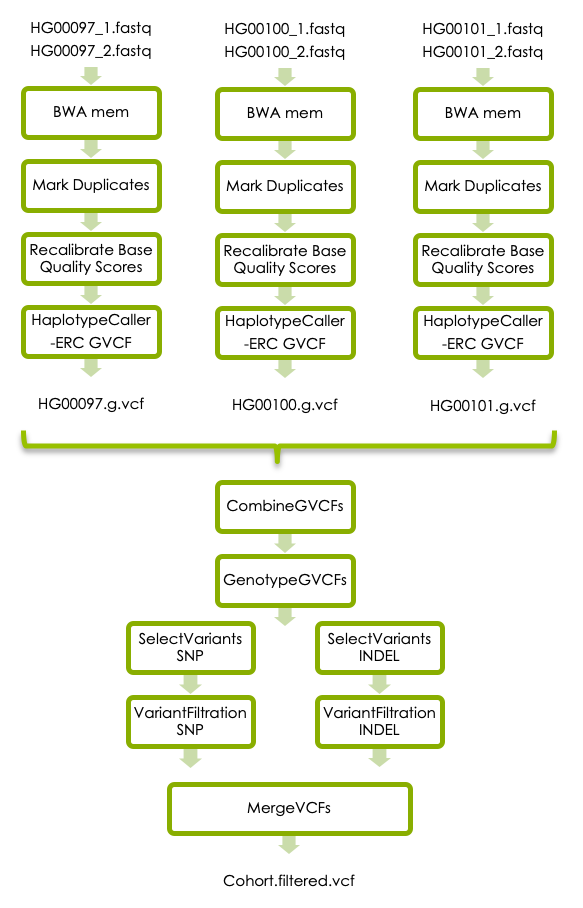

```{r,child="assets/header-lab.Rmd"}
```

```{r,eval=TRUE,include=FALSE}
library(yaml)
upid <- yaml::read_yaml("_site.yml")$uppmax_project
upres3 <- yaml::read_yaml("_site.yml")$uppmax_res_3
upres4 <- yaml::read_yaml("_site.yml")$uppmax_res_4
```

```{css,include=FALSE}
.workLocally{
background-color: red;
}
```

```{r,include=FALSE}
## VARIABLES
#colours
datadir <- "/sw/courses/ngsintro/reseq/data"
fastqdir <- "/sw/courses/ngsintro/reseq/data/fastq"
refdir <- "/sw/courses/ngsintro/reseq/data/ref"
bamdir <- "/sw/courses/ngsintro/reseq/data/bam"
vcfdir <- "/sw/courses/ngsintro/reseq/data/vcf"
bpbamdir <- "/sw/courses/ngsintro/reseq/data/best_practise_bam"
bpvcfdir <- "/sw/courses/ngsintro/reseq/data/best_practise_vcf"
col_uppmax <- "#f4f8e8"
col_local <- "#e5f4f8"
```
# Introduction {-}
Whole genome sequencing (WGS) is a comprehensive method for analyzing entire genomes. This workshop will take you through the process of calling germline short variants (SNVs and INDELs) in WGS data from three human samples. 
  
1. The first part of the workshop will guide you through a basic variant calling workflow in one sample. The aims are to get familiar with the bam and vcf file formats, and learn how to interpret the results of variant calling in Integrative Genomics Viewer (IGV).
2. If you have time, the next part of the workshop will show you how to perform joint variant calling in three samples. The aim here is that you should be able to interpret multi-sample vcf files and explain the differences between the g.vcf and vcf file formats. Also, if you are interested in learnding programming, the aim is to be able to combine individual linux commands into an SBATCH script.  
3. If you have time, the last part of the workshop will take you through the GATK best practices for germline short variant detection in three samples. The aim here is that you should learn how to use GATK's documentation so that you can analyze your own samples in the future.    

**General guide**
<div class="boxy boxy-primary boxy-lightbulb">
* You will work on the computing cluster Rackham at Uppmax
* In paths, please replace `<username>` with your actual UPPMAX username.
* In commands, please replace `<parameter>` with the correct parameter, for example your input file name, output file name, directory name, etc.
* Do not copy and paste commands from the exercise to terminal, as this can result in formatting errors. 
* Use tab completion.
* A line starting with `#` is a comment
* Running a command without parameters will often return a help message on how to run the command.
* After a command is completed, please check that the desired output file was generated and that it has a reasonable size (use `ls -l`). 
* A common mistake is to attempt to load input files that do not exist, or create output files where you don't have permission to write.
* Use output file names that describes what was done in the command.
* If you change the node you are working on you will need to reload the tool modules. 
* Google errors, someone in the world has run into EXACTLY the same problem you had and asked about it on a forum somewhere.
</p>
</div>

# Data description {-}
## Samples  {-}
The 1000 Genomes Project was the first project to sequence the entire genomes of a large number of people, to provide a comprehensive resource on human genetic variation. Data from the 1000 Genomes Project available through freely accessible public databases, and in this workshop, we will use 3 samples from the low coverage phase of the 1000 Genomes project.

Sample        | Population | Sequencing technology
------------- | ---------- | --------
HG00097       | British in England and Scotland    | Low coverage WGS
HG00100       | British in England and Scotland    | Low coverage WGS
HG00101       | British in England and Scotland    | Low coverage WGS 
## Genomic region {#Genomicregion -}  
The *LCT* gene on chromosome 2 encodes the lactase protein, which is responsible for the metabolism of lactose in mammals. Most mammals can not digest lactose as adults, but some humans can. Genetic variants upstream of the *LCT* gene lead to lactase persistence, wich means that the lactase protein is experssed also in aldulthood and the carrier can continue to digest lactose. The variant rs4988235, located at position chr2:136608646 in the HG19 reference genome, has been shown to lead to lactose persistence. The alternative allele (A on the forward strand and T on the reverse strand) creates a new transcription factor binding site that enables continued expression of the gene after weaning.
  
In this workshop we will use sequencing data for the region chr2:136545000-136617000 
chr2:136,039,147-136,662,073
in the 3 samples listed above to illustrate variant calling in NGS data. We will use chromosome 2 from hg19 as reference genome.  
  
For those interested in the details of the genetic bases for lactose tolerance, please read the first three pages of [Lactose intolerance: diagnosis, genetic, and clinical factors](https://www.ncbi.nlm.nih.gov/pmc/articles/PMC3401057/pdf/ceg-5-113.pdf) by Mattar et al. The variant rs4988235 is here referred to as LCT-13910C>T.  
  
## Data folder on UPPMAX {#Data -}  
All input data for this exercise is located in this folder on Rackham:
```{r,echo=FALSE,comment="",class.output="bash"}
cat(paste0(datadir))
```
The fastq files are located in this folder:
```{r,echo=FALSE,comment="",class.output="bash"}
cat(paste0(fastqdir))
```
Reference files, such as the reference genome in fasta format, are located in this folder: 
```{r,echo=FALSE,comment="",class.output="bash"}
cat(paste0(refdir))
```

# Preparations {-}
## Local workspace  {#preparelaptop -}  
The majority of the analyses in this workshop will be done on UPPMAX, but you will copy some of the resulting files to your laptop. Therefore, please start by creating a folder for this workshop on your laptop. It is up to you where you want to put this, but it can for example be a folder called *ngsworkflow* on Desktop. You need to have write permission in this folder. The folder you create here will be referred to as *local workspace* throughout this workshop. 

**For MobaXterm users**  
MobaXtert users need to set the *persistent home directory* to your local workspace. This means that your home directory in MobaXterm will be set to the folder that you created in the previous step.  
1. In MobaXterm click on the *Settings* tab, then choose *Configurations*.  
2. Click on the yellow folder icon in the line of *Persistent home directory*. Browse to the desired folder and click on *OK*.   
3. Then click *OK* to exit the *Configurations* window.  
4. Let MobaXterm restart to make the settings effective.  
Now your MobaXterm home directory is set to the folder you created for this lab. More details about this can be found in this [video](https://www.youtube.com/watch?v=ycUBjqyjORE&feature=youtu.be&t=2m47s)
  
## UPPMAX {-}
Please connect to the Rackham cluster on UPPMAX using `ssh`:
```bash
$ ssh -Y username@rackham.uppmax.uu.se
```  
  
### Workspace on UPPMAX {-}
During this lab you should work in your folder under the course's nobackup folder, just like you have done during the previous labs. Start by creating a workspace for this exercise in your folder, and then move into it. This folder will be referred to as your *UPPMAX workspace* throughout this workshop.  
```{r,echo=FALSE,comment="",class.output="bash"}
cat(paste0('mkdir /proj/',upid,'/nobackup/<username>/ngsworkflow\n'))
cat(paste0('cd /proj/',upid,'/nobackup/<username>/ngsworkflow'))
```
  
### Symbolic links to data {-}
The raw data files are located in the [Data](#Data) folder described above. Instead of copying the files to your workspace you should create symbolic links (soft-links) to them. Soft-linking files and folders allows you to work with them as if they were in your current directory, but without multiplying them.  
Create a symbolic link to the reference genome in your workspace:
```{r,echo=FALSE,comment="",class.output="bash"}
cat(paste0('ln -s ',refdir,'/human_g1k_v37_chr2.fasta'))  
```
Do the same with the fastq files:
```{r,echo=FALSE,comment="",class.output="bash"}
cat(paste0('ln -s ',fastqdir,'/HG00097_1.fq\n')) 
cat(paste0('ln -s ',fastqdir,'/HG00097_2.fq\n'))  
cat(paste0('ln -s ',fastqdir,'/HG00100_1.fq\n'))
cat(paste0('ln -s ',fastqdir,'/HG00100_2.fq\n'))
cat(paste0('ln -s ',fastqdir,'/HG00101_1.fq\n')) 
cat(paste0('ln -s ',fastqdir,'/HG00101_2.fq\n'))
```

### Book a node {-}
When you login to Rackham you enter the *login node*, which is not intended for compute intensive tasks. To be able to run analyses directly in the terminal you should therefore book a compute node (or in this case just one core of a node). Make sure you only do this once each day because we have reserved one core per student for the course.    
Use this reservation on day 1 of variant-calling:
```{r,echo=FALSE,comment="",class.output="bash"}
cat(paste0('salloc -A ',upid,' -t 04:00:00 -p core -n 1 --no-shell --reservation=',upres3,' &'))
```
Use this reservation on day 2 of variant-calling:
```{r,echo=FALSE,comment="",class.output="bash"}
cat(paste0('salloc -A ',upid,' -t 04:00:00 -p core -n 1 --no-shell --reservation=',upres4,' &'))
```
Once your job allocation has been granted (should not take long) you can connect to the node using `ssh`. To find out the name of your node, use:
```bash
squeue -u <username>
```
The node name is found under nodelist header, you should only see one. Connect to that node:  
```bash
ssh -Y <nodename>
```
  
### Accessing programs {#Accessingprograms -}
We will use several programs that are installed in the module system on UPPMAX. These modules must be loaded every time you login to Rackham, or when you connect to a new compute node.  
  
First load the `bioinfo-tools` module:
```bash
module load bioinfo-tools
```
This makes it possible to load the individual programs:
```bash
module load FastQC/0.11.8
module load bwa/0.7.17
module load samtools/1.10
module load GATK/4.1.4.1
```
You don't have to specify wich versions of the toos to use, but is recommended to do so for reproducibility if you want to rerun the  exact same analyses later.  
When loading the module GATK/4.1.4.1 you will get a warning message about the fact that GATK commands have been updated since the previous version of GATK. This is fine and you don't have to do anything about it. 
    
## Index the genome {-}
Tools that compare short reads with a large reference genome needs indexes of the reference genome to work efficiently. Before analysing the samples you therefore need to create index files for each tool. You don't have to understand the details of the generated index files to continue with this lab, just make sure that they are created.
  
Generate BWA index files:
```bash
bwa index -a bwtsw human_g1k_v37_chr2.fasta
```
Check to see that several new files have been created using `ls -l`.
  
Generate a Samtool index: 
```bash
samtools faidx human_g1k_v37_chr2.fasta
```
Check to see what file(s) were created using `ls -lrt`.

Genereate a GATK sequence dictionary:
```bash
gatk --java-options -Xmx7g CreateSequenceDictionary -R human_g1k_v37_chr2.fasta -O human_g1k_v37_chr2.dict
```
Again, check what file(s) were created using `ls -lrt`. 

# Variant calling in one sample
Now let's start the main part of the workshop, which will guide you through a basic variant calling workflow in one sample. The workflow consists of aligning the reads with [BWA](http://bio-bwa.sourceforge.net) and detecting variants with [HaplotypeCaller](https://gatk.broadinstitute.org/hc/en-us/articles/360037225632-HaplotypeCaller) as illustrated below. 
  


## Aligning reads

### BWA mem {#bwamem}

In the *UPPMAX workspace* you should now use `BWA mem` to align the reads to the reference genome.  
 
At the same time, you should add something called *read groups* to the reads in the fastq files. Read groups allow us to trace various technical features, such as which flowcell was used to generate the reads, and this is needed in order to perform variant calling with HaplotypeCaller. You are not expected to learn all the details of read groups here, but if you are interested in more information please read this article at [GATK-forum](https://gatk.broadinstitute.org/hc/en-us/articles/360035890671-Read-groups). The samples in this workshop come from the 1000 Genomes project, and we don't know how these reads were generated. Let's assume that each fastq file was generated from one library preparation (called *libraryx*), derived from one biological sample (called *HG00097*), that was run on one lane of a flowcell (called *lanex_flowcellx*) in the Illumina machine, and create a read group with id *readgroupx* that contains this information.   

  
The output from `BWA` should be parsed to `samtools sort`, which sorts the sam file according to chromosome position and then converts the sam file to the binary bam format. This saves space since no intermediary sam file is created.  
Please use this command for all of this:
```bash
bwa mem -R "@RG\\tID:readgroupx\\tPU:lanex_flowcellx\\tSM:HG00097\\tLB:libraryx\\tPL:illumina" -t 1 human_g1k_v37_chr2.fasta HG00097_1.fq HG00097_2.fq | samtools sort > HG00097.bam
```
Where -t 1 is the number of threads, which should be equal to the number of cores you booked. If you would have analysed the entire genome more threads would have been necessary.  You have to use a file redirect `>` for the output, otherwise it will be written to stdout (your screen).  

**NOTE: the read group is specific for each sample, so if you perform this step for another sample later on you need to change the SM tag in the read group from HG00097 to the new sample name.** 

Please check that the expected output file was generated and that it has content using `ls -lrt`. 

Next you need to index the output bam file so that programs can randomly access the sorted data without reading the whole file. This command creates an index file with the same name as the input bam file, except with a .bai extension:  
```bash
samtools index HG00097.bam
```
Please check what output file was generated this time. 
  
### Check bam with samtools
The bam file is binary so we cannot read it, but we can view it with `samtools view`. 
The header section of the bam file can be viewed separatedly with the `-H` flag:
```bash
samtools view -H HG00097.bam 
```
To look at the reads in the bam file just use `samtools view` without the `-H`. This will display the entire bam file which is quite large, so if you just want to look at the first 5 lines (for example) you can combine `samtools view` with `head`:
```bash
samtools view HG00097.bam | head -n 5 
```
For help with interpreting the bam file, please look at the sam/bam format definition at [Sequence Alignment/Map Format Specification](https://samtools.github.io/hts-specs/SAMv1.pdf).  
  
### Questions  
1. What does "SO:coordinate" in the "@HD" tag on the first line of the bam file mean?    
2. What does "SN:2" and "LN:243199373" in the "@SQ tag mean? 
3. What is encoded in the @RG tag?  
4. What is the leftmost mapping position of the first read in the bamfile? 
  
### Check bam in IGV
**Install IGV**  
Integrative Genomics Viewer (IGV) provides an interactive visualisation of the reads in a bam file. Here we will show you how to run IGV on your laptop. If you have not used IGV on your laptop before, then go to the IGV [download page](https://software.broadinstitute.org/software/igv/download), and follow the instructions to download it. It will prompt you to fill in some information and agree to license. Launch the viewer through web start. The 1.2 Gb version should be sufficient for our data.
  
**Download the bam file**  
You also need to download the bam file and the corresponding .bai file to your laptop. 
Navigate to your [local workspace](#preparelaptop), but do not log in to UPPMAX. Copy the .bam and .bam.bai files you just generated with this command:
```{r,echo=FALSE,comment="",class.output="bash"}
cat(paste0('scp <username>@rackham.uppmax.uu.se:/proj/',upid,'/nobackup/<username>/ngsworkflow/HG00097.bam* .'))
```
Check that the files are now present in your *local workspace* using `ls -lrt`. 
  
**Look at the bam file in IGV**  
* In `IGV`, go to the popup menu in the upper left and set it to `Human hg19`.  
* In the `Tools` menu, select `Run igvtools`. Choose the command `Count` and then use the `Browse` button next to the `Input File` line to select the bam file (not the bai) that you just downloaded. It will autofill the output file. Hit the `Run` button. This generates a .tdf file that allows you to see the coverage value for our bam file even at zoomed out views. `Close` the igvtools window.  
* In the `File` menu, select `Load from File` and select your BAMs (not the .bai or the .tdf), which should appear in the tracks window. You will have to zoom in before you can see any reads. You can either select a region by click and drag, or by typing a region or a gene name in the text box at the top. Remeber that we have data for the region chr2:136545000-136617000.
  
### Questions  
5. What is the read length?  
6. How can you estimate the coverage at a specific position in IGV? 
7. Which RefSeq Genes are located within the region chr2:136545000-136617000?
  
## Variant Calling

### HaplotypeCaller {#haplotypecaller}
Now we will detect short variants in the bam file using GATK's `HaplotypeCaller`. Go to your *UPPMAX workspace* and run:
```bash
gatk --java-options -Xmx7g HaplotypeCaller -R human_g1k_v37_chr2.fasta -I HG00097.bam -O HG00097.vcf 
```
Check what new files were generated with `ls -lrt`.  
  
### Explore the vcf file
Now you have your first vcf file containing the raw variants in the region chr2:136545000-136617000 in sample HG00097. Please look at the vcf file with `less` and try to understand its structure.  
  
Vcf files contains meta-information lines starting with *##*, a header line starting with *#CHROM*, and then data lines each containing information about one variant position in the genome. The header line defines the columns of the data lines, and to view the header line you can type this command:  
```bash
grep '#CHROM' HG00097.vcf
```
The meta-information lines starting with *##INFO* defines how the data in the *INFO* column is encoded, and the meta-information lines starting with *##FORMAT* defines how the data in the *FORMAT* column is encoded. To view the meta-information lines describing the *INFO* column use:
```bash
grep '##INFO' HG00097.vcf
```
To view the meta-information lines describing the *FORMAT* column use: 
```bash
grep '##FORMAT' HG00097.vcf
```
Now lets look at the details of one specific genetic variant at position 2:136545844:
```bash
grep '136545844' HG00097.vcf
```
For more detailed information about vcf files please have a look at [The Variant Call Format specification](https://samtools.github.io/hts-specs/VCFv4.2.pdf).
  
### Questions
8. What column of the VCF file contains genotype information for the sample HG00097?
9. What does *GT* in the *FORMAT* column of the data lines mean?
10. What genotype does the sample HG00097 have at position 2:136545844?
11. What does *AD* in the *FORMAT* column of the data lines mean? 
12. What are the allelic depths for the reference and alternative alles in sample HG00097 at position 2:136545844?
13. How many genetic variants was detected in the sample? The linux command `grep -v "#" HG00097.vcf | wc -l ` extracts all lines in HG00097.vcf that *don't* start with "#", and counts these lines.  

  
### Check vcf in IGV {#vcfinigv}
Download the vcf file and its index to the *local workspace* on your laptop, just like you did with the bam file and its index earlier. Navigate to your local workspace, but do not log in to UPPMAX. Copy the files that you just generated:
```{r,echo=FALSE,comment="",class.output="bash", class.source="workLocally"}
cat(paste0('scp <username>@rackham.uppmax.uu.se:/proj/',upid,'/nobackup/<username>/ngsworkflow/HG00097.vcf* .'))
```
Please replace `<username>` with your UPPMAX user name.  
Note that the * in the end of the file name means that you will download all files that start with *HG00097.vcf*, so you will also download the vcf index.  
Check that the files were properly downloaded to your *local workspace* using `ls -lrt`. 

In `IGV`, in the `File` menu, select `Load from File` and select your vcf file (not the .idx file) and the bam file (not the .bai file) that you downloaded earlier. The vcf and bam files should appear in the tracks window. You will now see all the variants called in HG00097. You can view all variants in the *LCT* gene by typing the gene name in the search box, and you can look specifically at the variant at position chr2:136545844 by typing that position in the serach box.  
  
### Questions  
14. Hoover the mouse over the upper row of the vcf track. What is the reference and alternative alleles of the variant at position chr2:136545844? 
15. Hoover the mouse over the lower row of the vcf track and look under "Genotype Information". What genotype does HG00097 have at position chr2:136545844? Is this the same as you found by looking directly in the vcf file in question 10?
16. Look in the bam track and count the number of reads that have "T" and "C", respectively,  at position chr2:136545844. How is this information captured under "Genotype Attributes"? (Again, hoover the mouse over the lower row of the vcf track.)
 
# Variant calling in cohort {#jointvc}
If you have time, you can now try joint variant calling in all three samples. Each sample has to be processed with `BWA mem` as above, and then with `HaplotypeCaller` with the flag `-ERC` to generate sample specific g.vcf files. The individual g.vcf fiels should subsequently be combined with GATK's `CombineGVCFs`, and translated into vcf format with GATK's `GenotypeGVCFs`. The workflow below shows how the three samples should be processed and combined.  
  


You can run all commands one by one in the terminal as you did in the first step of the workshop. We have also made intermediary files avaiable in case you don't have time to complete all steps, please see links under each analysis step. 
  
**Optionally** - If you are interested in programming and have time, you can also try to write a simple SBATCH script and run all steps automatically. Please check out the [SBATCH script](#sbatchscript) section below if you would like to try this. 
  
## BWA mem 
Run `BWA mem` for all three samples in the data set. `BWA mem` should be run exactly [as above](#bwamem) but with the new sample names. Please note that you also need to adjust the SM tag in the read group in each call so that it matches the sample name. Otherwise the [joint genotyping step](#jointgenotyping) will not work properly.  
  
If you run out of time, please click below to get pathts to precomputed bam files. 
```{r,accordion=TRUE,block.title=TRUE,echo=FALSE,comment="",class.output="sh"}
cat(paste0(bamdir,'/HG00097.bam\n')) 
cat(paste0(bamdir,'/HG00100.bam\n')) 
cat(paste0(bamdir,'/HG00101.bam\n')) 
```
 
## Generate g.vcf files {#generategvcf}
`HaplotypeCaller` should also be run for all three samples, but this time the output for each sample needs to be in g.vcf format. This is accomplished with a small change in the `HaploteypCaller` command: 
```bash
gatk --java-options -Xmx7g HaplotypeCaller -R human_g1k_v37_chr2.fasta -ERC GVCF -I <sample.bam> -O <sample>.g.vcf 
```
Please replace <sample> with the real sample names.
   
If you run out of time, please click below to get paths to the precomputed g.vcf files.
```{r,accordion=TRUE,block.title=TRUE,echo=FALSE,comment="",class.output="sh"}
cat(paste0(vcfdir,'/HG00097.g.vcf\n')) 
cat(paste0(vcfdir,'/HG00100.g.vcf\n')) 
cat(paste0(vcfdir,'/HG00101.g.vcf\n')) 
```
  
## Joint genotyping {#jointgenotyping}
Once you have the g.vcf files for all samples you should perform joint genotype calling. To do this you first need to combine all individual .g.vcf files to one file using `CombineGVCFs`:
```bash
gatk --java-options -Xmx7g CombineGVCFs -R human_g1k_v37_chr2.fasta -V <sample1>.g.vcf -V <sample2>.g.vcf -V <sample3>.g.vcf -O cohort.g.vcf
```
Please replace `<sample1>`, `<sample2>`, `<sample3>` with the real sample names.
  
Then run GATK's `GenoteypeGVC` to generate a vcf file:
```bash
gatk --java-options -Xmx7g GenotypeGVCFs -R human_g1k_v37_chr2.fasta -V cohort.g.vcf -O cohort.vcf
```
   
If you run out of time, please click below to get paths to the precomputed cohort.g.vcf and cohort.vcf files.
```{r,accordion=TRUE,block.title=TRUE,echo=FALSE,comment="",class.output="sh"}
cat(paste0(vcfdir,'/cohort.g.vcf\n')) 
cat(paste0(vcfdir,'/cohort.vcf\n')) 
```

### Questions {#jointvariantcallingquestions}
17. How many data lines do the cohort.g.vcf file have? You can use the linux command `grep -v "#" cohort.g.vcf` to extract all lines in "cohort.g.vcf" that don't start with "#", then `|`, and then `wc -l` to count those lines.  
18. How many data lines do the cohort.vcf file have?  
19. Explain the difference in number of data lines.  
20. Look at the header line of the cohort.vcf file. What columns does it have? 
21. What is encoded in the last three columns of the data lines?
  
## SBATCH script {#sbatchscript}
**Optionally** - This section is only for those of you who want to try to run all steps automatically in bash scripts. 
To learn more about SLURM and SBATCH scripts please look the [SLURM user guide](https://www.uppmax.uu.se/support/user-guides/slurm-user-guide/) on UPPMAX website.  
Below is a skeleton script that can be used as a template. Please modify it to run all the steps in part two of this workshop. 
```bash
#!/bin/bash
#SBATCH -A g2019031
#SBATCH -p core
#SBATCH -n 1
#SBATCH -t 1:00:00
#SBATCH -J jointGenotyping
module load bioinfo-tools
module load bwa/0.7.17
module load samtools/1.10
module load GATK/4.1.4.1
## loop through the samples:
for sample in HG00097 HG00100 HG00101;
do
  echo "Now analyzing: "$sample
  #Fill in the code for running bwa-mem for each sample here
  #Fill in the code for samtools index for each sample here 
  #Fill in the code for HaplotypeCaller for each sample here
done
#Fill in the code for CombineGVCFs for all samples here
#Fill in the code for GenotypeGVCFs here
```
Please save the sbatch script in your UPPMAX folder and call it "joint_genotyping.sbatch" or similar. Make the script executable by this command:
```bash
chmod u+x joint_genotyping.sbatch
```
To run the sbatch script in the SLURM queue, use this command:  
```bash
sbatch joint_genotyping.sbatch
```
If you have an active node reservation you can run the script as a normal bash script:
```bash
./joint_genotyping.sbatch
```
If you would like more help with creating the sbatch script, please look at our example solution:
```{r,accordion=TRUE,block.title=TRUE,echo=FALSE,comment="",class.output="sh"}
cat(paste0('#!/bin/bash
#SBATCH -A g2019031
#SBATCH -p core
#SBATCH -n 1
#SBATCH -t 1:00:00
#SBATCH -J jointGenotyping

module load bioinfo-tools
module load bwa/0.7.17
module load samtools/1.10
module load GATK/4.1.4.1

for sample in HG00097 HG00100 HG00101;
do
  echo "Now analyzing: "$sample
  bwa mem -R "@RG\\tID:readgroupx\\tPU:flowcellx_lanex\\tSM:"$sample"\\tLB:libraryx\\tPL:illumina" -t 1 human_g1k_v37_chr2.fasta $sample"_1.fq" $sample"_2.fq" | samtools sort > $sample".bam"
  samtools index $sample".bam"
  gatk --java-options -Xmx7g HaplotypeCaller -R human_g1k_v37_chr2.fasta -ERC GVCF -I $sample".bam" -O $sample".g.vcf"
done
gatk --java-options -Xmx7g CombineGVCFs -R human_g1k_v37_chr2.fasta -V HG00097.g.vcf -V HG00100.g.vcf -V HG00101.g.vcf -O cohort.g.vcf
gatk --java-options -Xmx7g GenotypeGVCFs -R human_g1k_v37_chr2.fasta -V cohort.g.vcf -O cohort.vcf'
))
```  

Please answer the [questions ](#jointvariantcallingquestions) above.
  
## Check combined vcf file in IGV
Download the file cohort.vcf and its index, as well as HG00100.bam and HG00101.bam and their indexes to your *local workspace* as described [above]{#downloaddata}. Then open cohort.vcf, HG00097.bam, HG00100.bam and HG00101.bam in IGV as described [above]{#vcfinigv}. This time lets look at the variant rs4988235, located at position chr2:136608646 in the HG19 reference genome, that has been shown to lead to lactose persistence. 
  
### Questions
22. What is the reference and alternative alleles at chr2:136608646?
23. What genotype do the three samples have at chr2:136608646? Note how genotypes are color coded in IGV.
24. Should any of the individuals avoid drinking milk?   
25. Now compare the data shown in IGV with the data in the VCF file. Extract the row for the chr2:136608646 variant in the cohort.vcf file, for example using `grep '136608646' cohort.vcf`. What columns of the vcf file contain the information shown in the upper part of the vcf track in IGV?
26. What columns of the vcf file contain the information shown in the lower part of the vcf track?
27. Zoom out so that you can see the *MCM6* and *LCT* genes. Is the variant at chr2:136608646 locate within the LCT gene?  
If you are interested in how this variant affects lactose tolerance please read the article by Mattar et al presented [above](#Genomicregion), or in [OMIM](https://www.omim.org/entry/601806#0001).
  

# GATK's best practices
The third part of this workshop will take you through additional refinement steps that are recommended in [GATKs best practices for germline short variant discovery](https://gatk.broadinstitute.org/hc/en-us/articles/360035535932-Germline-short-variant-discovery-SNPs-Indels-), illustrated in the flowchart below. You can either run the steps command by command in your reserved node, or a similar SBATCH script as described above.  
The additional steps in the best practise workflow was not covered in the variant-calling lecture on Wednesday afternoon. There will be a short lecture about this on Thursday morning at 9 am. However, if you reach this step earlier you can have a look at this [prerecorded video of the same lecture](https://youtu.be/b7VV6e5q6ss).  

{width=80%}
  
## BWA mem 
Run `BWA mem` for all three samples in the data set. `BWA mem` should be run exactly [as above](#bwamem) but with the new sample names. Please note that you also need to update the SM tag in the read group to the new sample name. 
  
## Mark Duplicates
Sometimes the same DNA fragment is sequenced multiple times, which leads to multiple reads from the same fragment in the fastq file. This can occur due to PCR amplification in the library preparation, or if one read cluster is incorrectly detected as multiple clusters by the sequencing instrument. 
If a duplicated read contains a genetic variant, the ratio of the two alleles might be obscured, which can lead to incorrect genotyping. It is therefore recommended (in most cases) to mark duplicate reads so that they are counted as one during genotyping. 
  
Please read about Picard's `MarkDuplicates` [here](https://gatk.broadinstitute.org/hc/en-us/articles/360037225972-MarkDuplicates-Picard-). Picard's MarkDuplicates has recently been incorporated into the GATK suite, but the usage example in GATKs documentation still describes how to call it via the stand alone Picard program. A usage example for the version of MarkDuplicates that is incorporated in GATK is (with this you don't have to load the Picard module): 
```bash
gatk --java-options -Xmx7g MarkDuplicates \
      -I input.bam \
      -O marked_duplicates.bam \
      -M marked_dup_metrics.txt
```
If you would like more help you can sneak peek at our example solution for HG00097 below. 
```{r,accordion=TRUE,block.title=TRUE,echo=FALSE,comment="",class.output="sh"}
cat(paste0('gatk --java-options -Xmx7g MarkDuplicates -I HG00097.bam -O HG00097.md.bam -M HG00097_mdmetrics.txt'))
```
  
## Recalibrate Base Quality Scores
Another source of error is systematic biases in the assignment of base quality scores by the sequencing instrument. This can be corrected by GATK's [Base Quality Score Recalibration](https://gatk.broadinstitute.org/hc/en-us/articles/360035890531-Base-Quality-Score-Recalibration-BQSR-). 
In short, you first use [BaseRecalibrator](https://gatk.broadinstitute.org/hc/en-us/articles/360037593511-BaseRecalibrator) to build a recalibration model, and then [ApplyBQSR](https://gatk.broadinstitute.org/hc/en-us/articles/360037225212-ApplyBQSR) to recalibrate the base qualities in your bam file.  
`BaseRecalibrator` requires a file with known SNPs as input. This file is available in the data folder on UPPMAX:
```{r,echo=FALSE,comment="",class.output="bash"}
cat(paste0(refdir,'/1000G_phase1.snps.high_confidence.b37.chr2.vcf'))
```
 Please use GATK's documentation to recalibrate the base quality scores in your data. If you would like more help you can sneak peek at our example solution for HG00097 below. 
```{r,accordion=TRUE,block.title=TRUE,echo=FALSE,comment="",class.output="sh"}
cat(paste0('gatk --java-options -Xmx7g BaseRecalibrator -R human_g1k_v37_chr2.fasta -I HG00097.md.bam> --known-sites ',refdir,'/1000G_phase1.snps.high_confidence.b37.chr2.vcf -O HG00097.recal.table\n'))
cat(paste0('gatk --java-options -Xmx7g ApplyBQSR -R human_g1k_v37_chr2.fasta -I HG00097.md.bam --bqsr-recal-file HG00097.recal.table -O HG00097.recal.bam'))
```

## Generate g.vcf files
`HaplotypeCaller` should also be run for all three samples, and the output should be in g.vcf exactly as described [above](#generategvcf). This time use recalibrated bam files as input. 
  
## Joint genotyping
Once you have the g.vcf files for all samples you should perform joint genotype calling. This should be done with the commands CombineGVCFs and GenotypeGVCFs exactly as described  [above](#jointgenotyping), but you should use the g.vcf files generated from the recalibrated bam files as input.
     
## Variant Filtering
HaplotypeCaller is designed to be very sensitive, which is good because it minimizes the chance of missing real variants. However, it means that the number of false positives can be quite large, so we need to filter the raw callset. GATK offers two ways to filter variants:  
1. The variant quality score recalibration (VQSR) method uses machine learning to identify variants that are likely to be real. This is the best method if you have a lot of data, for example one whole genome sequence sample or several whole exome samples.  
2. If you have less data you can use hard filters as described [here](https://gatk.broadinstitute.org/hc/en-us/articles/360035531112?id=2806#2). 
  
Since we have very little data we will use hard filters. The parameters are slightly different for SNVs and INDELs, so you need to first select all SNVs using [SelectVariants](https://gatk.broadinstitute.org/hc/en-us/articles/360037225432-SelectVariants) and filter them using [VariantFiltration](https://gatk.broadinstitute.org/hc/en-us/articles/360037226192-VariantFiltration) with the parameters suggested for SNVs. Then select all INDELs and filter them with the parameters suggested for INDELs. Finally merge the SNVs and INDELs to get all variants in one file using [MergeVCFs](https://gatk.broadinstitute.org/hc/en-us/articles/360037226612-MergeVcfs-Picard-). If you would like more help you can sneak peek at our example solution for HG00097 below.  
Filter SNVs:
```{r,accordion=TRUE,block.title=TRUE,echo=FALSE,comment="",class.output="sh"}
cat(paste0('gatk --java-options -Xmx7g SelectVariants \
  -R human_g1k_v37_chr2.fasta \
  -V cohort.vcf \
  --select-type-to-include SNP \
  -O cohort.snvs.vcf
  
gatk --java-options -Xmx7g VariantFiltration \
  -R human_g1k_v37_chr2.fasta \
  -V cohort.snvs.vcf \
  -O cohort.snvs.filtered.vcf \
  --filter-name QDfilter --filter-expression "QD < 2.0"  \
  --filter-name MQfilter --filter-expression "MQ < 40.0"  \
  --filter-name FSfilter --filter-expression "FS > 60.0"'))
```
Filter INDELs: 
```{r,accordion=TRUE,block.title=TRUE,echo=FALSE,comment="",class.output="sh"}
cat(paste0('gatk --java-options -Xmx7g SelectVariants \
  -R human_g1k_v37_chr2.fasta \
  -V cohort.vcf \
  --select-type-to-include INDEL \
  -o cohort.indels.vcf

gatk --java-options -Xmx7g VariantFiltration \
  -R human_g1k_v37_chr2.fasta \
  -V cohort.indels.vcf \
  -O cohort.indels.filtered.vcf \
  --filter-name QDfilter --filter-expression "QD < 2.0" \
  --filter-name FSfilter --filter-expression "FS > 200.0"'))
```
Merge filtered SNVs and INDELs: 
```{r,accordion=TRUE,block.title=TRUE,echo=FALSE,comment="",class.output="sh"}
cat(paste0('gatk --java-options -Xmx7g MergeVcfs -I cohort.snvs.filtered.vcf -I cohort.indels.filtered.vcf -O cohort.filtered.vcf'))
```
  
Open your filtered vcf with `less` and page through it. It still has all the variant lines, but the FILTER column that was blank before is now filled in, with PASS or a list of the filters it failed. Note also that the filters that were run are described in the header section.

## Precomputed files
If you run out of time, please click below to get the path to precomputed bam and vcf files for the GATK's best practices section.
```{r,accordion=TRUE,block.title=TRUE,echo=FALSE,comment="",class.output="sh"}
cat(paste0('Path to intermediary and final bam files: ',bpbamdir,'\n'))
cat(paste0('Path to intermediary and final vcf files: ',bpvcfdir,'\n'))
```


## SBATCH script {#bpscript}
We recommend you to incorporate the new steps into an SBATCH script similar to the one you created above for [joint variant calling](#sbatchscript). Please try to complete the script for GATK's best practices workflow. If you run out of time you can sneak peek at our example solution below. 
```{r,accordion=TRUE,block.title=TRUE,echo=FALSE,comment="",class.output="sh"}
cat(paste0('#!/bin/bash
#SBATCH -A g2019031
#SBATCH -p core
#SBATCH -n 1
#SBATCH -t 1:00:00
#SBATCH -J BestPractise

## load modules
module load bioinfo-tools
module load bwa/0.7.17
module load samtools/1.10
module load GATK/4.1.4.1

#Define path to reference genome
ref="/sw/courses/ngsintro/reseq/data/ref"

#Make symbolic links
ln -s /sw/courses/ngsintro/reseq/data/ref/human_g1k_v37_chr2.fasta
ln -s /sw/courses/ngsintro/reseq/data/fastq/HG00097_1.fq
ln -s /sw/courses/ngsintro/reseq/data/fastq/HG00097_2.fq
ln -s /sw/courses/ngsintro/reseq/data/fastq/HG00100_1.fq
ln -s /sw/courses/ngsintro/reseq/data/fastq/HG00100_2.fq
ln -s /sw/courses/ngsintro/reseq/data/fastq/HG00101_1.fq
ln -s /sw/courses/ngsintro/reseq/data/fastq/HG00101_2.fq

#Index reference genome
bwa index -a bwtsw human_g1k_v37_chr2.fasta
samtools faidx human_g1k_v37_chr2.fasta
gatk --java-options -Xmx7g CreateSequenceDictionary -R human_g1k_v37_chr2.fasta -O human_g1k_v37_chr2.dict

## loop through the samples:
for sample in HG00097 HG00100 HG00101;
do
  echo "Now analyzing: "$sample
  #Map the reads:
  bwa mem -R "@RG\\tID:readgroupx\\tPU:flowcellx_lanex\\tSM:"$sample"\\tLB:libraryx\\tPL:illumina" -t 1 human_g1k_v37_chr2.fasta $sample"_1.fq" $sample"_2.fq" | samtools sort > $sample".bam"
  samtools index $sample".bam"
  #Mark duplicates:
  gatk --java-options -Xmx7g MarkDuplicates -I $sample".bam" -O $sample".md.bam" -M $sample"_mdmetrics.txt"
  #Base quality score recalibration:
  gatk --java-options -Xmx7g BaseRecalibrator -R human_g1k_v37_chr2.fasta -I $sample".md.bam" --known-sites $ref"/1000G_phase1.snps.high_confidence.b37.chr2.vcf" -O $sample".recal.table"
  gatk --java-options -Xmx7g ApplyBQSR -R human_g1k_v37_chr2.fasta -I $sample".md.bam" --bqsr-recal-file $sample".recal.table" -O $sample".recal.bam"
  #HaplotypeCaller in -ERC mode:
  gatk --java-options -Xmx7g HaplotypeCaller -R human_g1k_v37_chr2.fasta -ERC GVCF -I $sample".bam" -O $sample".g.vcf" 
done
#Joint genotyping:
gatk --java-options -Xmx7g CombineGVCFs -R human_g1k_v37_chr2.fasta -V HG00097.g.vcf -V HG00100.g.vcf -V HG00101.g.vcf -O cohort.g.vcf
gatk --java-options -Xmx7g GenotypeGVCFs -R human_g1k_v37_chr2.fasta -V cohort.g.vcf -O cohort.vcf
#Variant filtration SNPs:
gatk --java-options -Xmx7g SelectVariants -R human_g1k_v37_chr2.fasta -V cohort.vcf --select-type-to-include SNP -O cohort.snvs.vcf
gatk --java-options -Xmx7g VariantFiltration -R human_g1k_v37_chr2.fasta -V cohort.snvs.vcf -O cohort.snvs.filtered.vcf --filter-name QDfilter --filter-expression "QD < 2.0" --filter-name MQfilter --filter-expression "MQ < 40.0"  --filter-name FSfilter --filter-expression "FS > 60.0"
#Variant filtration indels
gatk --java-options -Xmx7g SelectVariants -R human_g1k_v37_chr2.fasta -V cohort.vcf --select-type-to-include INDEL -O cohort.indels.vcf
gatk --java-options -Xmx7g VariantFiltration -R human_g1k_v37_chr2.fasta -V cohort.indels.vcf -O cohort.indels.filtered.vcf --filter-name QDfilter --filter-expression "QD < 2.0" --filter-name FSfilter --filter-expression "FS > 200.0"
#Merge filtered SNPs and indels
gatk --java-options -Xmx7g MergeVcfs -I cohort.snvs.filtered.vcf -I cohort.indels.filtered.vcf -O cohort.filtered.vcf'
))
```  
  
## Questions  
28. How many variants are present in the cohort.filtered.vcf file?  
29. How many variants have passed the filters?  
30. Look at the variants that did not pass the filters using `grep -v 'PASS' cohort.filtered.vcf`. Try to understand why these variants did't pass the filter.

# Clean up {-}
When the analysis is done and you are sure that you have the desired output, it is a good practise to remove intermediary files that are no longer needed. This will save disk space, and will be a crucial part of the routines when you work with your own data. Please think about which files you need to keep if you would like to go back and look at this lab later on. Remove the other files.
  
# Answers {-}
When you have finished the exercise, please have a look at this document with [answers to all questions](lab_vc_answers.pdf), and compare them with your answers. 

# Additional information {-}
* Here is a technical documentation of [Illumina Quality Scores](https://www.illumina.com/documents/products/technotes/technote_understanding_quality_scores.pdf)
* Tools used or referenced 
  * [BWA](http://bio-bwa.sourceforge.net/bwa.shtml)
  * [FastQC](https://www.bioinformatics.babraham.ac.uk/projects/fastqc/)
  * [MultiQC](http://multiqc.info/)
  * [Picard](https://broadinstitute.github.io/picard/command-line-overview.html)
  * [GATK](https://software.broadinstitute.org/gatk/)
  * [samtools](http://www.htslib.org/)

<!--# Alternative cluster
The teachers may inform you that we will use the high performance computing center NSC instead of UPPMAX during this workshop. If so, please follow this link to [run the workshop on NSC](lab_vc_tetralith.html).-->

# Thanks for today! {-}