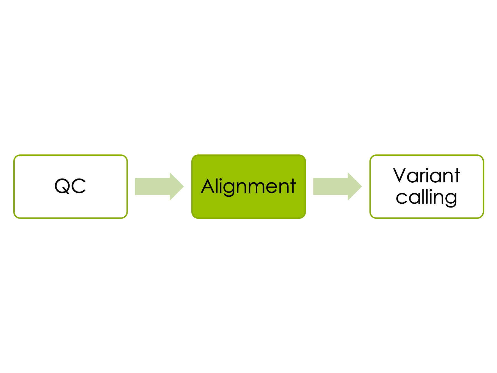
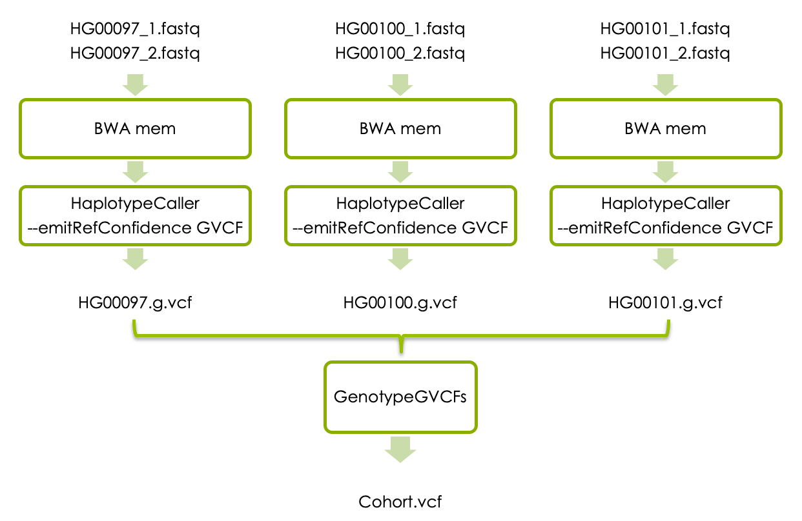
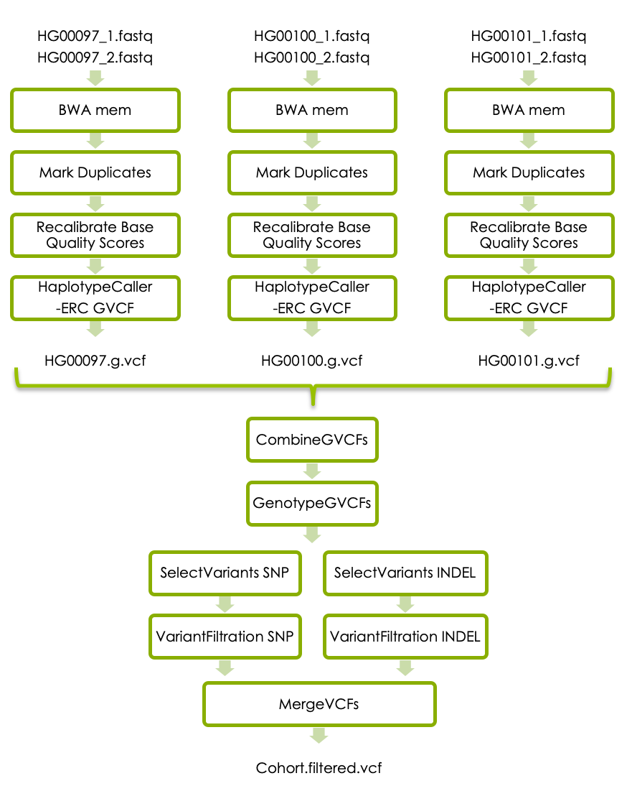

```{r,child="assets/header-lab.Rmd"}
```

```{r,eval=TRUE,include=FALSE}
library(yaml)
upid <- yaml::read_yaml("_site.yml")$uppmax_project
upres3 <- yaml::read_yaml("_site.yml")$uppmax_res_3
upres4 <- yaml::read_yaml("_site.yml")$uppmax_res_4
```

```{css,include=FALSE}
.workLocally{
background-color: red;
}
```

```{r,include=FALSE}
## VARIABLES
#colours
datadir <- "/sw/courses/ngsintro/reseq/data"
fastqdir <- "/sw/courses/ngsintro/reseq/data/fastq"
refdir <- "/sw/courses/ngsintro/reseq/data/ref"
col_uppmax <- "#f4f8e8"
col_local <- "#e5f4f8"
```

# Introduction
Rapidly dropping sequencing costs and the ability to obtain information about the entire genetic code has made whole genome sequening (WGS) a powerful research tool for detecting genetic variation. This workshop will take you thourgh the process of calling short variants (SNPs and indels) in whole geonome sequence data from three samples. 
  
1. The first part of the workshop will guide you through a basic short variant calling workflow for just one sample. The aim is to get familiar with the bam and vcf file formats, and how to interpret the results of variant calling in Integrative Genomics Viewer (IGV).
2. Next, if you have time, we will expand the workflow and perform joint variant calling on three samples. Here we will also give you an idea of how you can combine individual linux commands into a workflow that can be started as an SBATCH script.
3. The last part of the exercise, if you have time, will take you thourgh some additional steps that are recommended by GATK best practise short variant detection. 
  
## Samples
The 1000 Genomes Project was the first project to sequence the entire genomes of a large number of people, to provide a comprehensive resource on human genetic variation. Data from the 1000 Genomes Project available through freely accessible public databases, and in this workshop we will use 3 samples from the low converage phase of the 1000 Genomes project.

Sample        | Population | Sequencing technology
------------- | ---------- | --------
HG00097       | British in England and Scotland    | Low coverage WGS
HG00100       | British in England and Scotland    | Low coverage WGS
HG0010q       | British in England and Scotland    | Low coverage WGS 
  
## The *LCT* locus
The *LCT* gene on chromosome 2 encodes the lactase protein, which is responible for the metabolism of lactose in mammals. Most mammals can not digest lactose as adults, but some humans tolerate lactose also in adulthood. Genetic variants upstream of the human *LCT* control how lactose is tolerated in adults, and the variant **rs4988235** (located at at position chr2:136608646 in HG19) has been shown to lead to lactose persistence.  
  
In this workshop we will work with sequencing data (fastq files) for a small region on chromosome 2 that covers the LCT gene and upstream region: 
chr2:136545000-136617000

We will use this region as an example case to illustrate how you can look for genetic variation in NGS data. 
To learn more about the genetic bases for lactose tolerance please read the first three pages of this publication by Mattar et al. The variant (rs4988235) is here referred to as LCT-13910C>T. [Lactose intolerance: diagnosis, genetic, and clinical factors](https://www.ncbi.nlm.nih.gov/pmc/articles/PMC3401057/pdf/ceg-5-113.pdf).
  
## General guide
<div class="boxy boxy-lightbulb">
* In paths, please replace `<username>` with your actual UPPMAX username.
* In commands, please replace `<parameter>` with the correct parameter, for example your input file name, output file name, directory name, etc.
* Running a command without parameters will often return a help message on how to run the command.
* Copying and pasting commands from the exercise to terminal can result in formatting errors. 
* Use tab completion.
* A line starting with `#` is a comment
* If you change the node you are working on you will need to reload the tool modules. Please see [Accessing programs](#Acessingprograms) below.
* Check that the output file exists and is a reasonable size (use `ls -l`) after a command is completed as a quick way to see that the command went well. 
* A common mistake is to attempt to load input files that do not exist, or create output files where they cannot write.
* Giving good names to your output files that describes what has been done will help you.
* Google errors, someone in the world has run into EXACTLY the same problem you had and asked about it on a forum somewhere.
</p>
</div>
  
# Data {#Data}
All input data for this exercise is located in the folder on Rackham:
```{r,echo=FALSE,comment="",class.output="bash"}
cat(paste0(datadir))
```

The fastq files are located in this folder:
```{r,echo=FALSE,comment="",class.output="bash"}
cat(paste0(fastqdir))
```

You will also need the reference genome in fasta format. This, and a few other refence files are located in this folder: 
```{r,echo=FALSE,comment="",class.output="bash"}
cat(paste0(refdir))
```

# Preparations

## Local workspace  {#preparelaptop}
The majority of the analyses in this workshop will be done on Uppmax, but we will copy some of the resulting files to our laptops so that we can look at them in graphical browsers. Therefore, please start by creating a folder for this workshop on your local laptop. 
It is up to you where you want to put this, but it can for example be a folder called "ngsworkflow" on Desktop. You need to have write permission in this folder. The folder you create here will be refered to as "local workspace" throughout this workshop. 

## Uppmax
Connect to UPPMAX.
```bash
$ ssh -Y username@rackham.uppmax.uu.se
```
Book a core. Make sure you only do this once depeding on the day.  
Use this reservation on day 1 of variant-calling:
```{r,echo=FALSE,comment="",class.output="bash"}
cat(paste0("salloc -A ",upid," -t 04:00:00 -p core -n 1 --no-shell --reservation=",upres3," &"))
```
Use this reservation on day 2 of variant-calling:
```{r,echo=FALSE,comment="",class.output="bash"}
cat(paste0("salloc -A ",upid," -t 04:00:00 -p core -n 1 --no-shell --reservation=",upres4," &"))
```
Once your job allocation has been granted (should not take long) you can connect to the node using `ssh`. To find out the name of your node, use:
```bash
squeue -u <username>
# Node name is found under nodelist header. You should only see one node here.
```
and to connect to the node:
```bash
ssh -Y <nodename>
```
  
### Workspace on Uppmax
During this lab you should work in your folder under the course's nobackup folder, just like you have done during the previous labs. Start by creating a workspace for this exercise in your folder, and then move into it. This folder will be refered to as your "uppmax workspace" throughout this workshop.  

```{r,echo=FALSE,comment="",class.output="bash"}
cat(paste0("mkdir /proj/",upid,"/nobackup/<username>/ngsworkflow\n"))
cat(paste0("cd /proj/",upid,"/nobackup/<username>/ngsworkflow"))
```
  
### Symbolic links to data
The raw fastq files are located in the [Data](#Data) folder described above. In stead of copying the files to your workspace you should create symbolic links (soft-links) to them. Soft-linking files and folders allows us to work them as if they were in in your work directory, but we avoid multiplying them.   
Create a symbolic link to the reference in your workspace:
```{r,echo=FALSE,comment="",class.output="bash"}
cat(paste0("ln -s ",refdir,"/human_g1k_v37_chr2.fasta"))  
```

Do the same with the fastq files:
```{r,echo=FALSE,comment="",class.output="bash"}
cat(paste0("ln -s ",fastqdir,"/HG00097_1.fq\n")) 
cat(paste0("ln -s ",fastqdir,"/HG00097_2.fq\n"))  
cat(paste0("ln -s ",fastqdir,"/HG00100_1.fq\n"))
cat(paste0("ln -s ",fastqdir,"/HG00100_2.fq\n"))
cat(paste0("ln -s ",fastqdir,"/HG00101_1.fq\n")) 
cat(paste0("ln -s ",fastqdir,"/HG00101_2.fq\n"))
```
  
### Accessing programs {#Accessingprograms}
We will use several programs that are installed in the module system on Uppmax. First load the `bioinfo-tools` module:
```bash
module load bioinfo-tools
```
This makes it possible to load the individual programs we need:
```bash
module load FastQC/0.11.8
module load bwa/0.7.17
module load samtools/1.10
module load picard/2.20.4
module load GATK/4.1.4.1
```
You don't HAVE to specify version number when you load a tool, but it is recommended for reproducability if you want to rerun the exact same commands later.  
Picard and GATK are java programs, which means that we need the path to the program file, therefore UPPMAX sets a variable when you load these modules ($GATK_HOME or $PICARD_HOME).  

  
## Index the genome
Tools that compare (short) reads with a (large) reference genome needs genome index files to allow efficient random access to the reference genome. Before we can begin analysing our samples we therefore need to create index files for each tool.  
  
To generate several BWA index files:
```bash
bwa index -a bwtsw human_g1k_v37_chr2.fasta
```
Check to see that several new files have been created using `ls -l`.
  
Generate a Samtool index: 
```bash
samtools faidx human_g1k_v37_chr2.fasta
```
Check to see what file(s) were created using `ls -lrt`.
  
Generate a sequence dictionary for Picard:
```bash
java -Xmx7g -jar $PICARD_HOME/picard.jar CreateSequenceDictionary R=human_g1k_v37_chr2.fasta O=human_g1k_v37_chr2.dict
```
You will get a warning about upcoming command line syntax changes for Picard, but you can ignore them.  

Again, check that the last command generated a new index file using `ls -lrt`

# Part one
## Quality control

  
### FastQC  
We will use `FastQC` to check the qualiy scores of the reads in the fastq. The output is a .html document that shows the quality score along the reads, and other information. 
First create a folder where the output from FastQC will be stored:
```bash
mkdir fastqc 
```
Then run FastQC on the first sample, and direct the output to your new fastqc folder:
```bash
fastqc -q HG00097_1.fq HG00097_2.fq -o fastqc
```
  
### Dowload data to laptop {#downloaddata}
Uppmax is a compute cluster with great analysis capacity, but when it comes to displaying data graphically it is usually more efficient to dowload the data to your local computer. We will therefore download the .html files generated by `FastQC` using `scp`, and look at them in using a web-browser on your laptop. 
Open a new terminal and navigate to your [local workspace](#preparelaptop). Do not log in to UPPMAX. Copy the .html files generated above with this command:
```{r,echo=FALSE,comment="",class.output="bash"}
cat(paste0("scp <username>@rackham.uppmax.uu.se:/proj/",upid,"/nobackup/<username>/ngsworkflow/fastqc/*.html ."))
```
Please replace `<username>` with your uppmax user name.
Check that the files are now present in the local workspace using `ls -lrt`. 

Open a webbrowser in your local computer and open the two html files that you just dowloaded.  
**Questions:**   
* Look at the section "Sequence Length Distribution". How long are the reads?
* Look at the "per base sequence quality". How many bases in the reads have a median phred-score above 28?
* Are the quality scores higher for the first strand reads or the second strand reads?
Phred scores 

## Aligning reads


### BWA mem {#bwamem}
In the Uppmax workspace you will now use `BWA mem` to align the reads to the reference genome.  
 
At the same time you will add something called read groups to the reads in the fastq files. Read groups allow us to trace various technical features, such as which flowcell was used to generate the reads, and this is needed in order to perform variant calling with HaplotypeCaller. For a detailed description of read groups, please read this article at [GATK-forum](https://gatkforums.broadinstitute.org/gatk/discussion/6472/read-groups).   
The samples in this workshop comes from the 1000 Genomes project, and we don't have the experimental details of how the reads were generated. However, we assume that each fastq file was generated from one library preparation (called "libraryx"), derived from one biological sample (called "HG00097"), that was run on one lane of a flowcell (called "flowcellx_lanex") in the Illumina machine. We create a readgroup with id "readgroupx" that contains this information.   
  
The output from BWA should be parsed to `samtools sort`, which sorts the sam file according to chromosome position and then converts the sam file to the binary bam format. This saves space since no intermediary sam file is created!  
  
```bash
bwa mem -R "@RG\\tID:readgroupx\\tPU:flowcellx_lanex\\tSM:HG00097\\tLB:libraryx\\tPL:illumina" -t 1 human_g1k_v37_chr2.fasta HG00097_1.fq HG00097_2.fq | samtools sort > HG00097.bam
```
Where -t 1 is the number of threads to use (the number of cores you booked). If you would have analysed the entire genome more cores and threads would have been necessary.  
You have to use a file redirect `>` for the output, otherwise it will be written to stdout (your screen).  

Please check that the expected output file was generated and that it has content. 

Next we need to index the output bam file so that programs can randomly access the sorted data without reading the whole file. This creates an index file with the same name as the input bam file, except with a .bai extension.

```bash
samtools index HG00097.bam
```
Please check what output file was generated this time. 

### check bam with samtools
The bam file is binary so we can not direct read it, but we can view it with `samtools view`. 
The header section of the bam file can be viewed separatedly with the `-H` flag:
```bash
samtools view -H HG00097.bam 
```
Please look at the sam/bam format definition at [Sequence Alignment/Map Format Specification](https://samtools.github.io/hts-specs/SAMv1.pdf).  
**Questions**  
* How is your bam file sorted and what does it mean?  
* What is encoded in the @SQ tag?  
* What is encoded in the @RG tag?  
  
To look at the reads in the bam file just use `samtools view` without the `-H`. This will display the entire bam file whcih is quite large, so if you just want to look at the first 5 lines (for example) you can combine `samtools view` with `head`:
```bash
samtools view HG00097.bam | head -n 5 
```
  
### Check bam in IGV
**Install IGV**  
Integrative Genomics Viewer (IGV) provides an interactive visualisation of the reads in a bam file. Here we will show how to run IGV on your laptop. If you have not used IGV on your laptop before, plase go to the IGV [download page](https://software.broadinstitute.org/software/igv/download), and follow the instructions to dowload it. It will prompt you to fill in some information and agree to license. Launch the viewer through webstart. The 1.2 Gb version should be sufficient for our data.

**Dowload the bam file**  
You also need to download the bam file to your laptop. 
Navigate to your [local workspace](#preparelaptop), but do not log in to UPPMAX. Copy the .bam file generated in your **uppmax workspace** with this command:
```{r,echo=FALSE,comment="",class.output="bash"}
cat(paste0("scp <username>@rackham.uppmax.uu.se:/proj/",upid,"/nobackup/<username>/ngsworkflow/HG00097.bam ."))
#Replace <username> with your uppmax user name
```
Check that the files are now present in your **local workspace** using `ls -lrt`. 

**Look at the bam file in IGV**  
* In IGV, go to the popup menu in the upper left and set it to **Human hg19**.  
* In Tools menu, select **Run igvtools**. Choose the command **Count** and then use the Browse button next to the Input File line to select the BAMs (not the bai) that you just downloaded. It will autofill the output file. Hit the Run button. This generates a .tdf file for each BAM. This allows us to see the coverage value for our BAM file even at zoomed out views. **Close** the igvtools window.  
* In the File menu, select **Load from File** and select your BAMs (not the .bai or the .tdf), which should appear in the tracks window. You will have to zoom in before you can see any reads. You can either select a region by click and drag, or by typing a region (chr:from-to) or gene name in the text box at the top.  
**Questions**  
* What is the read length?  
* Can you estimate the coverage by looking at the bam file in IGV?   


## Variant Calling


### HaplotypeCaller {#haplotypecaller}
Now we will detect short variants in the bam file using GATK's HaplotypeCaller. Go to your **uppmax workspace** and run:
```bash
gatk --java-options -Xmx7g HaplotypeCaller -R human_g1k_v37_chr2.fasta -I HG00097.bam -O HG00097.vcf 
```
Check what new files were generated with `ls -lrt`.
**Question** 
What is the new file that ends with *idx*?


### Check vcf in IGV
To check the vcf file in IGV you first need to download this file from the **uppmax workspace** to the **local workspace** on your laptop. Navigate to your local workspace, but do not log in to UPPMAX. Copy the .vcf file that you just generated:
```{r,echo=FALSE,comment="",class.output="bash", class.source="workLocally"}
cat(paste0("scp <username>@rackham.uppmax.uu.se:/proj/",upid,"/nobackup/<username>/ngsworkflow/HG00097.vcf* ."))
```
Please replace `<username>` with your uppmax user name
Note that the `* in the end of the file name means that you will download all files that start with HG00097.vcf, so you will also dowload the vcf index file.
Check that the files are now present in your **local workspace** using `ls -lrt`. 

**Look at the vcf file in IGV** {#vcfinigv}
* In IGV, in the File menu, select **Load from File** and select your vcf file (not the .idx file), which should appear in the tracks window. You will now see all the variants called in HG00097. You can view all variants in the *LCT* gene by typing the gene name in the search box.  
**Questions**  
* The vcf file is displayed on two rows; what is shown in the two rows in this case?  
* What does it mean if a variant has two colors in the upper row?  
* What colour heterozygout variants have in the second row?  
* What does it mean if a variant is coloured in tourquise in the second row?  


# Part two 
Now it is time to align reads and perform variant calling in all three samples. This time variant calls in each sample will first be emitted g.vcf format. Joint variant calling of all three samples will then be performed with GATK's GenotypeGVCFs, and this will generate a vcf file with all samples.  



If you want to you can run all commands one by one in the terminal as you did in the first step of the workshop. However, you can also create an SBACH scripts to run this automatically for all samples, see [below]{#runinscript} 

## BWA mem 
Run BWA mem and HaplotypeCaller for all three samples in the data set. BWA mem should be run exaclty [as above]{#bwamem} but you need to replace the sample name in the above command with the new sample names. 
  
## Generate g.vcf files
HaplotypeCaller should also be run for all three samples, but this time the output for each sample needs to be in g.vcf format. This is accompliched with a small change in the HaploteypCaller command: 
```bash
gatk --java-options -Xmx7g HaplotypeCaller -R human_g1k_v37_chr2.fasta -ERC GVCF -I <sample.bam -O <sample>.g.vcf 
```
Please replace <sample> with the real sample names.

## Joint genotyping
Once you have the g.vcf files for all samples you should perform joint genotype calling. To do this you first need to combine all individual .g.vcf files to one file:
```bash
gatk --java-options -Xmx7g CombineGVCFs -R human_g1k_v37_chr2.fasta -V <sample1>.g.vcf -V <sample2>.g.vcf -V <sample3>.g.vcf -O cohort.g.vcf
```
Please replace `<sample1>`, `<sample2>`, `<sample3>` with the real sample names.
Then run GATK's GenoteypeGVC to generate a vcf file:
```bash
gatk --java-options -Xmx7g GenotypeGVCFs -R human_g1k_v37_chr2.fasta -V cohort.g.vcf -O cohort.vcf
```

## SBATCH script {#sbatchscript}
This section is for those of you who want to learn how to run analyses automatically in bash scripts. 
To learn more about SLURM and SBATCH scripts please look the [SLURM user guide](https://www.uppmax.uu.se/support/user-guides/slurm-user-guide/) on Uppmax website. 
  
Below is a skeleton script that can be used as a templeate. Please modify it to run all the steps in part two of this workshop. :
```bash
#!/bin/bash
#SBATCH -A g2019031
#SBATCH -p core
#SBATCH -n 1
#SBATCH -t 1:00:00
#SBATCH -J jointGenotyping
module load bioinfo-tools
module load bwa/0.7.17
module load samtools/1.10
module load GATK/4.1.4.1
## loop through the samples:
for sample in HG00097 HG00100 HG00101;
do
  echo "Now analyzing: "$sample
  #Fill in the code for running bwa-mem for each sample here
  #Fill in the code for samtools index for each sample here 
  #Fill in the code for HaplotypeCaller for each sample here
done
#Fill in the code for CombineGVCFs for all samples here
#Fill in the code for GenotypeGVCFs here
```
Please save the sbatch script in your uppmax folder and call it "joint_genotyping.sbatch" or similar.

To run the sbatch script in the SLURM queue, use this command: 
```bash
sbatch joint_genotyping.sbatch
```
If you have an active job reservation you can run the script as a normal bash script (because you are already working on one compute core):
```bash
./joint_genotyping.sbatch
```
If you would like more help with creating the sbatch script, please look at our example solution:
```{r,accordion=TRUE,block.title=TRUE,echo=FALSE,comment="",class.output="sh"}
cat(paste0('#!/bin/bash
#SBATCH -A g2019031
#SBATCH -p core
#SBATCH -n 1
#SBATCH -t 1:00:00
#SBATCH -J jointGenotyping

module load bioinfo-tools
module load bwa/0.7.17
module load samtools/1.10
module load GATK/4.1.4.1

for sample in HG00097 HG00100 HG00101;
do
  echo "Now analyzing: "$sample
  bwa mem -R "@RG\\tID:readgroupx\\tPU:flowcellx_lanex\\tSM:"$sample"\\tLB:libraryx\\tPL:illumina" -t 1 human_g1k_v37_chr2.fasta $sample"_1.fq" $sample"_2.fq" | samtools sort > $sample".bam"
  samtools index $sample".bam"
  gatk --java-options -Xmx7g HaplotypeCaller -R human_g1k_v37_chr2.fasta -ERC GVCF -I $sample".bam" -O $sample".g.vcf"
done
gatk --java-options -Xmx7g CombineGVCFs -R human_g1k_v37_chr2.fasta -V HG00097.g.vcf -V HG00100.g.vcf -V HG00101.g.vcf -O cohort.g.vcf
gatk --java-options -Xmx7g GenotypeGVCFs -R human_g1k_v37_chr2.fasta -V cohort.g.vcf -O cohort.vcf'
))
```  

**Questions**  
* How many lines do the comined.g.vcf file have? You can use the linux command `grep -v "#" filename.txt` to extract all lines in "filename.txt" that don't start with "#", then `|`, and then `wc` to count those lines.  
* How many lines do the combined.vcf file have?  
* Explain the difference in number of lines?  
* More questions - please add!  

## Check combined vcf in IGV
Download the combined vcf file to your **local workspace** as described [above]{#downloaddata}. Then open the combined vcf file in IGV as described [above]{#vcfinigv}.  
**Questions**  
* Can you find the variant shown to be associated with lactose tolerance in adults?  
* Do you have coverage in this region in all samples?  
* Which samples do you think should avoid drinking milk? Any heterozygotes?  
* Does this agree with the genotype in the vcf file?   

# Part three
Now we will look into the details of variant calling, and make a workflow that follows [GATKs best practise for germline short variant discovery](https://gatk.broadinstitute.org/hc/en-us/articles/360035535932-Germline-short-variant-discovery-SNPs-Indels-). 
  
The flowchart below shows how GATK's best practice short vartiant discovery should be applied to our three samples. You can either run the new steps command by command in your reserved core, or include the steps in the SBATCH script that you created in Step 2 [above]{#sbatchscript}.
The new steps are describer below.  Testing 2



## Mark Duplicates
This tool locates and tags duplicate reads in a BAM or SAM file, where duplicate reads are reads that originate from a single fragment of DNA. Duplicates can arise during sample preparation e.g. library construction using PCR. They can also result from a single amplification cluster, incorrectly detected as multiple clusters by the optical sensor of the sequencing instrument.  
This is the command to mark duplicates in one single bam file using Picard:
```bash
java -Xmx7g -jar $PICARD_HOME/picard.jar MarkDuplicates I=sample.bam O=sample.md.bam M=sample_mdmetrics.txt
```
  
## Recalibrate Base Quality Scores
The goal of this procedure is to correct for systematic bias that affect the assignment of base quality scores by the sequencer. The first pass consists of calculating error empirically and finding patterns in how error varies with basecall features over all bases. The relevant observations are written to a recalibration table. The second pass consists of applying numerical corrections to each individual basecall based on the patterns identified in the first step (recorded in the recalibration table) and write out the recalibrated data to a new BAM file.  
First generate a recalibration table for a sample:  
```{r,echo=FALSE,comment="",class.output="bash"}
cat(paste0("gatk --java-options -Xmx7g BaseRecalibrator -R human_g1k_v37_chr2.fasta -I <sample.md.bam> --known-sites ",datadir,"/1000G_phase1.snps.high_confidence.b37.chr2.vcf -O <sample.recal.table>\n"))
```
Then recalibrate the base quality scores in that sample's bam file:  
```{r,echo=FALSE,comment="",class.output="bash"}
cat(paste0("gatk --java-options -Xmx7g ApplyBQSR -R human_g1k_v37_chr2.fasta -I <sample.md.bam> --bqsr-recal-file <sample.recal.table> -O <sample.recal.bam>"))
```
  
## Variant Filtering
The GATK's variant calling tools are designed to be very sensitive, which good because it minimizes the chance of missing real variants. Howeer, it means that we need to filter the raw callset in order to reduce the amount of false positives, which can be quite large. GATK offers two ways to filter variants: The variant quality score recalibration (VQSR) methods uses machine learning to identify variants that are likely to be real, and hard filters. VQSR is very good, but requires quite a lot of data in order to learn the profiles of good vs. bad variants (for example one whole genome sequence sample or several whole exome samples). 
  
Since we have data for only a very small part of the human genome, and only three samples, we will use hard filters. Please read this article for [parameters suggested by GATK for hard filters](https://software.broadinstitute.org/gatk/documentation/article?id=2806). The parameters are slightly different for SNPs and INDELs, which we have called together and are both in our combined vcf file. You therefore need to perform the filtering in two separate steps: first select all SNPs and filter them, then select all indels and filter them. Finally you can merge the snps and indels to get all variants in one file. 
   
### SNPs
```bash
gatk --java-options -Xmx7g SelectVariants \
  -R human_g1k_v37_chr2.fasta \
  -V cohort.vcf \
  --selectType SNP \
  -O cohort.snvs.vcf
  
gatk --java-options -Xmx7g VariantFiltration \
  -R human_g1k_v37_chr2.fasta \
  -V cohort.snvs.vcf \
  -O cohort.snvs.filtered.vcf \
  --filterName QDfilter --filterExpression "QD < 2.0"  \
  --filterName MQfilter --filterExpression "MQ < 40.0"  \
  --filterName FSfilter --filterExpression "FS > 60.0" 
```
  
### Indels
```bash
gatk --java-options -Xmx7g SelectVariants \
  -R human_g1k_v37_chr2.fasta \
  -V cohort.vcf \
  --selectType INDEL \
  -o cohort.indels.vcf

gatk --java-options -Xmx7g VariantFiltration \
  -R human_g1k_v37_chr2.fasta \
  -V cohort.indels.vcf \
  -O cohort.indels.filtered.vcf \
  --filterName QDfilter --filterExpression "QD < 2.0" \
  --filterName FSfilter --filterExpression "FS > 200.0" \
```
  
### Merge SNPs and Indels
Once you have the filtered calls for both SNPs and INDELs, you can combine these using Picard's `MergeVcfs`:
```bash
java -Xmx7g -jar $PICARD_HOME/picard.jar MergeVcfs \
          I=cohort.snps.filtered.vcf \
          I=cohort.indels.filtered.vcf \
          O=cohort.filtered.vcf
```
Run the entire Best Practice workflow on all three samples, either command by command, or with a script.  
Open your filtered VCF with `less` and page through it. It still has all the variant lines, but the FILTER column that was blank before is now filled in, with PASS or a list of the filters it failed. Note also that the filters that were run are described in the header section.
  
**Questions**  
* How many variants are present in the cohort.filtered.vcf file?  
* How many variants have passed the filters?  
  
Copy the final filtered vcf file to your local workspace and open the file in IGV.   
**Questions**  
* Look at the variant associated with lactose tolerance in adults and compare with combined vcf generated in step two above. Can you see any differences?  
   
Note: In this workshop we use public data from low covare sequencing, that has been processed before publication. The difference between variants processed with our simplified workflow and the bet practise workflow may be small in this case, but with a real life data set it is recomended to follow the best pracites workflow!
  
**Thanks for today!**
  

# Additional information

* Here is a technical documentation of [Illumina Quality Scores](https://www.illumina.com/documents/products/technotes/technote_understanding_quality_scores.pdf)

* Tools used or referenced

  * [BWA](http://bio-bwa.sourceforge.net/bwa.shtml)
  * [FastQC](https://www.bioinformatics.babraham.ac.uk/projects/fastqc/)
  * [MultiQC](http://multiqc.info/)
  * [Picard](https://broadinstitute.github.io/picard/command-line-overview.html)
  * [GATK](https://software.broadinstitute.org/gatk/)
  * [samtools](http://www.htslib.org/)

