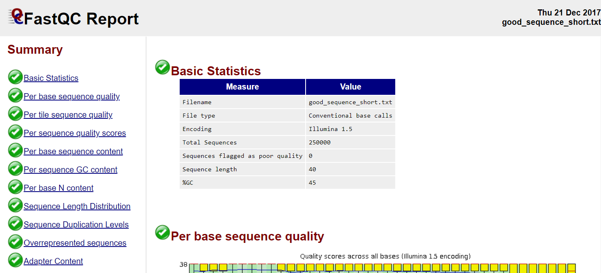
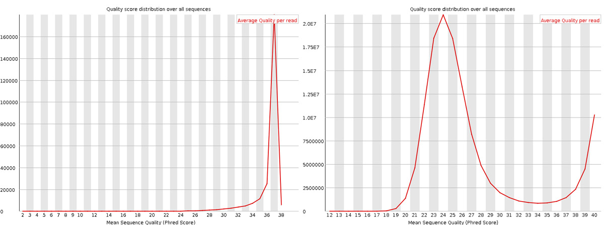
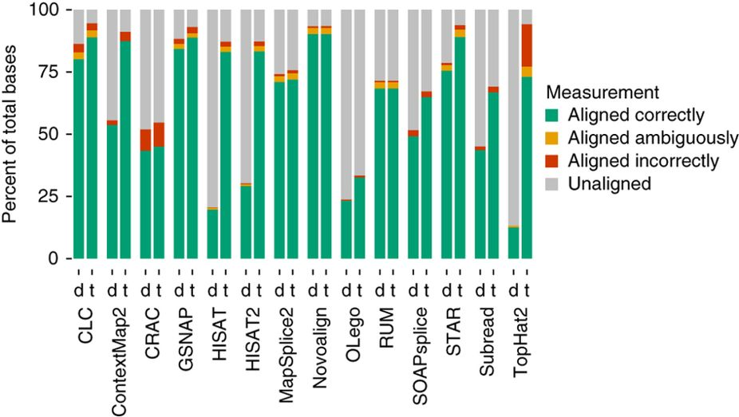
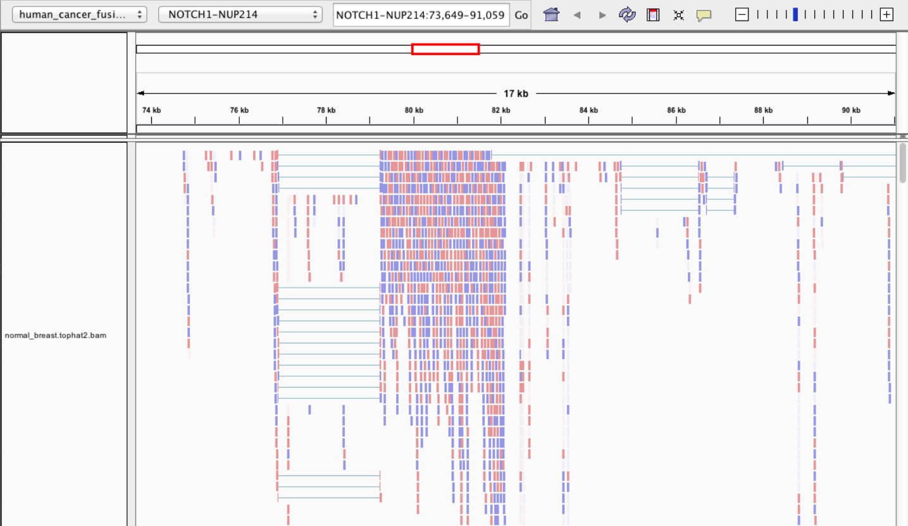
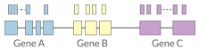
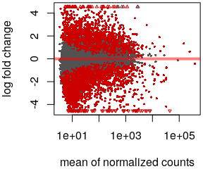
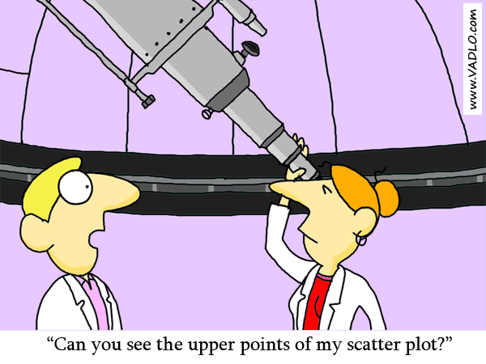
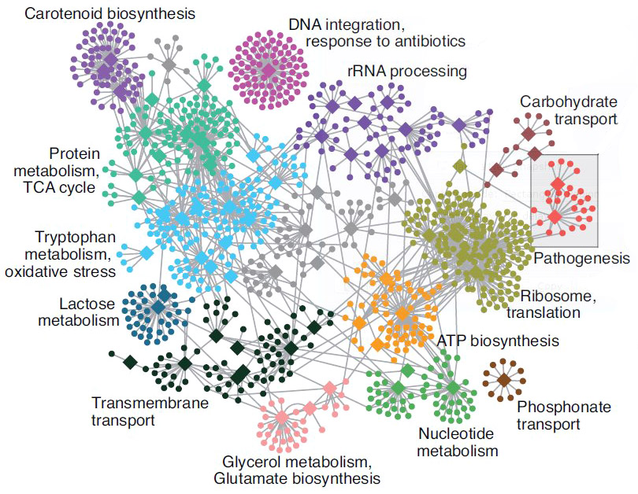

exclude: true
count: false

```{r,echo=FALSE,child="assets/header-slide.Rmd"}
```

<!-- ------------ Only edit title, subtitle & author above this ------------ -->

---
name: contents
class: spaced

```{r,include=FALSE}
# load packages
#library(dplyr)
#library(pheatmap)
#library(plotly)
#library(DESeq2)

#colours
col_sll_green <- "#95C11E"
col_sll_blue <- "#0093BD"
col_sll_orange <- "#EF7C00"
col_sll_green_light <- "#f4f8e8"
col_sll_blue_light <- "#e5f4f8"
col_sll_orange_light <- "#fdf1e5"
```

## Contents

* [RNA Sequencing](#intro)
* [Workflow](#workflow)
* [DGE Workflow](#workflow-dge)
* [ReadQC](#read-qc)
* [Mapping](#mapping-intro)
* [Alignment QC](#alignment-qc)
* [Quantification](#quantification-counts)
* [Normalisation](#normalisation)
* [Exploratory](#exploratory-heatmap)
* [DGE](#dge-1)
* [Functional analyses](#functional-analysis-1)
* [Summary](#summary)
* [Help](#help)

---
name: intro
class: spaced

## RNA Sequencing


- The transcriptome is spatially and temporally dynamic
- Data comes from functional units (coding regions)
- Only a tiny fraction of the genome

---
name: applications
class: spaced

## Applications

- Identify gene sequences in genomes
- Learn about gene function
- Differential gene expression
- Explore isoform and allelic expression
- Understand co-expression, pathways and networks
- Gene fusion
- RNA editing

---
name: workflow
class: spaced

## Workflow

.size-80[]


.citation[
.cite[<i class="fas fa-link"></i> Conesa, Ana, *et al.* "A survey of best practices for RNA-seq data analysis." [Genome biology 17.1 (2016): 13](https://genomebiology.biomedcentral.com/articles/10.1186/s13059-016-0881-8)]
]

---
name: exp-design
class: spaced

## Experimental design

.pull-left-50[
- Balanced design
- Technical replicates not necessary (.altcol[Marioni *et al.*, 2008])
- Biological replicates: 6 - 12 (.altcol[Schurch *et al.*, 2016])
- ENCODE consortium
- Previous publications
- Power analysis

<i class="fas fa-toolbox"></i> [RnaSeqSampleSize](https://cqs.mc.vanderbilt.edu/shiny/RnaSeqSampleSize/) (Power analysis), [Scotty](http://scotty.genetics.utah.edu/) (Power analysis with cost)
]

.pull-right-50[
.size-90[]
]

.citation[
.cite[<i class="fas fa-link"></i> Busby, Michele A., *et al.* "Scotty: a web tool for designing RNA-Seq experiments to measure differential gene expression." [Bioinformatics 29.5 (2013): 656-657](https://academic.oup.com/bioinformatics/article/29/5/656/252753)]  
.cite[<i class="fas fa-link"></i> Marioni, John C., *et al.* "RNA-seq: an assessment of technical reproducibility and comparison with gene expression arrays." [Genome research (2008)](https://genome.cshlp.org/content/18/9/1509.long)]  
.cite[<i class="fas fa-link"></i> Schurch, Nicholas J., *et al.* "How many biological replicates are needed in an RNA-seq experiment and which differential expression tool should you use?." [Rna (2016)](http://rnajournal.cshlp.org/content/early/2016/03/30/rna.053959.115.abstract)]  
.cite[<i class="fas fa-link"></i> Zhao, Shilin, *et al.* "RnaSeqSampleSize: real data based sample size estimation for RNA sequencing." [BMC bioinformatics 19.1 (2018): 191](https://bmcbioinformatics.biomedcentral.com/articles/10.1186/s12859-018-2191-5)]  
]

---
name: rna-extraction
class: spaced

## RNA extraction

.pull-left-50[
- Sample processing and storage
- Total RNA/mRNA/small RNA
- DNAse treatment
- Quantity & quality
- RIN values (Strong effect)
- Batch effect
- Extraction method bias (GC bias)
]

.pull-right-50[
.size-70[]
]

.citation[
.cite[<i class="fas fa-link"></i> Romero, Irene Gallego, *et al*. "RNA-seq: impact of RNA degradation on transcript quantification." [BMC biology 12.1 (2014): 42](https://bmcbiol.biomedcentral.com/articles/10.1186/1741-7007-12-42)]  
.cite[<i class="fas fa-link"></i> Kim, Young-Kook, *et al*. "Short structured RNAs with low GC content are selectively lost during extraction from a small number of cells." [Molecular cell 46.6 (2012): 893-895](https://www.cell.com/molecular-cell/fulltext/S1097-2765(12)00481-9).]  
]  

---
name: library-prep
class: spaced

## Library prep

.pull-left-50[
- PolyA selection
- rRNA depletion
- Size selection
- PCR amplification (See section PCR duplicates)
- Stranded (directional) libraries
  - Accurately identify sense/antisense transcript
  - Resolve overlapping genes
- Exome capture
- Library normalisation
- Batch effect
]  

.pull-right-50[

]

.citation[
.cite[<i class="fas fa-link"></i> Zhao, Shanrong, et al. "Comparison of stranded and non-stranded RNA-seq transcriptome profiling and investigation of gene overlap." [BMC genomics 16.1 (2015): 675](https://www.ncbi.nlm.nih.gov/pmc/articles/PMC4559181/)]  
.cite[<i class="fas fa-link"></i> Levin, Joshua Z., et al. "Comprehensive comparative analysis of strand-specific RNA sequencing methods." [Nature methods 7.9 (2010): 709](https://www.nature.com/articles/nmeth.1491)]  
]  

---
name: sequencing

## Sequencing

.pull-left-60[
- Sequencer (Illumina/PacBio)
- Read length
  - Greater than 50bp does not improve DGE
  - Longer reads better for isoforms
- Pooling samples
- Sequencing depth (Coverage/Reads per sample)
- Single-end reads (Cheaper)
- Paired-end reads
  - Increased mappable reads
  - Increased power in assemblies
  - Better for structural variation and isoforms
  - Decreased false-positives for DGE
]

.pull-right-40[

]

.citation[
.cite[<i class="fas fa-link"></i> Chhangawala, Sagar, et al. "The impact of read length on quantification of differentially expressed genes and splice junction detection." [Genome biology 16.1 (2015): 131](https://www.ncbi.nlm.nih.gov/pmc/articles/PMC4531809/)]  
.cite[<i class="fas fa-link"></i> Corley, Susan M., et al. "Differentially expressed genes from RNA-Seq and functional enrichment results are affected by the choice of single-end versus paired-end reads and stranded versus non-stranded protocols." [BMC genomics 18.1 (2017): 399](https://www.ncbi.nlm.nih.gov/pmc/articles/PMC5442695/)]  
.cite[<i class="fas fa-link"></i> Liu, Yuwen, Jie Zhou, and Kevin P. White. "RNA-seq differential expression studies: more sequence or more replication?." [Bioinformatics 30.3 (2013): 301-304](https://academic.oup.com/bioinformatics/article/30/3/301/228651)]
.cite[<i class="fas fa-link"></i> Comparison of PE and SE for RNA-Seq, [SciLifeLab](https://ngisweden.scilifelab.se/file/1540-1_Comparison_of_PE_and_SE_for_RNA-seq.pdf)]  
]

---
name: workflow-dge

## Workflow • DGE


---
name: de-novo-assembly
class: spaced

## De-Novo assembly

- When no reference genome available
- To identify novel genes/transcripts/isoforms
- Identify fusion genes
- Assemble transcriptome from short reads
- Access quality of assembly and refine
- Map reads back to assembled transcriptome

<i class="fas fa-toolbox"></i> [Trinity](https://github.com/trinityrnaseq/trinityrnaseq/wiki), [SOAPdenovo-Trans](http://soap.genomics.org.cn/SOAPdenovo-Trans.html), [Oases](https://www.ebi.ac.uk/~zerbino/oases/), [rnaSPAdes](http://cab.spbu.ru/software/rnaspades/)

.citation[
.cite[<i class="fas fa-link"></i> Hsieh, Ping-Han *et al*., "Effect of de novo transcriptome assembly on transcript quantification" [2018 bioRxiv 380998](https://www.biorxiv.org/content/early/2018/08/22/380998)]  
.cite[<i class="fas fa-link"></i> Wang, Sufang, and Michael Gribskov. "Comprehensive evaluation of de novo transcriptome assembly programs and their effects on differential gene expression analysis." [Bioinformatics 33.3 (2017): 327-333](https://academic.oup.com/bioinformatics/article/33/3/327/2580374)]  
]

---
name: read-qc

## Read QC

- Number of reads
- Per base sequence quality
- Per sequence quality score
- Per base sequence content
- Per sequence GC content
- Per base N content
- Sequence length distribution
- Sequence duplication levels
- Overrepresented sequences
- Adapter content
- Kmer content


<i class="fas fa-toolbox"></i> [FastQC](https://www.bioinformatics.babraham.ac.uk/projects/fastqc/), [MultiQC](http://multiqc.info/)

https://sequencing.qcfail.com/


---
name: fastqc

## FastQC

.size-70[[](http://www.bioinformatics.babraham.ac.uk/projects/fastqc/good_sequence_short_fastqc.html)]

.size-70[[](http://www.bioinformatics.babraham.ac.uk/projects/fastqc/bad_sequence_fastqc.html)]

---
name: read-qc-2

## Read QC • PBSQ, PSQS

.size-85[.small[**Per base sequence quality**] ]
.size-85[.small[**Per sequence quality scores**] ]

---
name: read-qc-3

## Read QC • PBSC, PSGC

.size-85[.small[**Per base sequence content**] ]
.size-85[.small[**Per sequence GC content**] ]

---
name: read-qc-4

## Read QC • SDL, AC

.size-85[.small[**Sequence duplication level**] ]
.size-85[.small[**Adapter content**] ]

---
name: trimming

## Trimming

.pull-left-50[
- Trim IF necessary
  - Synthetic bases can be an issue for SNP calling
  - Insert size distribution may be more important for assemblers
- Trim/Clip/Filter reads
- Remove adapter sequences
- Trim reads by quality
- Sliding window trimming
- Filter by min/max read length
  - Remove reads less than ~18nt
- Demultiplexing/Splitting

<i class="fas fa-toolbox"></i> [Cutadapt](https://github.com/marcelm/cutadapt/), [fastp](https://github.com/OpenGene/fastp), [Skewer](https://github.com/relipmoc/skewer), [Prinseq](http://prinseq.sourceforge.net/)
]

.pull-right-50[
.size-90[]
]

---
name: mapping-intro

## Mapping


- Aligning reads back to a reference sequence
- Mapping to genome vs transcriptome
- Splice-aware alignment (genome)

<i class="fas fa-toolbox"></i> [STAR](https://github.com/alexdobin/STAR),  [HiSat2](https://ccb.jhu.edu/software/hisat2/index.shtml), [GSNAP](http://research-pub.gene.com/gmap/), [Novoalign](http://www.novocraft.com/products/novoalign/) (Commercial)

.citation[
.cite[<i class="fas fa-link"></i> Baruzzo, Giacomo, *et al*. "Simulation-based comprehensive benchmarking of RNA-seq aligners." [Nature methods 14.2 (2017): 135](https://www.nature.com/articles/nmeth.4106)]
]  

---
name: aligner-speed

## Aligners • Speed

.pull-left-50[

]

.pull-right-50[
|Program|Time_Min|Memory_GB|
|-------|--------|---------|
|HISATx1|22.7|4.3|
|HISATx2|47.7|4.3|
|HISAT|26.7|4.3|
|STAR|25|28|
|STARx2|50.5|28|
|GSNAP|291.9|20.2|
|TopHat2|1170|4.3|
]

.citation[
.cite[<i class="fas fa-link"></i> Baruzzo, Giacomo, *et al*. "Simulation-based comprehensive benchmarking of RNA-seq aligners." [Nature methods 14.2 (2017): 135](https://www.nature.com/articles/nmeth.4106)]  
]

---
name: aligner-accuracy

## Aligners • Accuracy

.size-70[]

.size-40[]

<i class="fas fa-toolbox"></i> [STAR](https://github.com/alexdobin/STAR),  [HiSat2](https://ccb.jhu.edu/software/hisat2/index.shtml), [GSNAP](http://research-pub.gene.com/gmap/), [Novoalign](http://www.novocraft.com/products/novoalign/) (Commercial)

.citation[
.cite[<i class="fas fa-link"></i> Baruzzo, Giacomo, *et al*. "Simulation-based comprehensive benchmarking of RNA-seq aligners." [Nature methods 14.2 (2017): 135](https://www.nature.com/articles/nmeth.4106)]  
]  

---
name: mapping-required

## Mapping

- Reads (FASTQ)

```
@ST-E00274:179:HHYMLALXX:8:1101:1641:1309 1:N:0:NGATGT
NCATCGTGGTATTTGCACATCTTTTCTTATCAAATAAAAAGTTTAACCTACTCAGTTATGCGCATACGTTTTTTGATGGCATTTCCATAAACCGATTTTTTTTTTATGCACGTACCCAAAACGTGCAGAAAAATACGCTGCTAGAAATGTA
+
#AAAFAFA<-AFFJJJAFA-FFJJJJFFFAJJJJ-<FFJJJ-A-F-7--FA7F7-----FFFJFA<FFFFJ<AJ--FF-A<A-<JJ-7-7-<FF-FFFJAFFAA--A--7FJ-7----77-A--7F7)---7F-A----7)7-----7<<-
```

`@instrument:runid:flowcellid:lane:tile:xpos:ypos read:isfiltered:controlnumber:sampleid`

- Reference Genome/Transcriptome (FASTA)

```
>1 dna:chromosome chromosome:GRCz10:1:1:58871917:1 REF
GATCTTAAACATTTATTCCCCCTGCAAACATTTTCAATCATTACATTGTCATTTCCCCTC
CAAATTAAATTTAGCCAGAGGCGCACAACATACGACCTCTAAAAAAGGTGCTGTAACATG
```

- Annotation (GTF/GFF)

```
#!genome-build GRCz10
#!genebuild-last-updated 2016-11
4       ensembl_havana  gene    6732    52059   .       -       .       gene_id "ENSDARG00000104632"; gene_version "2"; gene_name "rerg"; gene_source "ensembl_havana"; gene_biotype "protein_coding"; havana_gene "OTTDARG00000044080"; havana_gene_version "1";
```

`seq source feature start end score strand frame attribute`

.citation[
.cite[<i class="fas fa-link"></i> Illumina read name [format](http://support.illumina.com/content/dam/illumina-support/help/BaseSpaceHelp_v2/Content/Vault/Informatics/Sequencing_Analysis/BS/swSEQ_mBS_FASTQFiles.htm), GTF [format](https://www.ensembl.org/info/website/upload/gff.html)]  
]

---
name: alignment

## Alignment

- SAM/BAM (Sequence Alignment Map format)

```
ST-E00274:188:H3JWNCCXY:4:1102:32431:49900      163     1       1       60      8S139M4S      =       385     535     TATTTAGAGATCTTAAACATCCATTCCCCCTGCAAACATTTTCAATCATTACATTGTCATTTTCCCTCCAAATTAAATTTAGCCAGAGGCGCACAACATACGACCTCTAAAAAAGGTGCTGGAACATGTACCTATATGCAGCACCACCATC     AAAFAFFAFFFFJ7FFFFJ<JAFA7F-<AJ7JJ<FFFJ--<FAJF<7<7FAFJ-<AFA<-JJJ-AF-AJ-FF<F--A<FF<-7777-7JA-77A---F-7AAFF-FJA--77FJ<--77)))7<JJA<J77<-------<7--))7)))7-    NM:i:4   MD:Z:12T0T40C58T25      AS:i:119        XS:i:102        XA:Z:17,-53287490,4S33M4D114M,11;     MQ:i:60 MC:Z:151M       RG:Z:ST-E00274_188_H3JWNCCXY_4
```

`query flag ref pos mapq cigar mrnm mpos tlen seq qual opt`

|Format|Size_GB|
|------|-------|
|SAM|7.4|
|BAM|1.9|
|CRAM lossless Q|1.4|
|CRAM 8 bins Q|0.8|
|CRAM no Q|0.26|

.citation[
.cite[<i class="fas fa-link"></i> SAM file [format](http://www.htslib.org/doc/sam.html)]
]

---
name: vis-tview

## Visualisation • `tview`

`samtools tview alignment.bam genome.fasta`


---
name: vis-igv

## Visualisation • IGV



<i class="fas fa-toolbox"></i> [IGV](http://software.broadinstitute.org/software/igv/), [UCSC Genome Browser](https://genome.ucsc.edu/)

---
name: vis-seqmonk

## Visualisation • SeqMonk


<i class="fas fa-toolbox"></i> [SeqMonk](https://www.bioinformatics.babraham.ac.uk/projects/seqmonk/)

---
name: alignment-qc
class: spaced

## Alignment QC

- Number of reads mapped/unmapped/paired etc
- Uniquely mapped
- Insert size distribution
- Coverage
- Gene body coverage
- Biotype counts / Chromosome counts
- Counts by region: gene/intron/non-genic
- Sequencing saturation
- Strand specificity

<i class="fas fa-toolbox"></i> STAR (final log file), samtools > stats, bamtools > stats, [QoRTs](https://hartleys.github.io/QoRTs/), [RSeQC](http://rseqc.sourceforge.net/), [Qualimap](http://qualimap.bioinfo.cipf.es/)

---
name: star-log

## Alignment QC • STAR Log

MultiQC can be used to summarise and plot STAR log files.

.size-95[]

---
name: qorts-region

## Alignment QC • Features

QoRTs was run on all samples and summarised using MultiQC.

.size-95[]

---
name: qorts-plots

## QoRTs

.size-95[]

---
name: alignment-qc-1

## Alignment QC

.pull-left-50[
**Soft clipping**

]

.pull-right-50[
**Gene body coverage**

]

---
name: alignment-qc-2

## Alignment QC

.pull-left-50[
**Insert size**

]

.pull-right-50[
**Saturation curve**

]

---
name: quantification-counts
class: spaced

## Quantification • Counts

.pull-left-50[
- Read counts = gene expression
- Reads can be quantified on any feature (gene, transcript, exon etc)
- Intersection on gene models
- Gene/Transcript level



<i class="fas fa-toolbox"></i> [featureCounts](http://bioinf.wehi.edu.au/featureCounts/), [HTSeq](https://github.com/simon-anders/htseq)
]  

.pull-right-50[
.size-85[.center[]]
]  

---
name: quant-pcr-multi

## Quantification

.pull-left-50[
**PCR duplicates**

- Ignore for RNA-Seq data
- Computational deduplication (Don't!)
- Use PCR-free library-prep kits
- Use UMIs during library-prep

**Multi-mapping**

- Added (BEDTools multicov)
- Discard (featureCounts, HTSeq)
- Distribute counts (Cufflinks)
- Rescue
  - Probabilistic assignment (Rcount, Cufflinks)
  - Prioritise features (Rcount)
  - Probabilistic assignment with EM (RSEM)
]

.pull-right-50[

]

.citation[
.cite[<i class="fas fa-link"></i> Fu, Yu, *et al*. "Elimination of PCR duplicates in RNA-seq and small RNA-seq using unique molecular identifiers." [BMC genomics 19.1 (2018): 531](https://bmcgenomics.biomedcentral.com/articles/10.1186/s12864-018-4933-1)]  
.cite[<i class="fas fa-link"></i> Parekh, Swati, *et al*. "The impact of amplification on differential expression analyses by RNA-seq." [Scientific reports 6 (2016): 25533](https://www.nature.com/articles/srep25533)]  
.cite[<i class="fas fa-link"></i> Klepikova, Anna V., *et al*. "Effect of method of deduplication on estimation of differential gene expression using RNA-seq." [PeerJ 5 (2017): e3091](https://www.ncbi.nlm.nih.gov/pmc/articles/PMC5357343/)]  
]  

---
name: quantification-abundance

## Quantification • Abundance

- Count methods
  - Provide no inference on isoforms
  - Cannot accurately measure fold change
<!--.size-60[]-->
- Probabilistic assignment
  - Deconvolute ambiguous mappings
  - Transcript-level
  - cDNA reference

**Kallisto, Salmon**

- Ultra-fast & alignment-free
- Subsampling & quantification confidence
- Transcript-level estimates improves gene-level estimates
- Kallisto/Salmon > transcript-counts > `tximport()` > gene-counts

<i class="fas fa-toolbox"></i> [RSEM](https://deweylab.github.io/RSEM/), [Kallisto](https://pachterlab.github.io/kallisto/), [Salmon](https://combine-lab.github.io/salmon/), [Cufflinks2](http://cole-trapnell-lab.github.io/cufflinks/)

.citation[
.cite[<i class="fas fa-link"></i> Soneson, Charlotte, *et al*. "Differential analyses for RNA-seq: transcript-level estimates improve gene-level inferences." [F1000Research 4 (2015)](https://f1000research.com/articles/4-1521/v2)]  
.cite[<i class="fas fa-link"></i> Zhang, Chi, *et al*. "Evaluation and comparison of computational tools for RNA-seq isoform quantification." [BMC genomics 18.1 (2017): 583](https://bmcgenomics.biomedcentral.com/articles/10.1186/s12864-017-4002-1)]  
]

---
name: quantification-qc

## Quantification QC

```
ENSG00000000003    140   242   188   143   287   344   438   280   253
ENSG00000000005    0     0     0     0     0     0     0     0     0
ENSG00000000419    69    98    77    55    52    94    116   79    69
ENSG00000000457    56    75    104   79    157   205   183   178   153
ENSG00000000460    33    27    23    19    27    42    69    44    40
ENSG00000000938    7     38    13    17    35    76    53    37    24
ENSG00000000971    545   878   694   636   647   216   492   798   323
ENSG00000001036    79    154   74    80    128   167   220   147   72
```

.pull-left-50[
- Pairwise correlation between samples must be high (>0.9)

.size-60[]

]

.pull-right-50[
- Count QC using RNASeqComp

.size-80[]

]

<i class="fas fa-toolbox"></i> [RNASeqComp](https://bioconductor.org/packages/release/bioc/html/rnaseqcomp.html)

.citation[
.cite[<i class="fas fa-link"></i> Teng, Mingxiang, *et al*. "A benchmark for RNA-seq quantification pipelines." [Genome biology 17.1 (2016): 74](https://genomebiology.biomedcentral.com/articles/10.1186/s13059-016-0940-1)]  
]

---
name: multiqc

## MultiQC

[](https://multiqc.info/examples/rna-seq/multiqc_report.html)

---
name: normalisation

## Normalisation

- Control for Sequencing depth & compositional bias
- Median of Ratios (DESeq2) and TMM (edgeR) perform the best


- For DGE using DGE packages, use raw counts
- For clustering, heatmaps etc use VST, VOOM or RLOG
- For own analysis, plots etc, use TPM
- Other solutions: spike-ins/house-keeping genes


.citation[
.cite[<i class="fas fa-link"></i> Dillies, Marie-Agnes, *et al*. "A comprehensive evaluation of normalization methods for Illumina high-throughput RNA sequencing data analysis." [Briefings in bioinformatics 14.6 (2013): 671-683](https://www.ncbi.nlm.nih.gov/pubmed/22988256)]  
.cite[<i class="fas fa-link"></i> Evans, Ciaran, Johanna Hardin, and Daniel M. Stoebel. "Selecting between-sample RNA-Seq normalization methods from the perspective of their assumptions." [Briefings in bioinformatics (2017)](https://arxiv.org/abs/1609.00959)]  
.cite[<i class="fas fa-link"></i> Wagner, Gunter P., Koryu Kin, and Vincent J. Lynch. "Measurement of mRNA abundance using RNA-seq data: RPKM measure is inconsistent among samples." [Theory in biosciences 131.4 (2012): 281-285](https://link.springer.com/article/10.1007/s12064-012-0162-3)]  
]

---
name: exploratory-heatmap

## Exploratory • Heatmap

- Remove lowly expressed genes
- Transform raw counts to VST, VOOM, RLOG, TPM etc
- Sample-sample clustering heatmap

```{r,echo=FALSE,eval=FALSE}
# read vst data
cvst <- readRDS("data/rnaseq/counts-filtered-vst.Rds")
mf <- readRDS("data/rnaseq/metadata-filtered.Rds")
```

```{r,echo=FALSE,fig.height=4.9,fig.width=6.8,dev="svg",eval=FALSE}
temp <- as.matrix(dist(t(cvst)))

df_annot <- mf[,c("patient"),drop=FALSE]
col_patient <- c("#A6CEE3","#1F78B4","#B2DF8A","#33A02C","#FB9A99",
                 "#E31A1C","#FDBF6F","#FF7F00")
ann_col_patient <- col_patient
names(ann_col_patient) <- levels(factor(df_annot$patient))

pheatmap(temp,border_color=NA,annotation_col=df_annot,
         annotation_row=df_annot,annotation_legend=T,
         annotation_colors=list(patient=ann_col_patient))
```

.size-70[]

<i class="fas fa-toolbox"></i> [`pheatmap()`](https://github.com/raivokolde/pheatmap)

---
name: exploratory-pca

## Exploratory • PCA

```{r,echo=FALSE,eval=FALSE}
mat1 <- as.data.frame(cmdscale(dist(t(cvst),method="euclidean"),eig=F,k=3))
mat1$nid <- row.names(mat1)
mat1 <- merge(mat1,mf,by="nid")

mat1$tt <- paste0("<b>ID: </b>",mat1$id,"\n",
                   "<b>NGS ID: </b>",mat1$nid)
p1 <- plot_ly(mat1,x=~V1,y=~V2,z=~V3,text=~tt,hoverinfo="text",
        colors=col_patient,width=750,height=500)
add_markers(p1,color=~patient)
```

.size-90[]

---
name: batch-correction
class: spaced

## Batch correction

- Estimate variation explained by variables (PVCA)

.size-70[]

- Find confounding effects as surrogate variables (SVA)
- Model known batches in the LM/GLM model
- Correct known batches (ComBat)(Harsh!)
- Interactively evaluate batch effects and correction (BatchQC)

<i class="fas fa-toolbox"></i> [SVA](http://bioconductor.org/packages/release/bioc/html/sva.html), [PVCA](https://bioconductor.org/packages/release/bioc/html/pvca.html), [BatchQC](http://bioconductor.org/packages/release/bioc/html/BatchQC.html)

.citation[
.cite[<i class="fas fa-link"></i> Liu, Qian, and Marianthi Markatou. "Evaluation of methods in removing batch effects on RNA-seq data." [Infectious Diseases and Translational Medicine 2.1 (2016): 3-9](http://www.tran-med.com/article/2016/2411-2917-2-1-3.html)]  
.cite[<i class="fas fa-link"></i> Manimaran, Solaiappan, et al. "BatchQC: interactive software for evaluating sample and batch effects in genomic data." [Bioinformatics 32.24 (2016): 3836-3838](https://academic.oup.com/bioinformatics/article/32/24/3836/2525651)]  
]

---
name: dge-1

## DGE

- DESeq2, edgeR (Neg-binom > GLM > Test), Limma-Voom (Neg-binom > Voom-transform > LM > Test)
- DESeq2 `~age+condition`
  - Estimate size factors `estimateSizeFactors()`
  - Estimate gene-wise dispersion `estimateDispersions()`
  - Fit curve to gene-wise dispersion estimates
  - Shrink gene-wise dispersion estimates
  - GLM fit for each gene
  - Wald test `nbinomWaldTest()`

```{r,echo=FALSE,fig.height=3.9,fig.width=3.9,eval=FALSE}
cf <- read.delim("data/rnaseq/counts-filtered.txt",header=T,stringsAsFactors=F)
mf <- readRDS("data/rnaseq/metadata-filtered.Rds")

# filtering
bads <- c("P8304_123","P8304_124","P8304_125","P8304_126","P8304_127","P8304_128")
cf <- cf %>% dplyr::select(-one_of(bads))
mf <- dplyr::filter(mf,!(nid %in% bads)) %>% droplevels()
mf$type <- factor(c(rep(c("type1","type1","type2","type2"),each=4),
             rep("type2",each=3),rep("control",each=4)))
```

```{r,echo=FALSE,fig.height=2.9,fig.width=2.9,eval=FALSE}
{plot(x=log10(rowMeans(as.matrix(cf))+1),y=log10(rowVars(as.matrix(cf))+1),xlab=bquote(~-log[10]~Mean),ylab=bquote(~-log[10]~Variance),pch=20,cex=0.4)
abline(a=0,b=1,col="red")}
```

```{r,echo=FALSE,fig.height=2.5,fig.width=5,dev="svg",eval=FALSE}
d <- DESeqDataSetFromMatrix(countData=cf,colData=mf,design=as.formula(~type))
d <- DESeq2::estimateSizeFactors(d,type="ratio")
d <- DESeq2::estimateDispersions(d)

{par(mar=c(4,4,0.2,0.5))
par(mfrow=c(1,2))
plotDispEsts(d)
plotDispEsts(d,xlim=c(600,700),ylim=c(0.05,1.2),cex=1)}
par(mfrow=c(1,1))
```

.size-50[]

<i class="fas fa-toolbox"></i> [DESeq2](), [edgeR](), [Limma-Voom]()

.citation[
.cite[<i class="fas fa-link"></i> Seyednasrollah, Fatemeh, *et al*. "Comparison of software packages for detecting differential expression in RNA-seq studies." [Briefings in bioinformatics 16.1 (2013): 59-70](https://academic.oup.com/bib/article/16/1/59/240754)]  
]

---
name: dge-2

## DGE

- Results `results()`

```{r,echo=FALSE,eval=FALSE}
d1 <- nbinomWaldTest(d)
d1r1 <- results(d1)
head(d1r1,n=1)
```

```
log2 fold change (MLE): type type2 vs control
Wald test p-value: type type2 vs control
DataFrame with 1 row and 6 columns
                        baseMean     log2FoldChange             lfcSE
                       <numeric>          <numeric>         <numeric>
ENSG00000000003 242.307796723287 -0.932926089608546 0.114285150312285
                             stat               pvalue                 padj
                        <numeric>            <numeric>            <numeric>
ENSG00000000003 -8.16314356729037 3.26416150242775e-16 1.36240609998527e-14
```


- Summary `summary()`

```{r,echo=FALSE,eval=FALSE}
summary(d1r1)
```

```
out of 17889 with nonzero total read count
adjusted p-value < 0.1
LFC > 0 (up)       : 4526, 25%
LFC < 0 (down)     : 5062, 28%
outliers [1]       : 25, 0.14%
low counts [2]     : 0, 0%
(mean count < 3)
[1] see 'cooksCutoff' argument of ?results
[2] see 'independentFiltering' argument of ?results
```

---
name: dge-3

## DGE

.pull-left-50[

- MA plot `plotMA()`

```{r,echo=FALSE,fig.height=2.5,fig.width=3,dev="svg",eval=FALSE}
{par(mar=c(4,4,0.2,0.2))
plotMA(d1)}
```



- Volcano plot

```{r,echo=FALSE,fig.height=2.5,fig.width=3,dev="svg",eval=FALSE}
par(mar=c(4,4,0.2,0.2))
topT <- as.data.frame(d1r1)

#Adjusted P values (FDR Q values)
with(topT, plot(log2FoldChange, -log10(padj), pch=20, cex=1.0, xlab=bquote(~Log[2]~fold~change), ylab=bquote(~-Log[10]~Q~value)))

with(subset(topT, padj<0.05 & abs(log2FoldChange)>2), points(log2FoldChange, -log10(padj), pch=20, col="red", cex=0.5))

#Add lines for absolute FC>2 and P-value cut-off at FDR Q<0.05
abline(v=0, col="black", lty=3, lwd=1.0)
abline(v=-2, col="black", lty=3, lwd=1.0)
abline(v=2, col="black", lty=3, lwd=1.0)
abline(h=-log10(max(topT$pvalue[topT$padj<0.05], na.rm=TRUE)), col="black", lty=3, lwd=1.0)
```


]

.pull-right-50[

- Normalised counts `plotCounts()`

```{r,echo=FALSE,fig.height=3,fig.width=3,dev="svg",eval=FALSE}
par(mar=c(4.5,4.5,1,0.2))
plotCounts(d1,"ENSG00000000003",intgroup="type")
```



]

---
name: functional-analysis-1

## Functional analysis • GO

- Gene set analysis (GSA)
- Gene set enrichment analysis (GSEA)
- Gene ontology / Reactome databases

.size-70[]


---
name: functional-analysis-2

## Functional analysis • Kegg

- Pathway analysis (Kegg)


<i class="fas fa-toolbox"></i> [DAVID](https://david.ncifcrf.gov/), [clusterProfiler](https://bioconductor.org/packages/release/bioc/html/clusterProfiler.html), [ClueGO](http://apps.cytoscape.org/apps/cluego), [ErmineJ](https://erminej.msl.ubc.ca/), [pathview](https://bioconductor.org/packages/release/bioc/html/pathview.html)

---
name: summary
class: spaced

## Summary

- Sound experimental design to avoid confounding
- Plan carefully about lib prep, sequencing etc based on experimental objective
- Biological replicates may be more important than paired-end reads or long reads
- Discard low quality bases, reads, genes and samples
- Verify that tools and methods align with data assumptions
- Experiment with multiple pipelines and tools
- QC! QC everything at every step

.large[<i class="fas fa-link"></i> Conesa, Ana, *et al.* "A survey of best practices for RNA-seq data analysis." [Genome biology 17.1 (2016): 13](https://genomebiology.biomedcentral.com/articles/10.1186/s13059-016-0881-8)]  

---
name: help
class: spaced

## Further learning

- Griffith lab [RNA-Seq using HiSat & StringTie tutorial](https://github.com/griffithlab/rnaseq_tutorial/wiki)
- SciLifeLab [courses](https://www.scilifelab.se/education/courses%26training)
- HBC Training [DGE using DeSeq2 tutorial](https://github.com/hbctraining/Intro-to-R-with-DGE)
- Hemberg lab [scRNA-Seq tutorial](http://hemberg-lab.github.io/scRNA.seq.course/index.html)
- [RNA-Seq Blog](https://www.rna-seqblog.com/)


---
name: end_slide
class: end-slide, middle
count: false

# Thank you. Questions?

```{r,echo=FALSE,child="assets/footer-slide.Rmd"}
```

---
name: lab1
class: spaced

## Hands-On tutorial

**Main exercise**

- 01 Check the quality of the raw reads with **FastQC**
- 02 Map the reads to the reference genome using **Star**
- 03 Assess the post-alignment quality using **QualiMap**
- 04 Count the reads overlapping with genes using **featureCounts**
- 05 Find DE genes using **edgeR** in R

**Bonus exercises**

- 01 Functional annotation of DE genes using **GO/Reactome/Kegg** databases
- 02 Visualisation of RNA-seq BAM files using **IGV** genome browser
- 03 RNA-Seq figures and plots using **R**
- 04 De-novo transcriptome assembly using **Trinity**

.large[**Data:** `/sw/courses/ngsintro/rnaseq/`]  
.large[**Work:** `/proj/gXXXXXXX/nobackup/<user>/rnaseq/`]  

---
name: lab2

## Hands-On tutorial

.pull-left-50[

- Course data directory

.large[`/sw/courses/ngsintro/rnaseq/`]   

.large[
```
rnaseq/
+-- bonus/
|   +-- assembly/
|   +-- exon/
|   +-- funannot/
|   +-- visual/
+-- documents/
+-- main/
|   +-- 1_raw/
|   +-- 2_fastqc/
|   +-- 3_mapping/
|   +-- 4_qualimap/
|   +-- 5_dge/
|   +-- 6_multiqc/
+-- reference/
|   +-- mouse/
|   +-- mouse_chr11/
+-- scripts/
```
]
]

.pull-right-50[

- Your work directory

.large[`/proj/gXXXXXXX/nobackup/[user]/`]  

.large[
```
[user]/
rnaseq/
  +-- 1_raw/
  +-- 2_fastqc/
  +-- 3_mapping/
  +-- 4_qualimap/
  +-- 5_dge/
  +-- 6_multiqc/
  +-- reference/
  |   +-- mouse/
  |   +-- mouse_chr11/
  +-- scripts/
  +-- funannot/
  +-- assembly/
```
]
]

```{r,include=FALSE,eval=FALSE}
# manually run this to render this document to HTML
rmarkdown::render("slide_rnaseq.Rmd")
# manually run this to convert HTML to PDF
#pagedown::chrome_print("slide_rnaseq.html",output="presentation.pdf")
```
