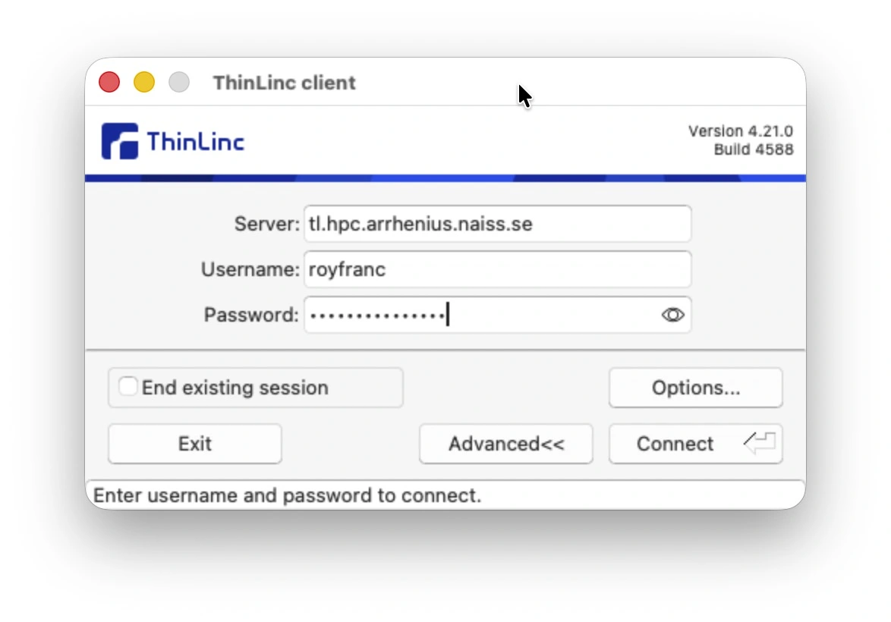
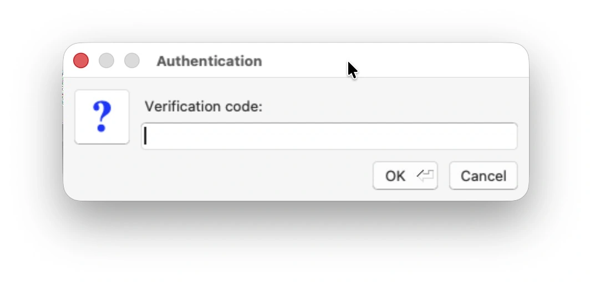
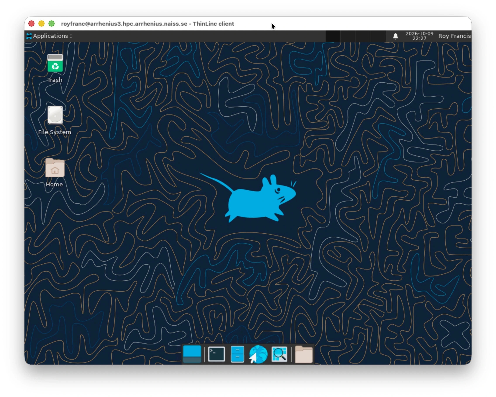

We will demonstrate different ways to connect to the NAISS Arrhenius high-performance cluster. From the cluster's point of view, it doesn't matter which method you use, and you can switch at any time or even use multiple methods simultaneously.

The options are a text-based SSH connection and a graphical remote desktop using ThinLinc, both of which are available on all major operating systems. ThinLinc is useful if you need to view images or documents in GUI programs without first downloading them to your own computer. Because it transfers graphics, it requires a good, stable internet connection.

We show you different methods because some parts of this course require you to view plots and images, and an additional download step would unnecessarily complicate the workflow.

## SSH connection

Let's look at the text-based SSH approach first. This type of connection works well even on slow internet connections because it transmits only small amounts of text. You will need a terminal and an SSH client, which are included in most major operating systems:

-  Linux: use a terminal
-  macOS: use Terminal
-  Windows: use PowerShell, Command Prompt, or WSL2

The guide below is based on [Arrhenius official instructions](https://hpc.pages.naiss.se/user-documentation/support-docs/arrhenius_hpc/login/login/).

### Connecting to HPC using SSH

::: {.callout-note}
Where `username` is mentioned, replace it with your cluster username.
:::

1. Open a terminal and enter the following command:

    ```sh
    ssh username@
    ```

2. Enter your password when prompted. As you type, nothing will appear on the screen: no stars and no dots. This is expected. Type the password, press <kbd>Enter</kbd>, and then enter your 2FA code.

    ```sh
    ssh username@
    (username@) Password:
    (username@) Verification code:
    ```

3. Your screen should display a login message and end with a terminal prompt:

    ```sh
    Last failed login: Thu Oct  8 20:23:16 CEST 2026 from hxx-xx-xxx-xx.cust.bredband2.com on ssh:notty
    There were 2 failed login attempts since the last successful login.
    Last login: Thu Oct  8 18:10:47 2026 from hxx-xx-xxx-xx.cust.bredband2.com
    Welcome to Arrhenius!

    ...

    [username@arrhenius1 ~]$
    ```

4. Now you are connected to the HPC and can start working.

## Remote desktop

::: {.callout-note}
There are a limited number of ThinLinc licenses, so it's possible that you might not be able to connect if all licenses are in use. If you are unable to connect, simply try again later.
:::

You can work on the HPC interactively through a graphical user interface (GUI) desktop environment using ThinLinc. This works on all major operating systems (  ).

The Arrhenius ThinLinc server provides a remote desktop on the login nodes. Connect to it using the ThinLinc client by following these steps:

1. [ Download](https://www.cendio.com/thinlinc/download/) and install the ThinLinc client.

2. Start ThinLinc and enter `tl.hpc.arrhenius.naiss.se` in the **Server** field, followed by your username and password. If the client asks for a key instead of a password, click **Advanced** if necessary, open **Options**, select the **Security** tab, and choose **Password** as the authentication method. Click **Connect**.

    {width="500px"}

3. Enter your 2FA code when prompted.

    {width="500px"}

4. You should now be connected to the remote desktop.

    {width="700px"}

5. When you have finished using the remote desktop, click your name in the top-right corner of the screen and select **Log Out**.

For more information, take a look at the official documentation: <a href="https://hpc.pages.naiss.se/user-documentation/support-docs/arrhenius_hpc/login/thinlinc/" target="_blank" rel="noopener noreferrer">Arrhenius ThinLinc Guide</a>
